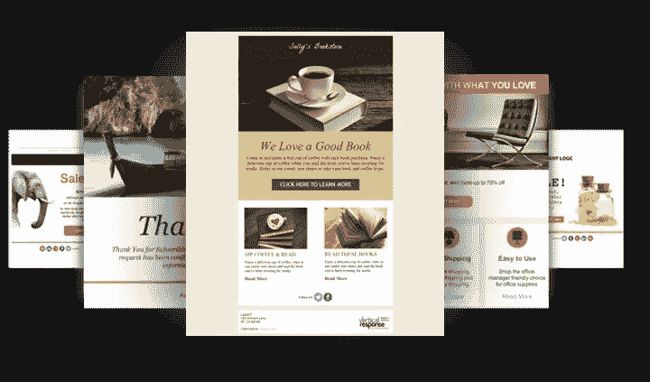

# 10 个免费电子邮件营销软件解决方案

> 原文：<https://medium.com/visualmodo/10-free-email-marketing-software-solutions-e0831d51e8c2?source=collection_archive---------3----------------------->

# 现在查看一个最佳免费电子邮件营销软件解决方案列表，帮助您的业务增长，并与您的用户/客户轻松保持联系

作为一名拥有自己创业梦想的小企业营销人员，我是美国广播公司(ABC)节目《鲨鱼池》的忠实粉丝。如果你不熟悉这个节目，每周都会有小企业主和企业家站在“鲨鱼”(即百万富翁风险投资家)面前，向风险投资家推销他们为什么应该投资他们的业务。在我看来，当一位鲨鱼问一位企业家，为什么他们应该投资一个还没有什么表现的新兴企业时，最常见的反驳是，“因为我们还没有在营销上投入任何资金！”

出于某种原因，许多小企业主仍然错误地认为，为了扩大规模，他们需要资金投资百万美元的电视广告，或者在广播和印刷广告中投入数十万美元来宣传。但是，由于互联网的广泛普及和如今消费者在网上花费的时间，接触你的潜在客户的成本从来没有减少过。

也许今天最快和最具成本效益的方法是使用[电子邮件营销软件](http://www.capterra.com/email-marketing-software)——尤其是当有这么多 100%免费的电子邮件营销解决方案可用的时候。

虽然电子邮件营销可能看起来像是 90 年代和 21 世纪初的[过时营销策略](http://blog.capterra.com/statistics-email-marketing-not-dead/)，但自那时以来，它已经成长了不少。在过去的 5 年里，各行各业的客户越来越多地转向网络来控制销售和营销流程。无论是阅读和留下在线评论，通过社交媒体向同行寻求产品推荐，还是在购买前进行在线研究和阅读博客，客户现在越来越多地掌控他们与企业的沟通。

因此，电子邮件营销软件不再只是一个让营销人员向大众推送信息的批处理和爆炸系统:它已经发展到包括先进的自动化规则，与博客、移动设备和社交媒体的集成，让你不仅可以通过收件箱接触客户，还可以通过他们在 2014 年经常使用的各种其他渠道接触客户。

**下面，我将深入研究十个最著名的免费电子邮件营销软件系统，你可以用它们来扩展你的小企业营销:**

# 1.[基准测试](http://www.benchmarkemail.com/?p=508492)

Benchmark 成立于 2004 年，专注于简单的电子邮件营销，凭借其定制电子邮件模板的能力，吸引了那些注重创意设计的人。

**免费计划:**最多 2000 名用户和每月 14，000 封电子邮件的终身免费计划

**付费计划:**每月 9.95 美元起；基于列表的计划，每月 11.95 美元

赞成的意见

*   用户友好的，干净的模板，包括能够发送视频电子邮件营销。
*   内置的 A/B 测试和收件箱检查器，显示您的电子邮件在收件人的移动设备和各种浏览器上的外观。

骗局

*   虽然你可以在你的终身免费计划中拥有无限的联系人，但他们必须来自你的基准用户注册表单，而不是从你的 CRM 或其他来源上传。
*   周末有限的客户支持；只有一些聊天和电子邮件支持在星期六。

# 2. [Reachmail](http://www.capterra.com/email-marketing-software/spotlight/135245/ReachMail/ReachMail)

Reachmail 成立于 2001 年，该公司表示，他们努力提供业内最好的个性化客户服务。

**免费计划:**每月免费发送多达 5，000 个联系人和 15，000 封电子邮件

**付费计划:**起价为每月 10 美元，每月最多 7500 个联系人和 30000 封电子邮件

赞成的意见

*   没有合同和承诺，外加免费培训和无限支持。
*   收取额外费用后，他们会清理你的电子邮件列表，以确保你的电子邮件送达率不会因地址错误而受到影响。

骗局

*   由 Reachmail 的设计团队设计的免费定制电子邮件模板只适用于付费账户。
*   尽管内置了与谷歌分析和 WordPress 的集成，Reachmail 并没有宣传任何与 CRM 系统的内置集成，这意味着你必须依赖他们的 API 来创建与你的[客户关系管理软件](http://www.capterra.com/customer-relationship-management-software)的同步。

# 3. [MailChimp](http://www.capterra.com/email-marketing-software/spotlight/110228/MailChimp/MailChimp)

MailChimp 可能是小企业使用最广泛的电子邮件营销系统，根据我们最近对 60 名小企业主进行的电子邮件营销调查，它获得了用户的好评。

**免费计划:**每月 2000 名用户和 12000 封电子邮件的永久免费计划

**付费计划:**每月 20 美元起，无限量使用电子邮件

赞成的意见

*   庞大的集成列表——集成了 WordPress、Twitter、脸书、Magento、Salesforce、ZenDesk、 [BigCommerce](http://bigcommerce.evyy.net/c/140313/180488/2941) 、Drupal、Mandrill 和 Google Analytics 等等。
*   漂亮的分析—易于阅读的图表报告，显示您的电子邮件性能与过去的电子邮件或您所在行业的其他电子邮件的并排比较。

骗局

*   难以自定义注册表单。
*   免费版中不包括的一些功能包括:自动回复、垃圾邮件过滤诊断、电子邮件客户端测试、按时区交付和高级社交媒体监控。

# 4.[垂直响应](http://www.capterra.com/email-management-software/spotlight/61128/VerticalResponse/VerticalResponse)

VerticalResponse 成立于 2001 年，该公司目前拥有超过 100 万用户。其基于网络的营销工具套件包括通过电子邮件、社交媒体、手机等方式接触客户和潜在客户。

**免费计划:**每月免费发送多达 1000 封电子邮件联系人和 4000 封电子邮件

付费计划:每月 22 美元起，可无限制发送电子邮件

赞成的意见

*   包括社交媒体日程安排工具，可以在脸书和推特上无限发布帖子。
*   与许多主要 CRM 的内置集成，如 Salesforce、SugarCRM、ZohoCRM、Nimble 等。

骗局

*   没有自动化功能，如自动回复或事件触发的电子邮件。
*   取消订阅任何垂直回复电子邮件也会从所有垂直回复用户的数据库中退出，因此您可能会通过该系统失去一些订户。

# 5.[精英电子邮件](http://www.eliteemail.com/#a_aid=55130ef7384b3)

精英电子邮件通过其大规模电子邮件营销解决方案面向小型企业、企业组织和非营利组织。

**免费计划:**免费为多达 500 个联系人无限发送电子邮件

**付费计划:**500 多个联系人每月 15 美元起，现收现付计划

赞成的意见

*   地理报告通过交互式地图告诉您您的客户位于何处，以及他们在何处使用您的电子邮件
*   你得到无限的电子邮件和无限的列表段，这使得更有针对性的发送。

骗局

*   没有移动应用程序可以在移动设备上随时部署电子邮件。
*   不包括任何基本的自动化功能，如 A/B 测试和滴注程序。

# 6.[疯咪咪](https://madmimi.com/short_ref/rU8T)

疯狂咪咪是一个受欢迎的解决方案，因为没有比这更简单的解决方案了。

**免费计划:**向 100 名订户免费发送无限量电子邮件

**付费计划:**他们的第一个付费计划起价 10 美元/月，最多 500 个联系人

赞成的意见

*   对于电子邮件营销新手来说，这是一个非凡的系统，因为它既容易使用，又有出色的客户服务。
*   电子邮件是 100%可定制的，不需要任何 HTML 知识。

骗局

*   他们的免费计划只针对非常非常小的公司。
*   没有模板。
*   你不能 A/B 测试你的电子邮件。

# 7.[新鲜邮件](http://freshmail.com/a/8dex5u3bwl/l/skg1)

Freshmail 并不适合电子邮件营销新手——主要是因为它不太像电子邮件营销系统，而更像营销自动化系统。但所有这些额外的功能对需要保持低价，但又有技能实施更高级的电子邮件活动的营销人员来说是一个福音。

**免费计划:**多达 500 个联系人的无限电子邮件。

**付费计划:**【1000 封邮件 7 美元；现收现付。

优点:

*   您可以创建电子邮件培养轨道和创建动态内容。(Freshmail 的一些优点更像是一个营销自动化系统。)
*   Freshmail 可以生成条形码发送到电子邮件中，这使得它成为零售商的理想选择。
*   A/B 测试功能。

缺点:

*   对于一个准备使用营销自动化的公司来说，500 个联系人是很容易超越的。

# 8. [Campayn](http://campayn.com/)

Campayn 是初学者的强大解决方案，价格极具竞争力。

**免费计划:**向 500 名订户发送 20，000 封电子邮件

**付费计划:**$ 20/月，可向 1000 名订户无限制发送电子邮件

优点:

*   它带有一个内置的联系人管理器，对于那些规模太小而无法使用 CRM 的公司来说，这是一个理想的选择。(尽管有这么多免费的 CRM，你真的太小了吗？)
*   它允许你在你的网站上嵌入选择加入表格，以方便收集电子邮件订户。
*   Campayn 拥有一支优秀的客户服务团队。

缺点:

*   如果你使用付费版本，Campayn 可能会变得很贵，因为你必须付费才能拥有一个以上的用户。例如，一个 10，000 个用户和 3 个用户的计划每月 79 美元。

# 9.[邮件地址](http://www.mailerlite.com/a/6ijivoxkbt)

Mailerlite 是最便宜的电子邮件解决方案之一，它让第一次使用电子邮件的营销人员变得简单。

**免费计划:**无限发送邮件给 1000 名订户。

**付费计划:**以 6.66 美元(按年付费)向 5000 名订户发送无限量电子邮件。

优点:

*   Mailerlite 确实是一个精简的解决方案。顾名思义，新手不会被一大堆功能搞糊涂。
*   Mailerlite 有一个拖放编辑器和一个照片编辑器。
*   它带有 A/B 测试、自动回复功能和收集电子邮件的嵌入式表单。
*   他们有一个 iPad 注册应用程序，所以你可以很容易地亲自收集电子邮件。
*   Mailerlite 非常便宜，所以超出免费计划没什么大不了的。

缺点:

*   Mailerlite 确实是一个精简的解决方案，所以高级营销人员可能会发现它缺少许多他们需要的功能。

# 10.[发送蓝色](https://www.sendinblue.com/?ae=126)

SendinBlue 是法国一个有四年历史的电子邮件营销服务。他们现在有一个北美办事处，并提供法语、英语、西班牙语、葡萄牙语、意大利语和德语服务。

**免费计划:**每月 9000 封电子邮件，不限用户。

**付费计划:**$ 7.37/月，40，000 封邮件/月，无限用户。

优点:

*   免费计划非常慷慨。9000 封邮件给一个 500 人的名单就是一个月 18 封邮件。
*   他们还提供自动短信，所以你在 SendInBlue 中有两个营销渠道。

缺点:

[审核人](http://www.capterra.com/email-marketing-software/spotlight/132996/Sendinblue/Sendinblue)在 SendinBlue 的客服上是分裂的。虽然一些客户喜欢它，但其他人似乎有过真正艰难的经历。

知道任何其他好的免费电子邮件营销软件解决方案吗？在下面的评论中分享吧！！

来源:[https://visualmodo.com/](https://visualmodo.com/)