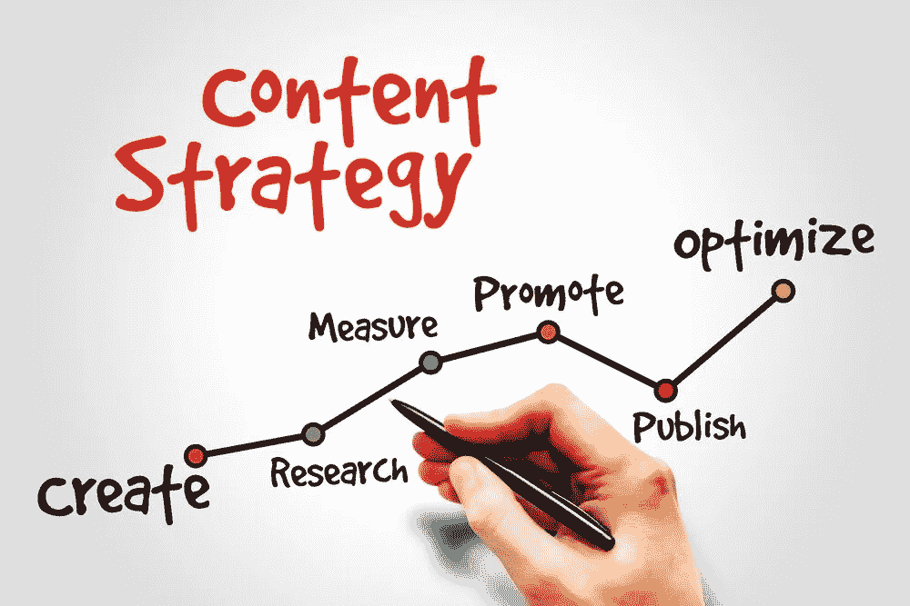

# 10 个最佳内容营销数字策略

> 原文：<https://medium.com/visualmodo/10-of-the-best-content-marketing-digital-strategies-c27e2cd971d9?source=collection_archive---------0----------------------->

关于内容营销，你需要知道的第一件事是什么。内容营销是一种将你的品牌推向市场的在线营销策略。无论你是想为一个网站、视频、书籍甚至是一个人赢得人气，你都需要运用内容营销的力量。在线内容包括视频、图像、动画、文章、网络研讨会、播客等等。

内容营销最重要的方面是能够教育你的读者，并为他们提供最有价值的内容。只要你的内容增加了读者(或观众)的价值，你就会让你的观众保持兴趣，并回来看更多。永远记住活跃在你提交内容的平台上。

*   用有用的内容创造价值

有用的、有趣的、娱乐性的内容，吸引你的观众并建立真正的价值。

众所周知，博客内容可以推动业务增长和扩张。与不写博客的企业相比，经常写博客的企业网站的流量和链接分别高出 77%和 97%。

社交媒体渠道上发布的内容在吸引市场的同时提高了知名度。

*   利用社交媒体吸引更多数字客户

欢迎来到关系[营销](https://digitalschoolofmarketing.co.za/courses/digital-marketing-course/)时代。社交媒体是吸引客户和建立有益关系的理想选择。

最重要的是，社交媒体需要人力资源的投资。你将需要管理你的在线社交社区，当然还需要具备与他们互动的必备技能。回报是社交媒体网站提供了接触大量受众的途径。社交媒体提供了与目标受众发展有意义关系的渠道。

*   优化您的搜索内容

95%的购买是从搜索引擎开始的。

当你适当地优化你的网站和搜索引擎的内容，你将提高你的排名，提供信任的证据，并为你的网站带来更多的有机流量。

利用像 Moz 和 WordPress SEO 这样工具来优化你的网站内容。

*   发挥社交广告的力量

[社交](https://digitalschoolofmarketing.co.za/courses/social-media-marketing-course/)广告将游客转化为顾客。付费社交广告触及那些最有可能购买的用户。

下面是它的使用方法:

创建并发布[您的客户需要了解的有用内容](https://visualmodo.com/blog/)。在社交渠道(脸书、Instagram 等)上发布并有选择地推广你的内容。)定义你的目标受众(那些想了解你的促销活动的人)。将行为和人口统计过滤器应用于您的受众，通过您网站上的登录页面获取销售线索。通过用 cookie 标记网站访问者来建立再销售受众。为以前的网站访问者提供高度集中的广告。

*   通过内容提供创造更多价值

免费电子书或电子邮件课程等优质内容的销售机会是传统“外向”营销的三倍，而成本却低 62%。

免费提供专属会员和简讯，为您的数字声誉增值。

*   通过行动号召推动事情发展

你必须要求人们做你想让他们做的事情。如果你不问，你就得不到。

70%的企业在其主页上没有行动号召。这使得将访问者转化为客户几乎是不可能的。引导你的访客去你想让他们去的地方，这样他们就会做你想让他们做的事情。

*   通过登录页面转换访问者

创建一个“全循环”营销策略来确立目标并执行策略来实现这些目标是至关重要的。

一个合适的在线营销活动为访问者提供一些有价值的东西，然后引导他们完成购买决策过程。

一个网站的登陆页面是用来引导潜在买家的必要工具。带有销售线索表格的引人注目的行动号召会让他们更接近销售，更接近您发展业务的目标。

*   建立您的电子邮件列表，提供选择加入服务

建立你的电子邮件列表对发展你的业务至关重要。发现你的产品或服务有价值的人希望听到你的声音。他们可能不准备购买，但如果他们在你的名单上，你可以保持有用的信息流，这样当他们准备购买时，你就是他们会选择的人。

不管你喜不喜欢，弹出窗口确实有用。提供一个免费的，超级有用的电子书，由你的一些博客文章编辑而成，以换取你的访问者的电子邮件地址。

*   鼓励员工参与内容创作

公司发展面临的挑战之一是创建足够多的相关内容，让客户需要或想要参与其中。

采取合作的方式来应对这些挑战通常会产生出色的结果。你也有最好的“品牌专家”在你的指尖，所以使用他们。

让您的员工参与内容创作，拓宽您的视野。员工拥有你的客户需要的知识，他们经验丰富的专业知识会比你投放的任何广告更能赢得信任。

*   通过电子邮件营销提高您的销售额

电子邮件营销一直被评为最有效的营销渠道。花在电子邮件营销上的每一美元平均回报为 44.25 美元。

一旦你采取行动建立了你的名单，是时候向你的粉丝群提供优惠了。但并不是所有的电子邮件营销都是平等的。

增加你的电子邮件营销的趣味，这样你的客户会对打开它感到兴奋。做一些与众不同的事情，让他们再次光顾，并向他们推荐你的产品。