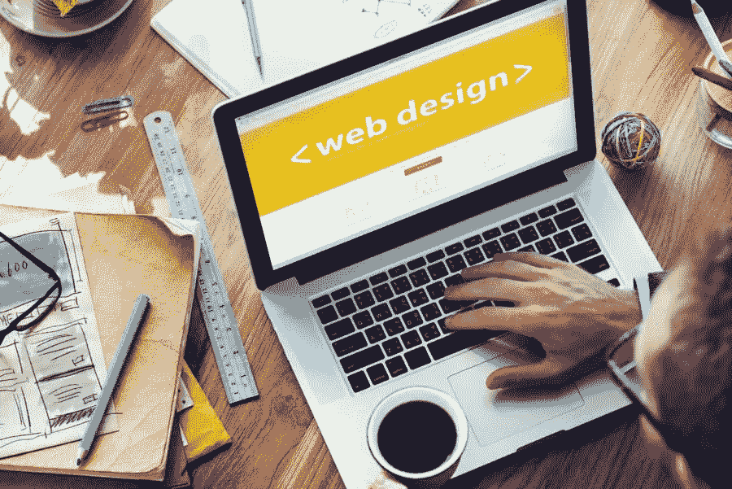
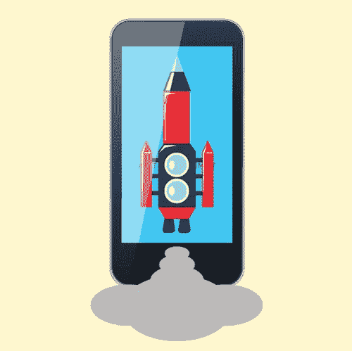
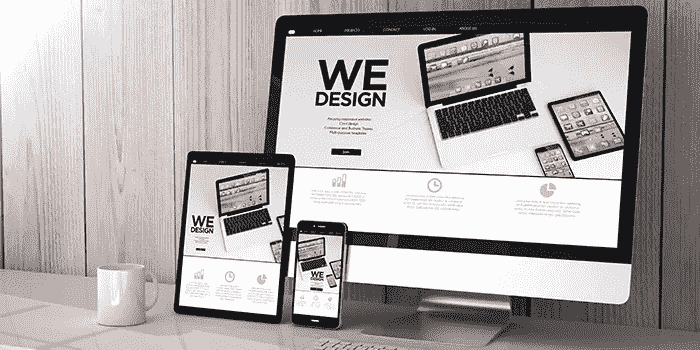

# 推动销售的 10 个网页设计技巧

> 原文：<https://medium.com/visualmodo/10-tips-for-web-design-that-drives-sales-ad780e61dec6?source=collection_archive---------0----------------------->

所以你的网站有大量的流量，这总是一件好事。这意味着你的在线营销运作良好，并带来了观众。然而，如果尽管有相当多的人浏览你的网站，但销售并没有增加，你可能需要对你的网页设计进行一些调整来推动销售。

从表面上看，网页设计可能与网站的外观有关，但它不仅仅是让网站漂亮。它还可以用来影响潜在买家和他们的选择。访问者可以在几秒钟内评估出你能提供什么，并且和搜索引擎优化解决方案一起，你的网页设计在帮助那个人决定是买你卖的东西还是转到另一个网站上起着至关重要的作用。

# 推动销售的 10 个网页设计技巧

一个网站管理员可以有很多理由来建立一个网站，而获得转化率是最重要的。任何人订阅你的时事通讯、填写联系表格或注册网上研讨会都是成功的，但让人们购买你的产品或服务是最终的转化，你的网页设计将与此有很大关系。这里有一些[网页设计](https://visualmodo.com/)技巧，将有助于推动销售。

# 保持简短的联系方式

很少有人喜欢填写表格，更不用说长表格了。只需将你需要的信息限制在姓名、电子邮件地址和邮政编码。保持你的注册表格简洁明了会鼓励更多的人乐意给你信息。

# 运用色彩心理学

在网页设计中，颜色可以是一个强大的工具，它们可以用来引起访问者的反应，有望导致转变。色彩心理学是关于理解与色彩相关的价值和情感，并在你的网页设计中很好地运用它们。例如，红色会产生一种紧迫感，对于宣传清仓[销售](https://visualmodo.com/psychology-into-logo-designing/)的页面来说会很棒。

# 让您的行动号召(CTA)按钮脱颖而出

你的行动号召或 CTA 按钮是你的网站邀请人们联系或购买的一个方面，所以重要的是你的访问者永远不要错过它。所以在你的网站上，把它放在文件夹的上方，让它更加突出。给它一个像红色一样引人注目的颜色也会有所帮助。

# 证明书

推荐书将有助于让访问者相信你的产品或服务是值得的。如果你的证明附有客户的全名和照片，那么这将有助于建立真实性和可信度。

# 炫耀那些徽章

不要羞于展示您多年来获得的信任、安全和奖励徽章。徽章可以给你带来信誉，帮助你获得访问者的信任，这可能会直接导致转化。

# 放一个视频

许多人没有时间或耐心阅读书面内容。一个关于你的企业及其产品的视频应该能引起他们的注意，因为它更容易理解。然而，确保视频简短，比如两到三分钟长。

# 提供免费赠品

你遇到过不喜欢免费东西的人吗？大概不会。每个人都喜欢免费赠品，所以送一些出去，让你的访客足够高兴，给你你想要的转换。它可以是免费订阅，免费试用，或免费送货，所有这些都可以吸引访问者的注意，包括那些只是随便看看你的网站的人。

# 让导航变得简单

访问者在你的网站停留的时间越长，你获得销售的机会就越大。然而，他们在你的网站上停留的时间长短很大程度上取决于浏览网站的难易程度。因此，更好地组织导航栏和网站地图，让你的访问者不会在浏览你的网站时迷路和沮丧，他们会在上面停留更长时间，并可能购买一些东西。

# 在登陆页面上写清楚标题

许多人根据他们在登录页面上看到的标题做出决定，所以要确保标题写得很好，并且总结了你的访问者将从你的产品或服务中得到什么。简洁而巧妙的标题会让你更有机会吸引读者。

# 让你的网站响应迅速

长期以来，移动用户的数量一直超过桌面用户，他们中的大多数人(如果不是全部的话)都在智能手机和平板电脑上进行网上购物。你不想错过这个机会，所以如果你的网站还没有手机版，那就努力把它做好。

这些只是你调整网页设计来推动销售的一些方法。现在就在你的网站上实施这些改变，增加你获得你想要的销售数据的机会。