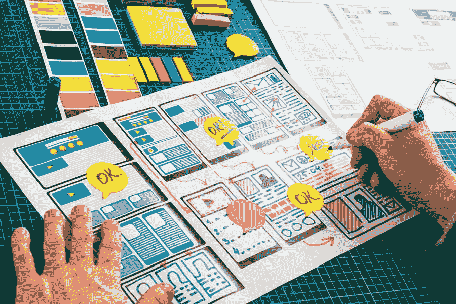

# 2020 年社交媒体需要的 10 种视觉内容

> 原文：<https://medium.com/visualmodo/10-types-of-visual-content-you-need-for-social-media-in-2020-7b662a354637?source=collection_archive---------0----------------------->

将社交媒体用于商业目的已经变得越来越必要。我们将探索你在社交媒体上需要的 10 种视觉内容。其他每一个有影响力的人或营销人员都想最大化他们在帖子上获得的喜欢、分享和参与的数量，这样他们就可以增加他们在受众中的整体影响力。越来越多的图形设计软件工具，以及互联网上涌现的一些数字营销课程，向我们展示了这是一项在未来几年，尤其是 2020 年非常重要的技能。

# 社交媒体所需的视觉内容类型

然而，你在社交媒体上发布和广告的内容是你和你的品牌的代表。对你发布的作品有一些背景知识是至关重要的，而且要与上下文相关。一篇格式糟糕、没有说服力、未经修改的帖子可能会对你和你的品牌产生反作用，让你的辛勤工作和努力付之东流。一旦上线，即使你把它们从源头上删除，它们也会一直在线，藏在某个档案馆里。

定制您的视觉内容和网站有助于您在竞争对手中脱颖而出，并为您增加市场份额和在线业务提供优势。为了确保您发布的视觉内容能够获得最大的吸引力，我们为您提供了 10 种视觉内容，您需要将这些内容发布到您的社交媒体上，以提升您的游戏并使您的内容迅速传播开来！

# 1 张图片

当你想到视觉内容时，与之同义的词是图像或图片。毫无疑问，图片是你的社交媒体内容策略的主导者。照片和图像使用了大量的颜色，在视觉营销中可以特别引人注目和足智多谋。它可以为社交媒体馈送添加必要的颜色流行，特别是对于 Instagram。

你一定注意到了，Instagram 上的大多数企业甚至个人资料都自始至终保持着一个颜色主题。它增加了您的提要的美感，使其更加生动和迷人。除此之外，它也为你的品牌定下了基调。你可以在提要中加入你的品牌颜色，并确保观众熟悉它们。这样，他们也会记住它，并将颜色与你的品牌联系起来。

此外，图片和图像往往会成为你的品牌的代言人，能够影响人们购买你的产品或服务。他们将你的核心信息快速传递给观众，而且据说对搜索引擎优化很友好。SEO 的重要性可以认为等同于成功。因此，使用图片来确保你的内容保持搜索引擎友好。

最棒的是，在图形设计软件的帮助下，你可以尝试不同的编辑或拼贴。同样，对于 Instagram feed，您可以在 3、6 或 9 个网格上分割图像。这将真正吸引你的观众的注意力。

# 2 个视频

视频是如今新的内容王。当然，图像是令人难忘的。然而，一个故事中的多个图片更值得保留。视频往往引人注目，能立即抓住一个人的注意力。还需要注意的是，视频往往比图像更容易被分享，这意味着如果你不在个人资料或网站上使用这些视觉内容，你将错过重要的业务。

更重要的是，视频也可以个性化。你在视频中的动作和手势比静态图像更能说服读者。它还可以用来合并其他元素，如图形、文本或动画。

视频增加了客户保留率，提高了你所有帖子的参与度。此外，他们有强大的能力通过与观众建立情感联系来吸引客户，据说这有利于你的品牌忠诚度。与图片和图像类似，视频对 SEO 非常友好，创建能够实现 SEO 好处的视频内容是一门艺术。

# 3 信息图表

好的内容创作的一个重要方面是传递信息。确保你的品牌对受众有帮助并增加其知识价值的一个重要方法是通过信息图表。他们能够简洁而精确地表达信息，这对于观众来说更容易理解。当涉及到向观众展示任何数据或统计数据时，使用图形比只写数字更有效。

信息图分享起来更舒服，可以把复杂的信息变成更容易理解的形式。从本质上说，它帮助听众在比阅读一篇报告或文章更长的时间内记住要点。这也更有可能留在他们的记忆中，主要是如果你使用颜色和图形来吸引他们。

# 4 行动要求(CTA)

行动号召是在你成功地让你的观众看到你的内容后，让他们做一些事情(将你的产品添加到购物车或喜欢、分享或关注一些东西)的一种方式。对于任何企业来说，这都是一个至关重要的因素。你可以创造出好的内容，但是如果你通过一个号召行动的按钮来完成它，它会为你的观众提供一个从你的公司购买东西的机会。

你可以尝试使用不寻常的字体和充满色彩的图像来影响你的观众，提高他们采取行动的可能性。CTA 在为一些销售或独家优惠做广告时特别有用。它们的位置也很重要。所以你必须确保它们被放在能产生更大影响的地方。

# 5 GIFs 和 Memes:社交媒体的视觉内容类型

迷因和 gif 是这十年来最流行的视觉内容形式。所有年龄段的人都喜欢开怀大笑，而迷因和 gif 经常为这一目的服务。模因通常更适合轻松的内容，并获得大量关注。尤其是年轻观众。最棒的是，它比任何其他形式的内容都更吸引千禧一代和 Z 世代。在今天这个快节奏的世界里，大多数内容都是针对千禧一代的，所以使用迷因和 gif 是明智的。

gif 的用途更广，可以用于公司和社交场合。这些图片是一种非常吸引人的视觉内容，通常由脸书和 Twitter 等社交媒体巨头制作。

# 6 教程

教程可以包括任何事情的一步一步的指导。这些可能以视频、图像、文本或三者结合的形式出现。

这种视觉内容为创作者留下了大量的创作和创新空间。它也为你的观众增加了价值，提升了你的品牌形象。现在，你可以创建很多东西的教程。从烹饪教程到 DIY 项目，你可以涵盖任何与你的品牌声音相符的内容。

# 7 张截图

截屏是解决问题或简单分享图片来解释描述内容的绝佳资源。它们可以用来说明教学内容或显示消费者对服务的评论。特别是，向客户展示积极的评价可以增加你的[客户影响力](https://visualmodo.com/5-things-to-consider-when-designing-a-website/)。

# 8 测验和视觉难题:社交媒体的视觉内容类型

观众的参与度可能会很高。如果你让他们参加关于你的产品和服务的测验和谜题。它们可以是一种创造性的方式，让你的产品知识更加清晰。否则可能过于抽象。一旦人们对一种产品产生共鸣，他们就更有可能购买它。

# 9 数据可视化

当你有大量密集的数据要呈现给你的观众时。数据可视化以及精确地用图形表示数据非常重要。最好使用数据可视化来描述事实、数字和推断。

观众可能在寻找特定的趋势和模式，而看到原始数据只会让他们不知所措。然而，图形、图表、地图和图解等。可以帮助提高你的品牌在观众心目中的形象。

# 10 绘画和漫画:社交媒体的视觉内容类型

绘画和漫画往往与模因略有不同，因为它们通常使用品牌调色板。因此，排版和其他视觉线索，改变和调整你的工作与你的品牌正确。

在你的画中引用或通过漫画策划故事可以帮助你建立情感联系。帮助你创造更有意义的影响。给你的图片语录配上合适的标签可以大大提高你的社交媒体参与度。

# 放大你的社交媒体游戏！

所以，如果你想提升你的品牌，并围绕它制造轰动效应，现在是你采用这些做法的时候了。如上所述，他们会帮助你增加你的观众。更多的观众意味着更多的业务增长。此外，创造引人入胜的内容还能确保消费者的忠诚度，这将有助于你保持品牌的长久性。这十种视觉内容将使你的内容多样化，有帮助，有吸引力。