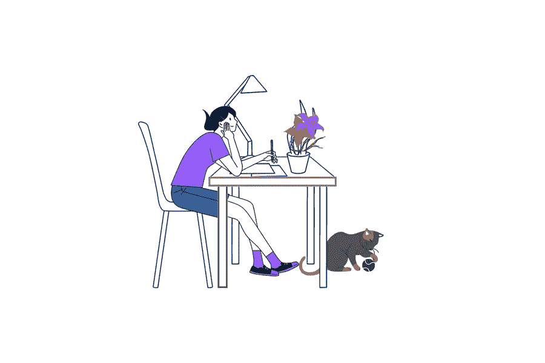

# 每个大学生应该知道的 10 个 WordPress 黑客

> 原文：<https://medium.com/visualmodo/10-wordpress-hacks-each-college-student-should-know-cafe265b2dc3?source=collection_archive---------0----------------------->

你打算在 WordPress 上开一个博客吗？或者，您是该平台的居民，但您的内容并未吸引多少用户和读者。WordPress 容纳了许多推广他们的服务和故事的博客和企业。因此，区分它们变得可读和可爱是至关重要的。在本文中，您将学习每个大学生都应该知道的 10 个 WordPress 黑客。

阅读本指南，了解 10 个让你的 WordPress 博客变得有趣的基本技巧。请注意，黑客代表积极的提示，不会对平台所写的代码造成任何损害。任何时候都应该避免这种意图，因为法律后果可能很容易适用。

# 你的 WordPress 网站的 10 个超级黑客

让我们简单描述一下 WordPress 的用途。WordPress 是一个内容管理软件。在上面建立和运行一个网站是有帮助的。例如，英国广播公司和《纽约时报》就住在那里，他们两个有很多访客，很受欢迎。说到学生对平台的使用，他们可能只是在那里运行他们的博客。否则，杰出的学生喜欢经营他们初创公司的网站进行推广。如何提升你的博客？

# №1 做一名 SEO:大学生的 WordPress 黑客

唯一有趣的内容是在平台上获得领先。你可以发布数百条关于吸引人的内容的信息，但是别人看不到。SEO 代表搜索引擎优化，有助于在搜索引擎的第一页推广你的博客。要做到这一点，你应该在关键词和短语上下功夫。你的每篇文章都应该有一定数量的重复关键词，这将使你的博客更加显眼。

# №2 坚持一种风格

没必要以不同的方式编辑你的帖子。如果你写了你的第二篇或第三篇帖子，确保它有一个与前几篇类似的结构。读者会因此而爱你，并且会更好地理解你的内容。例如，分成几个块，并有表格、图片等的文本更容易理解。你应该使用的字体类型也是如此。用一种字体制作你的博客。

博客的最佳字体是:

*   机器人；
*   奥斯瓦尔德；
*   开放桑斯。

避免漫画风格的字体，因为它们很难阅读。

# №3 编辑照片:大学生写字板小技巧

忘记上传你直接从谷歌上拍摄的原始照片。WordPress 有一个很好的插件，叫做 NextGEN Gallery 插件。您可以将其用于照片、添加标签、更改标题、颜色等。除此之外，要非常小心版权。每当您下载一张照片时，确保如果您将其用于博客，不会因此受到起诉。

# №4 提供社交媒体链接

你的 WordPress 站点应该有联系信息。所以，人们最感兴趣的是社交媒体的链接。如果你经营一个博客，在那里你作为一个专业人士宣传你的服务，LinkedIn 的链接会很棒。否则，只需添加 Instagram、脸书和你的电子邮件的链接。这样的技巧让读者明白你是一个真实的人，不要隐藏你自己或你的角色。

# №5 组织你的内容和工作量

如果你和其他作家或学生一起经营博客，确保组织是一流的。每个帖子都可以标记为待审核、草稿和已发布。因此，您可能会忽略什么是悬而未决的，并在需要时进行更正。你的仪表盘会很好地为你服务，因为所有的帖子和文本都要经过你，这听起来可能有点奇怪。另一件要提到的事情是，你可以通过依靠定制写作服务中的文章专家来优化你的内容。例如，当你对帖子缺乏灵感时。

# №6 编辑你的工具栏:给大学生的提示

正如上面所暗示的，你所有的帖子应该看起来一样，有相同的结构。为了增强你的编辑体验，你可以使用一个名为 TinyMCE Advanced 的插件。因为它只允许分配编写和编辑所需的工具。所以，你不会花时间去寻找报价编辑或平板电脑等。

# №7 记忆键盘快捷键

类似于工具栏，你要多了解键盘快捷键。特别是，它们对于管理和调节帖子下的评论非常有用。通过按快捷键，您可以立即批准评论或将其标记为垃圾邮件。