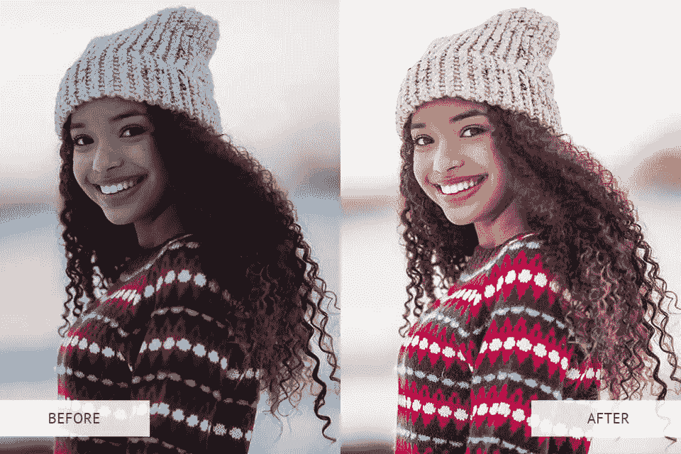

# 最佳 Lightroom 预设，可轻松快速地编辑照片

> 原文：<https://medium.com/visualmodo/15-best-lightroom-presets-for-easy-and-fast-photo-editing-581797f90fbe?source=collection_archive---------0----------------------->

应用 Lightroom 预设将帮助您对照片进行专业和一致的颜色分级，并更快地编辑整个照片。预设加速照片后期处理，并允许您应用各种效果，如黑白、单色、胶片、彩色等。有许多专门为人像、婚礼或街头摄影设计的滤镜。在本文中，我们将分享 15 个最佳的 Lightroom 预设，以便轻松快速地编辑照片。

# 工具包中应该有的顶级 Lightroom 预设

这是一个必备的 Lightroom 预设列表，您可以在移动应用程序或桌面程序的 4–6 和 CC 版本中应用这些预设。

如果您需要快速调整照片中的色调，那么最快的方法是将现成的预设导入 Lightroom。从网上下载滤镜后，将其添加到 Lightroom。要将滤镜上传到“开发 Lightroom”模块，右键单击**预设面板**。所以，在下拉菜单中选择**导入**。

你会看到**导入预置**窗口。现在，您可以在预设面板中找到新的滤镜。此外，它们在中也有提供。与各种版本的 Mac 和 Windows 程序兼容的 lrtemplate 和. xmp .格式。

# 1.肖像专业系列

**摄影使用:**人像

这些预设混合并优化光线、色调和颜色。它们中的每一种都可以增强肤色，这使它们非常适合人像、自拍、工作室人像等。而且，这个集合可以帮助一个摄影师改善肖像，强调五官，使图像更清晰，更生动。

一些亮度调节预设可以稍微提高亮度，使肤色看起来更自然。此外，通过提高亮度，你还可以掩盖皱纹、毛孔和其他皮肤缺陷。

# 2.婚礼经典系列 Lightroom 预设，用于快速编辑照片

**摄影用途:**婚礼、订婚

这个系列优化了婚纱照中的光线和色彩。此外，通过使用这些壮观的 Lightroom 预设，您可以让您的照片看起来明亮、喜庆，就像是由著名的[婚礼摄影师](https://visualmodo.com/5-tips-how-to-choose-your-wedding-photographer/)处理过的一样。无论是室内还是室外照片，无论是哪种类型的照明，这个选择都非常棒。

# 3.新生儿系列

**摄影使用人群:**儿童，新生儿

这个过滤器集合允许你给你的孩子的照片添加华丽的、令人兴奋的颜色。明亮自然的色调有助于传达无忧无虑的童年氛围。因此，这个系列包括各种各样的选择，深暗色调，增加对比度和细节，暖色调使皮肤更光滑，平衡的白色减少高光。

在这里，您还可以找到用于处理白色和彩色背景的预设，非常适合增强在工作室和户外拍摄的照片。

# 4.majestic Landscape Collection Lightroom 预设用于快速编辑照片

**摄影用途:**建筑、风景

此集合包括为编辑在各种天气条件下拍摄的照片而设计的最佳 Lightroom 预设。它们非常适合增强在雾中拍摄的风景图像。除了霜、雾、黄昏，还有更多。

有了这些滤镜，你可以让你的摄影作品更加生动，更具视觉吸引力。因此，配置针对不同季节进行了优化。最后，考虑到各种季节性配色方案，你可以改善自然照片。