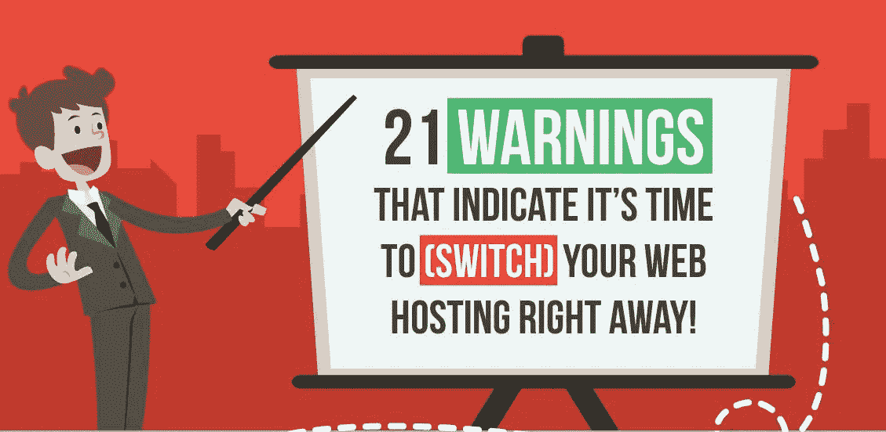

# 低质量网络主机的 21 个警告信号

> 原文：<https://medium.com/visualmodo/21-warning-signs-of-a-low-quality-web-host-edc3827fa7e9?source=collection_archive---------0----------------------->

## 初学者指南[信息图]

对于那些刚刚开始网上之旅的人来说，犯一些无辜的错误是很常见的。由于一个人需要处理很多事情来确保他们的在线业务以正确的方式建立，你很可能会在这个过程中犯一些错误。新手博主和初创公司容易犯的一个错误是选择低质量的网络主机。

# 低质量网络主机的 21 个警告信号

虚拟主机在确保你的网站在任何时候都以最佳状态运行方面发挥着巨大的作用。它还确保您的网站免受所有网络威胁。此外，它还在存储和带宽方面为您提供急需的支持，确保随着您的业务增长平稳扩展。

但是，当您必须从各种可用选项中进行选择时，问题就出现了。对于一个新手来说，不知道应该寻找什么样的虚拟主机功能，选择合适的虚拟主机是很困难的。而这反过来又会导致你选择一个错误或糟糕的网站[托管](https://visualmodo.com/)，这可能会阻碍你的业务增长。

因此，为了帮助你做出正确的决定，这里有一个初学者指南，强调了低质量网站主机的 21 个警告标志。这些迹象将有助于你了解基本的主机功能，你需要寻找当购买网站主机。它还会帮助你弄清楚你是否选择了一个低于标准的主机，在这种情况下，你需要立即切换到另一个网站主机，以避开可能损害你的品牌信誉的问题。

因此，看看信息图就知道这些警告标志是什么了，更多信息，[请点击此处](https://hostgatorcouponcode.in/signs-of-bad-webhosting/)查看完整的主机警告标志指南。

**hostgatorcouponcode . in**的团队提出了 21 条警告，表明是时候立即(切换)您的虚拟主机了[信息图]

[https://visual modo . com/21-warning-signs-low-quality-we B- host-infograph/](https://visualmodo.com/21-warning-signs-low-quality-web-host-infographic/)