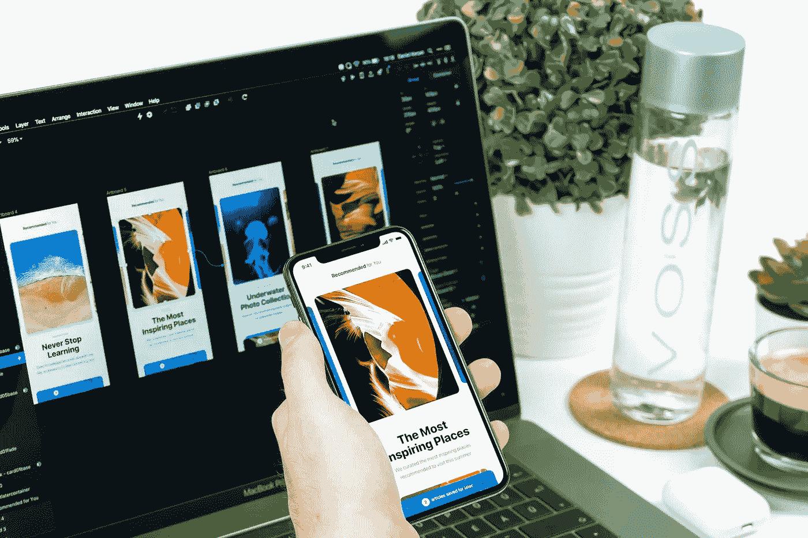

# 每个 UX/UI 团队需要实现的 3 个工具

> 原文：<https://medium.com/visualmodo/3-tools-every-ux-ui-team-needs-to-implement-8657af5ebe05?source=collection_archive---------0----------------------->

虽然 UX 和用户界面设计重叠，但它们有许多关键的区别，特别是在它们如何影响消费者体验方面。UX(用户体验)专注于使产品和技术简单易用，而 UI(用户界面)本质上是任何产品或技术的外观和布局。UX 设计是每个企业成功的关键。在这篇文章中，我们将分享三个神奇的工具，每个 UX UI 团队都需要实现。

这是因为消费者的用户体验越无缝，产品或技术在更广阔的市场中的渗透力就越大。另一方面，UI 设计确保产品或技术在表面上有吸引力。

# 每个 UX UI 团队需要实现的 3 个工具

为了实现这一点，设计师关注交互模型、产品颜色等指标。此外，他们建立原型，并在焦点小组内进行测试，以确定消费者的反应。这些以及其他几个[设计策略](https://visualmodo.com/7-best-wordpress-web-design-strategies-to-build-audiences-trust/)的实施是为了与消费者建立信任。为了创建引人入胜的设计组件，UX/UI 团队利用了各种工具。这些工具为设计团队提供了独特的功能。更重要的是，它们大多是特定于项目的，这意味着团队的特殊需求和任务应该决定它使用什么工具。

因此，团队必须对每种工具的预期以及它们适合什么类型的项目有一个公平的想法。下面是每个 UX/UI 设计团队为了更好的输出需要使用的三个工具。

# 1.视觉

InVision 是 UX/用户界面设计者中流行的工具。这是一个非常注重团队协作的工作流平台。它不仅允许个人单独工作，而且还允许在一个团体内交换意见。它允许团队成员对正在进行的项目进行实时评论，并使用讨论板分享建议。这个特性很重要，因为它为持续不断的反馈和建议创造了空间，增强了团队在这个过程中的动力。

Vision 表现出色的另一个关键领域是原型制作。有了 InVision，将静态设计文件转化为原型就像在公园散步一样简单。更有趣的是，它允许在应用程序中添加手势和过渡等效果。这适用于 Android 和 iOS 应用程序，并有助于制作原型动画。

尤其是为了简化 UX/UI 设计师的工作。例如，它最近增加了 Craft Prototype，这是一个简化草图和视觉之间联系的功能。视觉让它的使用物有所值。因此，伟大的 UX 和 UI 工具得以实现。

在一篇评论中，一位产品设计负责人如此专业地描述了他们的体验:“我们喜欢使用 InVision 的关键点一直是它的简单性。你只需导出文件，导入到 Vision，点击-点击-点击，你的原型就建立起来了。分享和评论也很得心应手；一切都在一个地方发生，项目不断向前推进。”这里列出了 InVision 的主要优点和缺点，以便更清楚地了解它的前景。

## 赞成的意见

*   它是免费的。
*   Vision 是用户友好的，可以帮助初学者快速学习或按照自己的速度学习。
*   团队可以整合原型草图和图像，而不需要使用拖放功能。
*   对于团队协作，视觉是无与伦比的。它被明确地设计来简化团队使用的任何反馈系统。
*   InVision 允许与 JIRA 和 Slack 集成。

## 骗局

*   InVision 使得团队很难在它的程序上建立线框。
*   团队在与客户分享他们的项目时可能会遇到困难。
*   您可能需要为任何打字和绘图需求获得单独的工具，因为 InVision 不提供这些选项。

# 2.要实现的 UX UI 工具草图

草图是最受欢迎的矢量工具之一，因为它专注于屏幕设计。这是伟大的绘图，并允许您调整图像的大小，同时保持其清晰度。让 Sketch 成为如此强大的工具的原因是，除了在绘图中使用之外，它还是专业标志设计、线框和原型制作的强大工具。它的多用途使它成为移动设计者和开发者的最爱。设计团队可以利用该工具为各种智能设备设计令人惊叹的用户界面。

Sketch 考虑了计算机和移动设备之间不同的导航结构。一般来说，手机用户和电脑用户在用户体验上存在差异并不罕见，后者更容易使用。然而，当草图被用于设计时，这种差异并没有被注意到。许多设计师证明了这样一个事实，即 Sketch 本质上是一个由设计师构建的简化工具，用于设计师专门协助数字接口。

Sketch 提供了一个促进团队协作的协作平台。设计时，它的网格和引导线可以轻松地提起和移动对象。它允许各种插件，并可以与各种其他应用程序集成，如吉拉云和 Zeplin。这样，对于需要同时使用不同工具的任何设计需求，它都是一站式商店。

# 不利方面

然而，该工具的一个缺点是它只适用于 Mac 设备。此外，您需要在使用前付款，尽管这是一次性付款。在首次支付应用程序后，你可以想用多久就用多久。任何额外的费用都将用于许可证更新，尽管这是可选的。许可证每年更新一次，用户可以访问该工具的任何更新。这里是它的重要资产和次要障碍的摘要。因此，伟大的 UX 和 UI 工具得以实现。

## 赞成的意见

*   自动保存您正在处理的任何项目，即使出现中断。它还同时提供多个画板。
*   作为基于向量的设备，默认情况下每个元素都是向量。
*   对设计高质量模型感兴趣的团队会发现 Sketch 特别有用。
*   创建将系统导出到其他应用程序。即使在移植时，它也能保持创作的完整性。
*   此外，Sketch 允许设备镜像。它将使您能够在不同的设备上镜像设计，以确定它们的外观。
*   Sketch 允许轻松地创建和重用图标和其他元素。

## 骗局

*   草图对于调色板的创建并不理想。
*   尽管 Sketch 相对较小(12 MB ),但它可能会降低设备的运行速度。
*   可能需要一段时间让团队中的每个人都熟悉如何使用该设备。
*   插件需要在平台上有效使用。

# 3.迷惑

Maze 是一个在线可用性测试工具，非常适合准备可用性测试/远程 UT 设置。专门从事数据驱动设计的设计师发现 Maze 在这方面非常有用。Maze 准备可用性测试任务，在视觉或草图中使用原型。它与真实用户合作，将原型转化为可操作的见解。这些任务被称为使命，是用户的链接。这使得测试过程变得容易，使得用户更有可能愿意经历这个过程。因此，伟大的 UX 和 UI 工具得以实现。

Maze 也非常适合管理反馈。一旦用户执行了一项测试，Maze 就会打开一个仪表盘，显示所执行操作的概况。例如，它显示了成功率以及每次测试完成所需的时间。此外，用户可以对设计发表评论。这将让你的团队了解什么可行，什么不可行。Maze 为设置和组织测试会话提供了一个可靠的系统。

Maze 的主要吸引力在于它让设计师在设计阶段就可以选择测试产品。因此，它为设计团队提供了执行完美设计过程所需的数据。这一点尤其重要，因为它可以确保设计师不会对他们产品的性质一无所知。当试图吸引客户时，你的团队熟练使用诸如迷宫这样的工具，再加上令人印象深刻的设计方案，可以为你赢得一些额外的分数。

## 赞成的意见

*   迷宫很有趣，也很容易使用，有直观的花费和分析。
*   非常适合构建和测试设计测试。
*   它提供了一个无缝的内聚系统来跟踪任何设计测试的成功率。
*   Maze 是移动的，也是兼容浏览器的。

## 骗局

*   Maze 对某些屏幕尺寸有所偏爱。
*   它相当昂贵。

# UX UI 工具实施结论

保持凝聚力和协同对于任何团队都是非常重要的，包括设计团队。因此，团队使用的设计工具必须考虑到灵活性和协作性。上面讨论的三个工具在这方面非常出色。其他因素包括团队的设计需求、设备与所选工具的兼容性，以及定价和成本。本质上，一个伟大的设计团队需要不断更新知识。目标应该是让每个团队成员变得自给自足，用在线标志设计工具、网站布局等知识武装自己，同时仍然作为一个团队有效地工作。