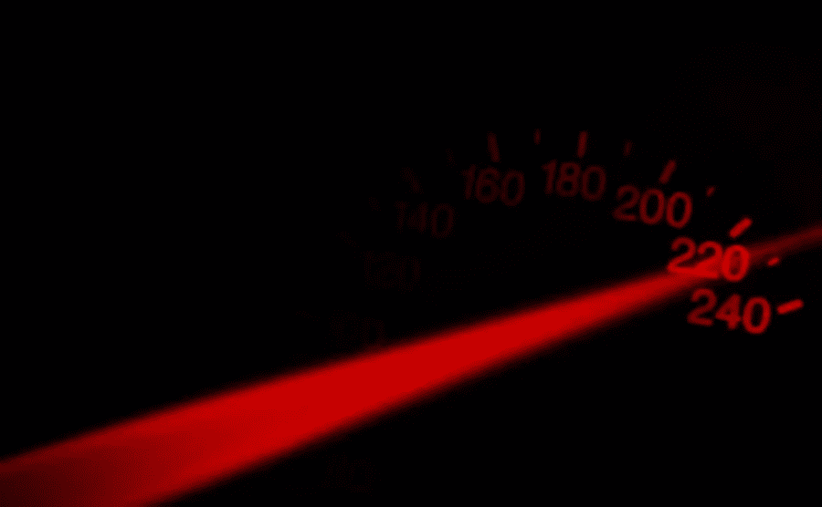

# 好的网页设计可以提高 SEO 性能的 3 种方法

> 原文：<https://medium.com/visualmodo/3-ways-good-web-design-can-improve-seo-performance-b50f5c1fac14?source=collection_archive---------0----------------------->

拥有一个为搜索引擎优化的优秀网站比以往任何时候都重要。超过 80%的互联网用户本能地转向搜索引擎来查找信息、产品和服务以及他们在线需要的其他东西。这个领域的竞争也比以往更加激烈，所以在搜索结果中脱颖而出是必须的。搜索引擎优化或 SEO 是一个至关重要的数字营销工具，但它不能单独使用。你对网站做的其他事情会影响你的 SEO 表现，包括网站的设计方式。好的网页设计有三种方法可以提高你的网站的 SEO 性能，我们将在这篇文章中仔细研究一下。

# 好的网页设计可以提高搜索引擎优化性能的方法

# 性能为王

用户没有 8 到 10 秒的时间来等待你的网站加载。一般的互联网用户希望在最初的 3 到 4 秒内看到屏幕上的活动，所以你必须相应地设计你的网站。拥有一个有很多沉重的视觉元素的网站不再是一条出路。

当今市场，性能才是王道。如果你希望你的网站有一个奢侈的设计，你必须加倍努力地考虑保持性能。这就是为什么像 WSI 数码网络这样的顶级设计公司更强调为性能而设计。

你还可以做其他事情来提高性能。例如，您可以使用加载(或延迟加载)来确保内容快速加载。你也可以添加一个加载动画来进一步延伸用户的注意力。

# 干净的代码和功能设计可以提高 SEO 性能

好的网页设计有助于 SEO 性能的另一个方法是使网站更容易被抓取。诱人的做法是利用大量的视觉元素使网站更吸引人，更有吸引力；这种方法没有错。但是，视觉元素是不可抓取的。因此，网页设计可以提高 SEO 性能的一个很好的方法。

你必须给图片和页面上的其他视觉元素添加 ALT 标签，这样搜索引擎才能识别它们。爬虫甚至会索引你的视觉元素(即照片和插图)并将其包含在图片搜索结果中，这对你的 SEO 表现也有好处。

作为一个额外的好处，给图像添加 ALT 标签是一个很好的编码实践。您可以扩展干净和一致的编码来进一步提高网站的 SEO 性能。

# 设计中的纯 SEO

最后但肯定不是最不重要的，有直接影响 SEO 性能的设计元素。例如，你放在页脚的信息在你做本地 SEO 的时候会很有用。以 WSI 数码网的网站为例，你可以看到布局是多么重要。

这家网站设计公司增加了大量的行动号召和一个真正代表他们的页脚。看到公司的网站结构，知道网站本身在 SEO 方面表现得非常好，你会有很大的信心。

这是网页设计影响网站 SEO 性能的三种方式。使用本文中讨论的技巧和见解来改进您自己的站点，并提高其在搜索结果中的性能。