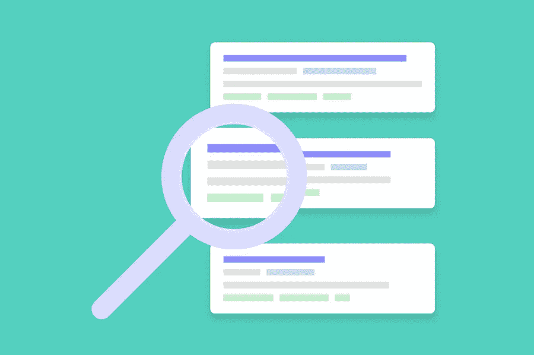
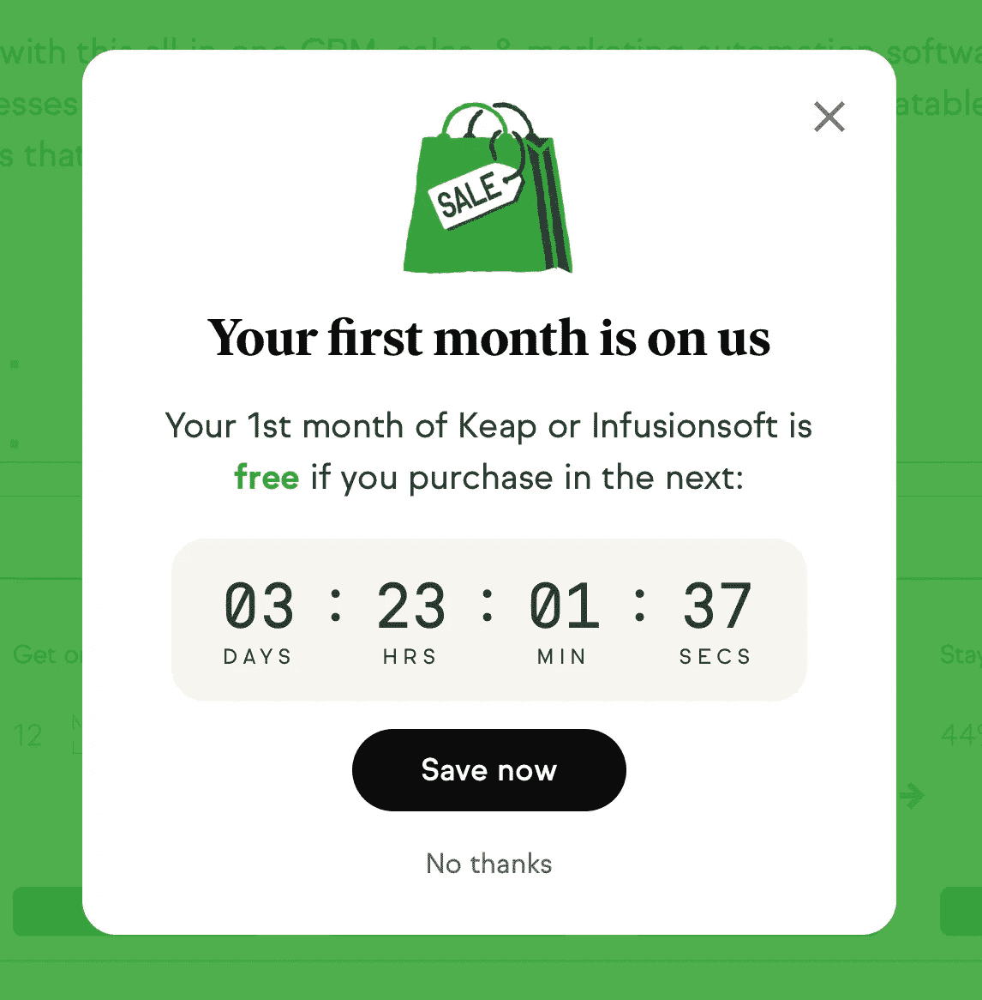
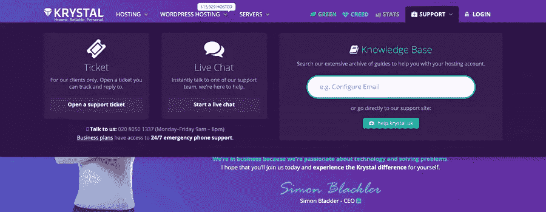
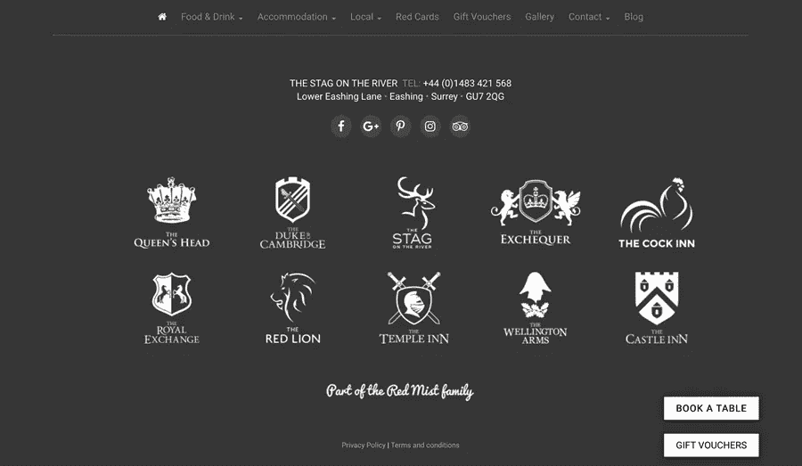

# 提高网站转化率的 3 种方法

> 原文：<https://medium.com/visualmodo/3-ways-to-improve-your-website-for-better-conversions-f7c36d9afb54?source=collection_archive---------0----------------------->

你的网站是用来销售的。当然，它应该看起来很棒，有时会让你的读者发笑。它应该有惊人的摄影，易于博客文章，以及伟大的产品和销售网页。但是别忘了，你的网站是用来销售的。在这篇文章中，你将学习提高网站转化率的三大方法。

# 大多数网站的问题是…

它们是由网页设计师创作的。(无意冒犯网页设计师。我也是。)大多数网页设计师关注的是设计，而不是你的商业目标。不幸的是，你的网站不仅仅是为了好看，而是为了销售(只是重复我自己，这样你就不会忘记)。

设计师喜欢制作令人惊叹的图形和惊人的滚动，视差页面，以及各种各样的铃铛和哨子。他们喜欢设计。谁能责怪他们呢？

他们通常不做的是:通过网站元素和搜索引擎优化的战略使用，驱动你的访问者到你的网站目标。

设计师，或者他们的雇主，专注于手头的工作——网站创建，而不是你的实际目标。这就是为什么我用不同的方式进行网页设计，以最终目标(销售)为出发点。你也应该这样。

# 你如何确保修复你的网站？

这里有一些方法可以改进你的网站，帮助你通过你的网站获得更多的客户。

# 1 关注你的主页，以获得更好的转化率

你的网站上最受欢迎的页面通常是主页，所以从那里把访问者引向你的主要商业目标是至关重要的。这个目标可以是:

*   更多地了解您的业务
*   注册您的电子邮件列表
*   发现你最畅销的产品

诸如此类。每个企业都不一样，并且随着企业和一年中的时间的变化而变化。

注意:小心不要操之过急，以为每个人都会在第一次拜访时购买或致电。尤其是当你出售昂贵的产品或服务时。

这里有一个来自 Keap 的例子，他们鼓励访问者到他们的主页试用他们的软件:

行动步骤:检查你主页的顶部区域，确保你把访问者引向你网站的首要目标。退出意向弹出窗口对于转化客户也很有用。

# 2 确保你的访问者能够联系上(尽可能容易)

另一个基本的网站问题是不允许你的访问者尽可能容易地联系。毕竟，你确实想听听你的潜在客户(甚至现有客户)的意见，对吗？

我确信你有一个联系页面(或者至少我希望如此),因为这是最重要和最常见的页面之一

*   在线联系(你的电子邮件或联系方式)
*   写信给你的邮件或访问你的商店(即。你的地址)
*   给你打电话(你的电话号码或热线)

但是有其他方法可以让这个任务变得更容易，特别是如果你有一个物理位置和电话号码的话。

# 将它添加到标题中，以提高网站的转化率

标题经常出现，如果不是一直出现的话，那么为什么不多加利用呢！

像这个标题来自一个叫做郑秀晶的虚拟主机公司，他们确保他们的电话号码，支持网站和电子邮件都在标题中，这样他们的客户就可以很容易地联系上(在任何页面上，在任何时间)。这使得现有客户和新客户更容易找到和联系他们。

# 将其添加到页脚，以改善网站更好的转换

另一个常见的方式是在页脚提供你所有的联系方式。类似于上面的页眉示例，但是现在你有了更多的空间。

一个来自我最喜欢的餐馆之一的例子(河上的牡鹿)，在英国的戈达尔明(离我住的地方很近)。他们有一个页脚，不仅提供所有你需要联系的信息，还有他们的姐妹餐厅和预订链接。他们显然在考虑如何让你的生活更轻松！

行动步骤:在尽可能多的地方(页眉、页脚、联系页面等)放置你的业务联系信息，以便人们尽可能容易地联系到你。

# 3 将你的导航集中在最重要的事情上

你可能没有意识到，但是你放在导航中的东西(也就是菜单)会对你的访问者产生很大的影响。它实际上是你网站上点击量最大的区域之一(它出现在每个页面上)，因此非常强大。所以，你需要认真考虑你在菜单里放了什么，因为这些链接会导致访问者更频繁地访问这些链接到的页面。

我最近不得不认真反思我的导航，因为:

*   当你包括一个标志并且考虑移动的时候，空间是有限的
*   说到选择，少即是多(你可能听说过著名的果酱研究)

所以当你创建下一个版本的网站导航时，把它分解并重新思考，然后再做一遍。

1.  你的网站上最重要的页面是什么(销售页面、产品页面、联系人、关于、博客)？)
2.  可以把一些放在一个子菜单中，主菜单概括所有的内容吗
3.  有些可以放在页脚，因为它们没有被使用，也没有推动业务目标(条款和条件、团队、工作)

# 例子，以改善网站更好的转换

这里有两个很好的例子，让你了解不同的行业是如何解决这个问题的:

Coschedule 为 WordPress 提供博客编辑和日程安排软件，他们的重点是让人们注册他们的产品。因此，他们的菜单仅限于潜在客户最关心的领域。

你甚至可以在菜单上看到他们的博客(顺便说一句，这很棒)。他们专注于他们的业务目标！

Chris Drucker 是营销领域一位受欢迎的企业家，他专注于许多业务领域。这些包括他的播客、演讲以及获得他的私人会员资格。正如你所看到的，它们都是菜单中的焦点(以及他的联系人、关于和博客)。

行动步骤:看一下你的菜单，看看有什么可以去掉的，把重点放在最重要的元素上。让你的访客更接近购买的东西。现在你有了一些可以放在你网站上的想法。每个月花一点时间回顾和改进你的网站。

# 审查以下所有内容，以改进网站，提高转化率

*   你的主页——考虑你的主要商业目标
*   联系您的企业有多容易—在适当的地方添加
*   菜单有多集中——根据最有用的页面进行调整

它会带来更多的顾客，最后，我可以向你保证。