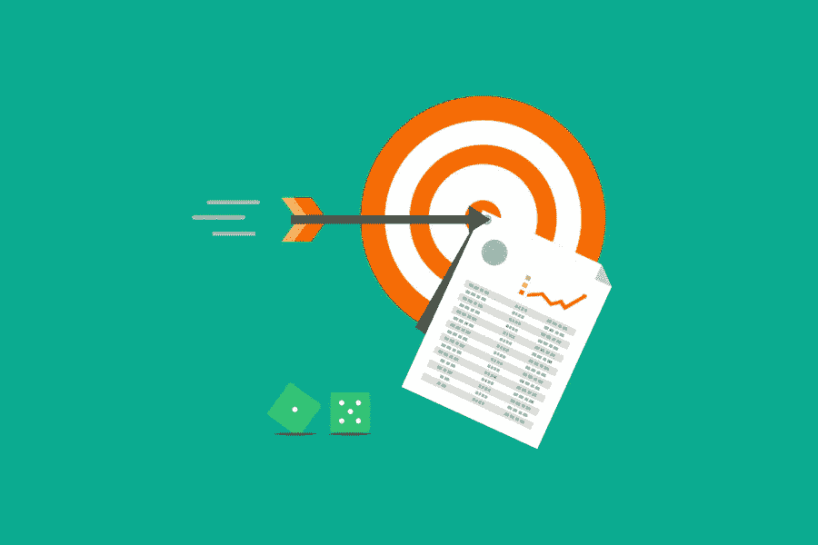

# 36 个内容营销工具基本工具箱

> 原文：<https://medium.com/visualmodo/36-content-marketing-tools-the-essential-toolbox-c271c880d5f5?source=collection_archive---------0----------------------->

正确的内容营销工具可以将任何内容营销策略转化为高度成功的计划。问题？有几十种工具可供选择。你怎么知道哪些工具该用，哪些该留？在这篇文章中，你会看到最重要的内容营销工具。

我研究了最好的内容营销工具，当你的目标是在互联网上管理、创建和分发你的内容时，这些工具会有所不同。避免所有的混乱。只需选择以下 36 个工具中的几个。让我们开始吧…

# 内容创建工具

内容营销的成功始于向受众提供优秀的内容。使用这些内容创建工具来研究和创建您的内容。

# 1.使用网站:搜索

你知道你以前在你的网站上写过一些可引用的东西，但是不记得它在哪个帖子里了吗？

或者，需要搜索第三方网站寻找研究素材吗？站点:搜索是一个简单的技巧，可以让你将搜索限制在特定站点的内容上。这是公式:地点:*samplewebsite.com*【关键词】

写了一篇关于图书编辑的文章，你记得在 becomeawritertoday.com 上读到过相关内容吗？把公式输入谷歌是这样的:site:becomeawritertoday.com 图书编辑。所以，你的搜索会显示出 becomeawritertoday.com 所有与图书编辑相关的帖子。

# 2.在 Giphy 中搜索

使用 Giphy Chrome 扩展找到完美的 GIF。采取以下四个步骤:

1.  首先，打开 Chrome 内部的扩展
2.  其次，进行搜索
3.  选择一个 GIF
4.  最后，将 GIF 拖放到您的文档中

Giphy 提供了对其扩展的支持，并且它在应用程序内部工作，例如:

*   脸谱网
*   推特
*   谷歌邮箱

# 3.谷歌的内容营销工具探索工具

你知道你可以在不离开谷歌文档的情况下进行谷歌搜索吗？当使用谷歌的“探索”工具时，这是可能的。

突出显示文档中的关键字，右键单击，然后选择“浏览”您会注意到在文档的右侧栏中打开了一个搜索结果图标，其中有三个研究选项:

1.  网
2.  形象
3.  驱动器

# 4.谷歌快讯

通过在新闻发生后立即报道行业内的新闻来提高你的内容营销效果。当有趣的事情发生时，使用 Google Alerts 向您的帐户发送通知。设置提醒很简单:

1.  首先，点击这里打开谷歌快讯
2.  其次，在搜索框中键入关键字
3.  点击“创建提醒”
4.  最后，通过点击“显示选项”获得实时提醒选择“发生时”作为您的“频率”设置

# 内容监管工具

有时候你需要收集别人的内容，而不是自己创造一切。因此，这是一个称为内容监管的过程，有一些高质量的工具可以帮助简化这项工作。

# 5.Curata 内容营销工具

Curata 允许您使用作者、新闻网站、关键字和博客文章作为内容来源。此外，使用直观的仪表板添加评论、图像，甚至共享或安排您收集的内容。

# 6.邮政规划员

Post Planner 的主页引用了 Buffer 和 Buzzsumo 的研究，使用他们的应用程序可以产生 510%的参与度。这个工具使用过去的表现来为你挑选可分享的内容。围绕这些精选内容创建社交媒体帖子后，Post Planner 允许您将帖子直接拖放到内容日历中。

# 7.拼趣

使用 Pinterest 管理视觉内容以备后用。建立收集图像和信息图表的公告板。创建博客帖子或社交媒体帖子时，您可以添加标签和链接来帮助您搜索和查找内容。

# 8.口袋

有了 Pocket，你可以使用浏览器书签快速保存内容。使用标签来标记每一条内容，使您可以随时轻松找到自己喜欢的主题。

# 9.勺子. it

Scoop .它自动化了内容管理过程。在您的帐户中，使用感兴趣的区域来构建主题页面。接下来，告诉应用程序使用 RSS 源、网站、搜索和博客来获取相关内容。在发布下一篇文章或社交媒体帖子时，使用精选内容。

# 社交媒体工具

社交媒体是任何内容营销计划的重要组成部分。如果你不小心的话，它也会超过你的时间表。使用这些工具来帮助您:

*   分析活动效果
*   自动化你在社交媒体上的发布时间表
*   跟踪和评估接下来要使用哪些新的内容创意

# 10.BuzzSumo 内容营销工具

使用 Buzzsumo 查看各种社交媒体平台上分享最多的内容。

它可以帮助你发现有影响力的人，以及他们在社交网站上分享什么类型的内容。这在寻找合作机会时非常有效，因为有影响力的人会为你分享你的内容。你也应该使用这个工具来跟踪热门内容，寻找关于创作下一篇博文的新想法。

# 11.Followerwonk

Twitter 是你内容计划的一大部分吗？使用 Followerwonk 了解你的 Twitter 用户。使用该工具的分析可以揭示谁在关注你，他们与谁有联系，以及与哪些有影响的人有联系以获得最大的内容分发，在使用该工具后，你会发现增加 Twitter 关注者会更加成功。

# 12.顺风

利用这个简单而强大的内容调度工具，充分利用您在 Instagram 和 Pinterest 上的成果。Tailwind 会跟踪你的受众何时在线，并优化你在 Instagram 或 Pinterest 上发布的帖子的发布时间。结果是更多的社会提及和参与，因为你的内容是在你的观众最活跃的时候发布的。

借助以下顺风功能节省时间:

*   多板钉扎
*   批量图像上传
*   标签列表
*   引脚循环
*   拖放日历

还有一个强大的分析和报告区域，在这里你可以发现哪些帖子和大头针效果很好，哪些内容没有引起你的观众的共鸣。

# 13.缓冲内容营销工具

使用 Buffer 增强您的社交媒体营销活动。它让你可以根据预先设定的时间表，通过几个不同的渠道建立各种社交媒体更新。查看分析仪表板后，跟踪内容的表现并做出调整决策。

# 初学者博客工具

你可能想知道:创造和营销内容的最佳方式是什么？用一个词来回答:写博客。

如果你正在开始你的内容营销之旅，还没有开始写博客，那么是时候了。原因是你没有自己的社交媒体平台。社交媒体就像把你的生意建立在沙滩上，因为如果你违反了平台的服务条款，它就可能被夺走。

学习如何开始一个成功的博客，这样你就可以在基石上建立业务。你的网上“大本营”就是你的网站。你想写什么说什么都可以。只要你支付托管费，没人能抢走你的生意。这里有一些工具可以让你轻松开始写博客。

# 14.博客暴君内容营销工具

博客暴君在一个地方提供了许多博客工具。

了解以下方面:

*   搜索引擎优化
*   电子邮件营销
*   写作技巧
*   WordPress 插件开始

# 15.欢迎光临

不管你是新手还是经验丰富的博客写手；你需要一个将流量转化为订户的主页。因此，Welcome.ly 可以很容易地建立一个主页，以最大限度地将访问者的注意力集中在注册销售线索磁铁上。此外，这个工具通过将主页元素限制为:

*   内容升级机会
*   社会证明
*   飞行员故事

# 16.命名男孩

你需要为你的博客想出一个完美的域名。Nameboy 通过其域名生成器工具使之变得容易。因此，只需在搜索框中输入一两个词，就可以找到适合你的企业的可用域名。

# 基本内容营销工具

大量内容管理系统(CMS)工具的存在有助于加速[内容创建](https://visualmodo.com/web-design-drives-sales/)过程。选择以下选项之一，让您的内容井井有条。

# 17.轮毂点

您是否正在寻找一套集 CRM、销售和集客营销于一体的工具套件？看看 HubSpot 就知道了。该工具为您提供了创建可操作内容所需的一切。HubSpot 的许多内容营销工具都可以免费试用:

*   弹出工具
*   用于内容管理和线索捕捉的 WordPress 插件
*   表单生成器
*   实时聊天和聊天机器人

它的 CRM 允许您将所有的内容营销工作集中在一个地方，这样您就可以创建、优化内容并将其分发给正确的受众。HubSpot 不断分析您的整体营销计划，以便随着时间的推移，潜在客户和收入数字不断增长。

# 18.wordpress 软件

世界上最流行的内容管理系统之一是 WordPress。简而言之，WordPress 最好被定义为一个开源的 CMS，允许初学者和经验丰富的老手创建和管理他们的网站。

使用 WordPress 创建内容，上传内容，跟踪网站访问者，并将内容分发给你的观众。它的插件架构提供了独特的定制内容管理工作的能力。此外，你可以使用 WordPress 来设置:

*   博客
*   社交网络
*   静态站点
*   会员资格
*   电子商务商店
*   在线课程
*   文件夹

# 19.内容工具

内容工具是一个有趣的内容管理系统，让您的内容集思广益，创作和发布的需要都在一个地方。因此，它包括一个“想法管道”，工作流程，营销日历，社交媒体调度，以及分析和跟踪工具。

使用应用内编辑器来构建您的内容，并使用其 SEO 指标来检查搜索引擎优化。内容工具使用人工智能来支持其内容洞察工具。此外，社交媒体营销工具提供自动发布功能。需要与其他工具集成？

没问题。因为它通过 Zapier 集成了其他第三方工具，如 Dropbox、Evernote 和 Salesforce。

# 内容跟踪工具

在创建和分发内容之后，您会做什么？所以，跟踪它！分析受众的反应有助于理解您需要创建的内容类型。有没有觉得时间不够用？因此，分析你的受众最关注的内容，并投入宝贵的时间创造更多的内容。

您想知道发布内容的最佳位置或如何开展盈利的付费广告活动吗？跟踪推荐来源，这样你就知道哪些平台会把最多的访问者送回你的网站。下面，您将发现跟踪内容表现的工具，并深入了解观众互动。

# 20.链接浏览器基本内容营销工具

Moz 推出了一款名为 Link Explorer 的免费工具，你可以用它来调查你的网站与竞争对手相比表现如何。此外，链接浏览器揭示了任何网站的域权限和反向链接配置文件。此外，跟踪你的内容是否产生反向链接活动。检查竞争对手的反向链接档案，发现新的合作伙伴的可能性，推动您的内容在搜索引擎中上升。

# 21.Feedly 基本内容营销工具

关注重要话题和网站时感到不知所措？只需看看 Feedly。这是一个一站式商店，可随时分享精彩内容、新闻和新鲜话题，添加到您的内容营销日历中。

# 22.怪兽之眼

始终关注你的内容营销分析。所以，这是知道你的策略是否有效的唯一方法。MonsterInsights 简化了跟踪过程，因为它发送 KPI 报告和指标。所以你需要它来直接在你的 WordPress 后台做出高质量的决定。将 Google Analytics 连接到 MonsterInsights，获取更多关于以下领域的详细信息:

*   首先，页面上的时间
*   其次，浏览量
*   人口统计数据
*   会议
*   表现最佳的职位
*   跳出率
*   最后，推荐流量

使用 MonsterInsights 跟踪其他重要指标，如最佳发布时间和 SEO 分数。此外，整合其他平台，如 WPForms、WooCommerce 和 Adsense。

# 标题优化工具

我想你会同意我的话:如果你不能让读者对你的标题感兴趣，你的内容营销计划就会受到影响。优秀的标题可以提高搜索引擎结果页面的点击率，从而提高排名。

伟大的标题会吸引你的观众更深入地挖掘你的主要内容。因此，我们的订户和销售。下一套内容营销工具将帮助您在标题之外编写标题，从而推动您的整个内容营销计划。

# 23.情感营销价值标题分析器

高级营销学院的免费工具。情感营销价值标题分析器给每个标题打分。此外，这个标题分析器检查你的标题如何影响读者的某些情绪。更具体地说:

智慧:当购买决策需要仔细评估或推理时，这些词语会产生效果。感同身受:创造有影响力的、积极的情绪并以感同身受的方式产生共鸣的词语。精神上的:用深刻的情感冲击击中人的话。

# 24.IsItWP 基本内容营销工具的标题分析器

没有什么比在你的锦囊妙计中增加第二个分析器更好的了。此外，IsItWP 还提供了一个标题分析器，可以根据标题的结构、可读性和用词对标题进行评级。

该工具在考虑以下因素后提供一个分数:

*   生僻字
*   单词平衡
*   情感词汇
*   字数
*   常用词
*   标题长度
*   权力话语

IsItWP 的 analyzer 还会向您显示每个标题如何出现在您的电子邮件服务提供商或谷歌的搜索结果中，以便您可以“即时”进行调整。

# 25.回答公众内容营销工具

你知道问题会成为有力的头条新闻吗？因此，使用“回答公众”来研究你的目标市场正在询问的问题。

该工具根据您在搜索栏中输入的关键字生成几个问题。此外，回答你的标题和题目提出的问题以一种有意义的方式服务于你的读者。当搜索者在搜索引擎中输入这些问题时，它也有助于你的内容被找到。

# 26.分享头条分析器

又一个头条分析器？你打赌！

Sharethrough 标题分析器提供了基于神经科学的印象和参与度评分。所以，你和你的团队无法使用足够的标题分析器工具来考虑点击率对你的谷歌排名有多大影响。

# 27.HubSpot 的博客创意生成器

你希望同时产生一组标题创意吗？在 HubSpot 的博客创意生成器中输入最多五个名词，你的愿望就会实现。尽可能频繁地重复搜索以获得更多的想法。

# 内容升级工具

想一想:如果你不专注于产生潜在客户，那么创建内容和分发内容就毫无意义。

以下工具可帮助您创建内容升级，从而构建您的电子邮件营销列表。

# 28.Attract.io 基本内容营销工具

Attract.io 让创造销售线索变得轻而易举。此外，该工具还能帮助您决定哪种销售线索磁铁最适合您当前的项目:

*   首先，案例研究
*   第二，清单
*   操作指南
*   最后，资源指南

然后，它会根据从真实企业中筛选出的列表提供一系列模板。选择一个模板，添加您的图像和配色方案，您将获得令人惊叹的内容升级。然后，Attract.io 会提供一个可用的链接，以便您的销售线索磁铁可以立即共享。

# 29.颜色搜索

我在上面解释 Attract.io 的时候提到过挑选你的配色方案。如果你因为不是设计师而觉得在这方面有挑战，那就使用色彩搜索。此外，该工具提供了多种可能性，有助于轻松选择内容升级的配色方案。添加他们的 Chrome 扩展以获得最大的易用性。

# 30.Canva 基本内容营销工具

使用 Canva 为您的内容营销需求创建销售线索磁铁。因此，您可以创建以下资源来进行出色的内容升级:

*   电子书
*   信息图表
*   图表
*   清单
*   工作簿
*   工作表
*   备忘单
*   规划者

此外，这个工具带有一个简单的拖放编辑器，所以即使你是在设计技能领域，也不会有任何问题。

# 31.皮沙贝

伟大的内容升级往往需要有趣的图片。Pixabay 提供不需要预算的高质量免版税图像。因此，只需在搜索框中输入关键词，就可以免费下载所需数量的图片。

# 32.Audacity 基本内容营销工具

你知道什么是疯狂吗？当需要创建内容升级时，音频经常会被遗忘。

我们都知道播客的流行。因此，考虑使用 Audacity，通过录制一个音频文件来创建您的下一个内容升级，这样您的订阅者就可以随时使用。一个简单的想法:阅读你最新的博客文章，并将其保存为音频。你可能会发现这种方法如此受欢迎，以至于你开始为每篇博客文章创建音频版本，并且每次都增加电子邮件的选择。

# 内容推广工具

制作优秀的内容是不够的。你的内容营销策略必须包括推广计划。以下工具有助于将您的内容传播到各种互联网渠道，以获得最大的曝光率。

# 33.病毒内容被

Viral Content Bee 以前被称为 Viral Content Buzz，它提供了一个让你的内容被 Pinterest 分享的平台。Twitter、StumbleUpon 和脸书的影响者。此外，他们的团队密切关注内容质量和分享您内容的社交媒体影响者的有效性。

重点是保持流程不受自动化社交媒体交互的影响。因此，期待真实的社交媒体分享，因为你的内容得到分发，并提高你的线索生成和销售结果。

# 34.付费广告平台

你需要启动你的搜索引擎优化吗？所以，使用谷歌广告，跃居搜索榜首。不要忘记选择一两个社交媒体网站，并支付广告费用。此外，几乎每个社交平台都允许你付费获得向新观众展示你的内容的权利。此外，脸书、YouTube、Instagram 和 LinkedIn 提供了一些收入最高的内容分发机会。

# 35.Rafflecopter 基本内容营销工具

使用 Rafflecopter 创建赠品促销。

赠品可以让你一次分享内容，创造社会参与，创造链接建设的机会。

Rafflecopter 集成到你的博客、脸书页面和其他社交媒体账户中。以便您可以在参与者执行以下任何方法以获得参赛资格时共享内容:

*   首先，留下博客评论
*   其次，在推特上发布赠品
*   像脸书邮报一样
*   推特粉丝
*   关注 Instagram
*   关注 Pinterest
*   链接到博客文章
*   最后，在 Youtube 上订阅

# 36.政府的

GoViral 帮助你建立“病毒式传播”的感谢页面因此，您将创建一个感谢页面，所有新订户在加入您的列表后都会立即看到。

政府，谢谢你。除了博客帖子、视频或您选择的任何其他登录页面，Page 鼓励您的新订户向他们的社交媒体受众分享您的销售线索磁铁。于是，一波新的流量，社交分享。所以，随着你的内容在你的受众中迅速传播，会有新的订户。因此，它在社交媒体平台上发展壮大。

# 多加 37。设计上限

DesignCap 是一款易于使用的在线工具，用于为商业、活动和社交媒体制作平面设计。它拥有图形设计工具的所有强大功能。

只需 3 个步骤，你就能创造出一个精彩的设计。

以下是一些关键特性:

1.易于使用，友好的用户界面，不需要图形设计技能。
2。用于演示、图表、报告、社交媒体、信息图表等的丰富模板。
3。一个大的库存照片、图表、预设文本样式、模块&背景库。
4。能够将您的设计保存到您的设备，在社交媒体上共享，并直接打印。

# 轮到您使用基本内容营销工具了

你准备好通过推出你的领域中最好的内容来开始统治市场了吗？听着。首先，你的大多数竞争对手不会花时间系统地、持续地创建内容。但是，你不一样，对吗？让我们回顾一下你现在的内容营销工具箱。所以，你有工具来赢得内容的五个阶段:

1.  研究
2.  副牧师
3.  创造
4.  促进
5.  分析

# 让我留给你最后一个提示:

总之，不要试图同时使用所有 36 种内容营销工具。所以，从每个类别中挑选一两个。使用它们，习惯它们，掌握它们。专注于有用和吸引人的内容。最后，分析你的听众的反应。给他们更多他们喜欢的东西。

因此，你将获得建立繁荣的在线业务所需的所有线索和销售。