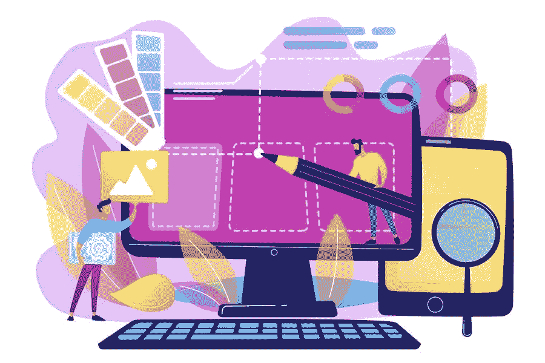

# 4 个最大的网页设计错误以及如何避免它们

> 原文：<https://medium.com/visualmodo/4-biggest-web-design-mistakes-and-how-to-avoid-them-52a121c05454?source=collection_archive---------0----------------------->

说到推广你的公司，一个有创意的网站是必不可少的元素。此外，有效的网站设计会影响你的排名和消费者流量。因此，避免大多数公司犯的最普遍的网页设计错误是至关重要的。在这篇文章中，你会看到 4 个最大的网页设计错误以及如何避免它们。

# 网站设计错误

如果你是一个相当新的设计者，但是渴望提升你的网站，你必须考虑你的选择。首先，你可以使用网页设计和数字营销服务，比如 web 和其他类似的服务。另一个选择是学习更多关于网页设计和提高你的技能。

网页设计需要一定的想象力和对细节的关注，此外还需要一些技术专长。然而，如果你知道如何避免网页设计中最大和最常见的错误，创建一个漂亮、实用、用户友好的网站并不困难。

继续阅读，了解最常见的网站设计错误以及如何预防。

# 1.加载时间过长:避免网页设计错误

如果你的网站加载时间过长，你可能需要重新考虑一些设计功能。你的网站加载越快，你的客户的体验就越愉快。有几种方法可以优化你的网站。

首先，你应该优化你网站上的图片，尤其是首页。没有什么比一个需要很长时间才能加载的主页更容易让人离开了。因此，为了避免这种情况，减少你的图片的尺寸，并精简你的内容。

此外，避免拥挤的设计，这些设计可能会用侵入性的弹出广告、自动播放的剪辑和混乱的导航菜单淹没访问者。始终保持一个整洁的网站设计。

此外，臃肿的插件、主题和模块可能会降低速度。将这些项目更新到最新版本可能有助于加快加载过程，特别是如果它们很长时间没有更新的话。

请记住在更新后做一个全面的测试。通过这种方式，您可以确保不会因为更新而中断任何功能。然后，您可以在彻底测试一切之后执行修改。

# 2.缺乏视觉层次

新网站最常见的错误是忽视视觉层次的重要性。术语“视觉层次”指的是根据组件的相对重要性对其进行系统的排列。

这需要以一种能传达故事和吸引访问者的方式来安排你的商标、页面、联系信息和其他元素。简单地把你所有的信息随意地扔在那里是不够的。

如果你没有得到正确的视觉层次，消费者可能会被你设计的许多元素淹没。因此，他们将不会有效地导致你的内容定向广告(CTA)，导致没有转换。

为了开发一个更好的视觉层次，考虑一下为什么你的客户会访问你的网站。然后，做用户体验(UX)研究，确保用户流程简单流畅。