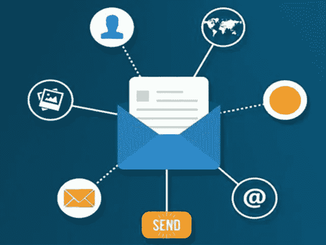

# 4 个电子邮件优化技巧将提升你的营销活动

> 原文：<https://medium.com/visualmodo/4-email-optimization-hacks-that-will-boost-your-campaign-5f42d23e6065?source=collection_archive---------0----------------------->

在 B2B 和 B2C 广告转换方面，电子邮件营销仍然领先。这是最经济、覆盖面最广的方式，因为不是每个人都使用所有流行的社交媒体网络，但每个人都有电子邮件。为了最大限度地提高你的活动的打开率和转化率，这里有 4 个重要的事实，在设计你的电子邮件活动时要遵守，这是促进你的活动的最佳电子邮件优化技巧。

# 电子邮件优化技巧

# 少说话，多点击

根据[的消息来源](https://99firms.com/blog/email-marketing-optimization-hacks/)，只有 3-4 个单词的主题词被回复的最多。它还指出，65%的人更喜欢混有大约 20 行或更少文字的图像。

这并不意味着你可以简单地把四个词放在一起，然后侥幸逃脱。包括收件人姓名、表情符号、单词“alert”或其他形式的紧急强调的主题行获得最多的点击。

也不要忘记预览文本。如果不打开，你的收件人就看不到你包含的精彩图片，所以请确保你制作了一个引人入胜的预览文本来支持你的主题。

# 明确你希望读者做什么

使用图像是好的，但是太多会有损于你所说的内容。在你的邮件中最多只添加三张图片，并把你的行动号召按钮限制在一张。这样，收件人就能确切地知道你想让他们做什么。

事实证明，只有一个 CTA 按钮的电子邮件可以增加高达 1617%的销售额！使用准确、可行的短语，如“立即下载”或“[与专家交谈](https://visualmodo.com/blog/)”，而不是简单地留下一个链接或使用通用的“点击这里”。

此外，保持语言简单。如果一个三年级学生能理解你的信息，那就太好了。

# 通过拟人化和个性化来建立关系

电子邮件被发送到垃圾箱或被标记为垃圾邮件的原因是因为它们听起来是如此的没有人情味和机械。人们希望与人而不是机器人进行交互。

首先，确保您的发件人地址使用人名。这将让收件人感觉他们被你的公司彻底照顾，并能在需要时联系实际的人。你可以实现自动化，但是必须要有个人风格。

如前所述，使用客户名称可以提高打开率。如果你使用触发(当顾客放弃购物车或浏览后关闭网站时自动发送的电子邮件)，提醒会让他们感觉受到重视，并且好像你真的试图通过他们的购物习惯来了解他们。

这些只是几个技巧，将提高你的电子邮件营销工作。要了解更多信息，请查看信息图:

[https://99 firms . com/blog/email-marketing-optimization-hacks/](https://99firms.com/blog/email-marketing-optimization-hacks/)