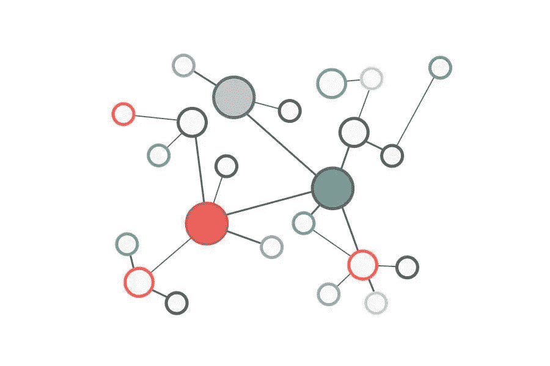
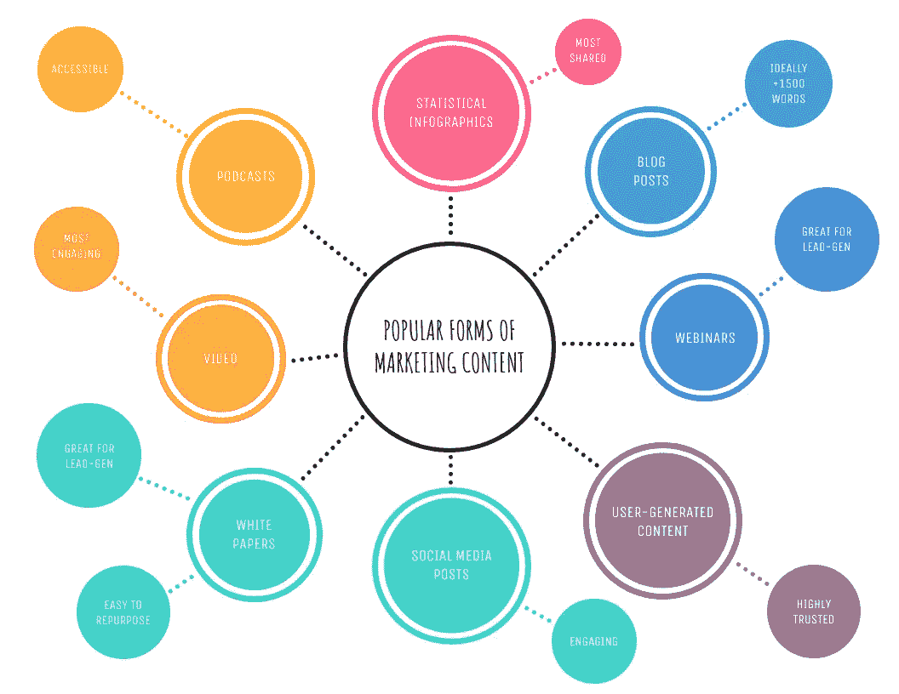
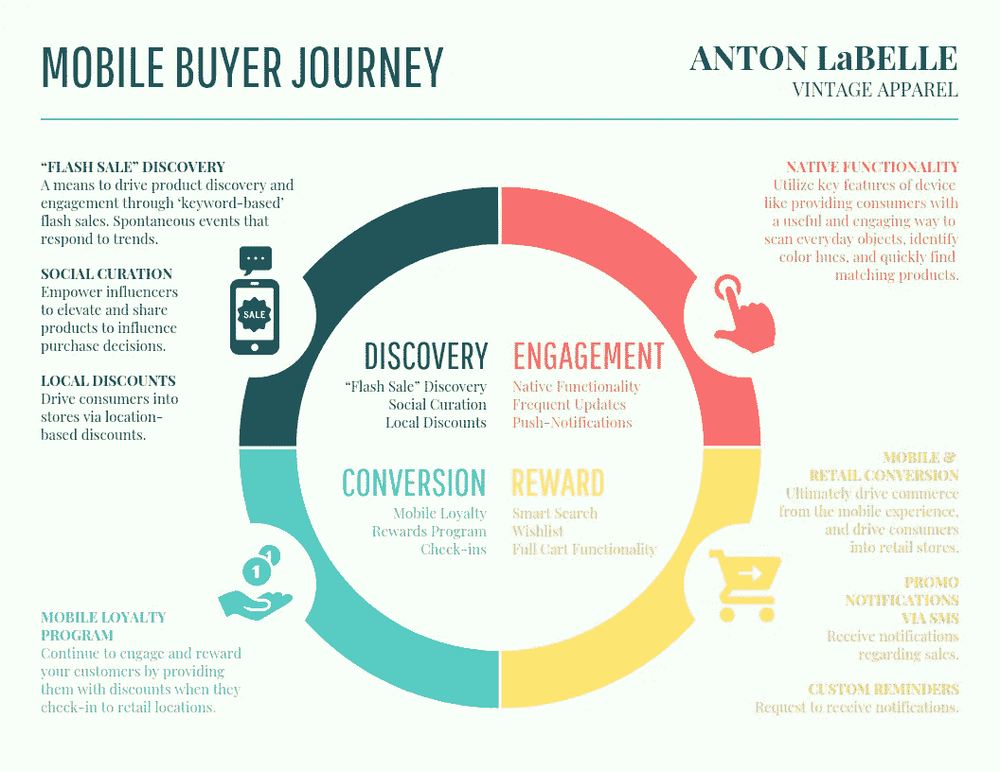
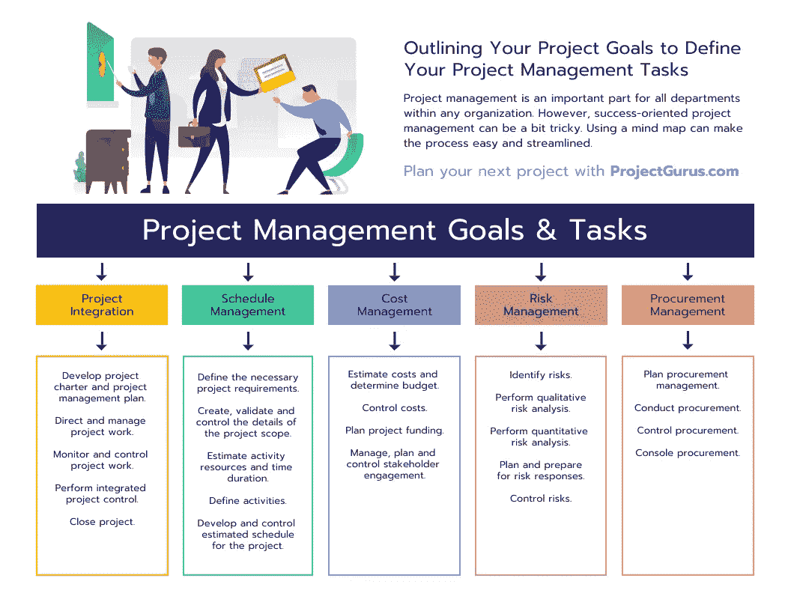
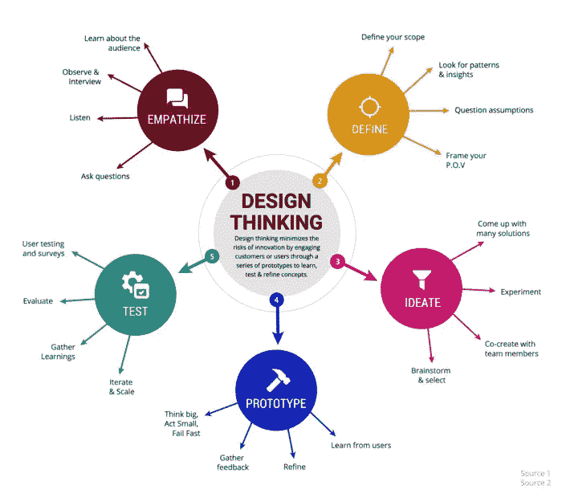

# 4 使用思维导图来改进你的设计过程

> 原文：<https://medium.com/visualmodo/4-uses-of-mind-maps-to-improve-your-design-process-7d2e7cd38135?source=collection_archive---------0----------------------->

从分解客户简报和做研究到开发概念、修改和展示最终设计。每个设计过程都由几个步骤和利益相关者组成。作为一名设计师。如果你发现自己在匆忙地翻阅笔记或弄懂零散的想法。是时候给混乱带来秩序了。在本文中，您将看到如何使用思维导图来改进您的设计过程。

超越传统的工作方式，转向更实用的工具，帮助简化设计流程并提高效率。思维导图就是这样一种工具。

思维导图是一种视觉思维工具，可以让你以图表的形式捕捉和组织想法。主要观点放在中间，支持观点从中间分支出来。

让我们来看看你如何利用它来增强你的设计过程，成为一个更有效率的设计师。

# 1 集思广益

构思是设计思维过程的核心，头脑风暴是其中的一种技巧。它需要你产生尽可能多的想法。

无论你是单独头脑风暴，还是与团队一起头脑风暴，甚至是远程工作——如果你的头脑风暴会议涉及以线性方式记下想法，你可能需要考虑一种更有成效的方法。

使用气泡图集思广益是组织、联系和分组想法的好方法。它帮助你在构思时采取整体的方法，产生大量的想法。

这里有一个气泡图模板的例子，你可以用它来形象化你的想法。注意模板是如何利用颜色编码来区分不同的想法的。

*来源:Venngage*

# 2 组织你的研究以改进设计过程

根据一篇心灵感应的文章:“设计研究允许探索和定义高度抽象的概念。它通过优先考虑早期阶段的测试和定义，减少了开发过程中的猜测、沟通不畅和效率低下。

这显示了研究在设计过程中的重要作用。

思维导图在这方面有什么帮助？它使您能够识别研究机会或组织您的研究数据。

例如，假设你是一名 UX 设计师，想要进行用户研究。您可以使用思维导图来概述调查问题，并根据您的调查结果进一步完善这些问题。

这样做可以让你对情况有一个鸟瞰，帮助你在设计时发现差距和实施学习。

这里有一个买家旅程图的例子，你可以用它来对不同的阶段进行分类。

*来源:Venngage*

# 3 .说明设计项目计划

考虑到所涉及的计划、协调和期望管理的范围，设计师也被期望成为优秀的项目经理。

一旦你和你的团队最终确定了设计项目计划，与你的内部利益相关者或客户进行沟通是很重要的。

在这种情况下，您可以使用项目管理思维导图来可视化项目并突出显示所涉及的步骤，同时确保每个人都在同一页面上。

这是一个项目思维导图的例子，它概述了项目的目标，并使用彩色方框来区分每个步骤。

*来源:Venngage*

# 4 提出设计概念以改进设计过程

你可能已经开发了一个出色的设计概念，但是如果你不能有效地展示它，你的客户就不可能给你开绿灯。

战略思维导图是一种令人印象深刻的方式来交流战略，提出概念，提高理解能力，同时保持读者参与。在你的客户演示或报告中使用它来分解总体概念并提供背景。

这有助于客户理解你策略背后的思维过程，让你更容易说服他们。

这里有一个战略地图模板的例子，它将信息分解成易于管理的块。所以，让读者看到全局。

*来源:Venngage*

# 要点:使用思维导图来改进你的设计过程

从构思阶段到客户演示，思维导图可以在设计过程中用于各种目的。

当正确使用时，它们被证明是有效的可视化工具。这不仅有助于理解，还能提高生产率和团队协作。

*Simki Dutta 是 Venngage 的内容营销人员，这是一个免费的信息图表制作和设计平台。当她不工作的时候，她会刷新自己的推特，狂看网飞的节目。*