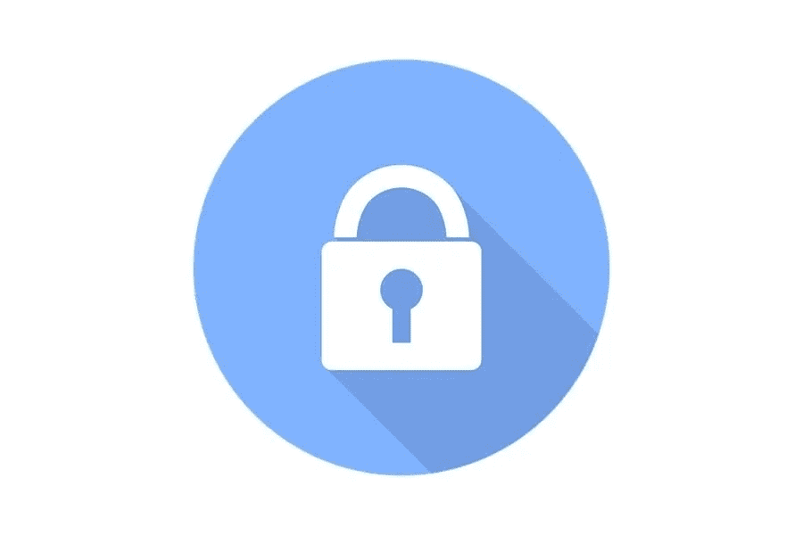

# 提高电子商务安全性的 4 种方法

> 原文：<https://medium.com/visualmodo/4-ways-to-improve-your-ecommerce-security-966de56ba46?source=collection_archive---------0----------------------->

当你在经营一家电子商务商店时，有一件事你绝对不能忽视，那就是你的网站的安全性。如果你看一下过去几年的新闻，你会发现即使像雅虎这样的巨头也是网络攻击的受害者，并使他们的客户处于危险之中。在本文中，我们将探索提高电子商务商店安全性的最佳方法。

作为一家电子商务商店的所有者，你有责任照顾好你的客户和同行，并确保他们的数据不会落入坏人之手。在这个现代数字时代，数据就是一切，如果数据被滥用，一家公司很容易就垮了。这就是为什么你需要提高商店的安全性，保护所有相关利益方。让我们来看看几种可以提高电子商务商店安全性的方法。

# 选择正确的电子商务平台以提高安全性

你为你的电子商务商店使用的平台的种类在它的安全方面扮演一个巨大的角色。大多数在线商店选择 Shopify 和 Magento，背后的原因是它们提供了比其他平台更好的安全性。除此之外，这些平台在功能方面非常强大，并且更易于管理。他们还定期获得安全更新，这意味着如果有新的威胁，你的平台已经知道如何处理它。然而，仅仅因为平台定期更新并不意味着它在各个方面都是安全的。你还是应该采取额外的措施，确保没有任何疏漏。

# 帮助您的客户保护自己

如果你想进一步加强你的安全，那么你也必须教育你的客户。是的，不惜一切代价保护客户的数据是你的职责，但是如果他们没有以正确的方式注册或者粗心大意，那么你对此无能为力。首先，你需要教育他们如何建立一个安全的帐户，然后你需要确保他们使用一个强密码。因此，这是一个提高你的电子商务商店安全性的好方法。

您还必须建议他们在需要时使用正确的身份证明，因为如果他们不这样做。这会给他们带来更多的麻烦。如果购物需要身份证明，建议他们不要使用假身份证。如今，你可以得到一个在 2020 年扫描的假身份证，虽然这些可能有利于娱乐，但你的客户不应该使用它们进行重要的购买。

# 创建数据备份以提高您的电子商务安全性

您是否正在创建站点数据的定期备份？好吧，如果没有，那么现在是你开始这样做的时候了。当有人黑了你的网站。它不仅允许外人偷看你的数据。但它也夺走了你所有的权利。数据是任何公司最重要的资产，失去它相当于失去你的整个业务。所以不要仅仅依赖你的托管公司，每周或每月手动备份你的数据。这样，即使您发现自己处于最坏的情况，您仍然可以访问您的数据。

# 永远不要存储信用卡号码

许多网上商店犯的另一个错误是他们储存了顾客的信用号码。为他们提供线下购物体验。虽然这听起来很方便，但一点也不安全。通过使用这种方法来提高电子商务的安全性。你暴露了你的顾客。所以，如果你被黑了，你的客户就会暴露无遗，你的声誉也会一落千丈。