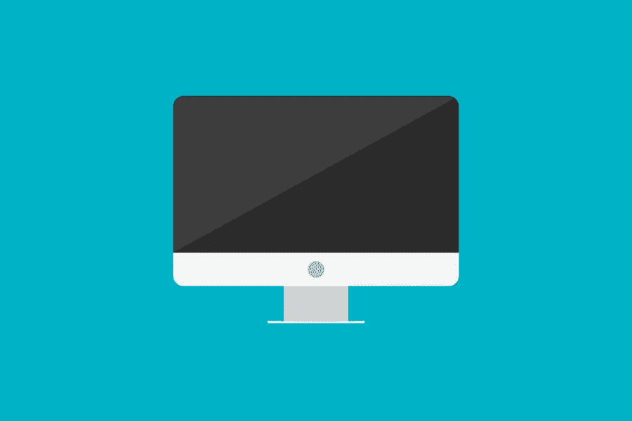

# 永远不要打破的 4 条网页设计黄金法则

> 原文：<https://medium.com/visualmodo/4-web-design-golden-rules-you-should-never-break-209670d1a954?source=collection_archive---------0----------------------->

当谈到网页设计时，很容易被它的美学所迷惑。但是对于一个优秀的网站来说，这就足够了吗？答案是:“不尽然！”对于一个成功的网站，你需要关注的不仅仅是网站的外观。在这篇文章中，我们将检查你永远不应该打破的四大网页设计黄金法则。

今天，有超过 10 亿个网站可供用户登陆，这意味着你将面临激烈的竞争。为了有机会脱颖而出，你的网站需要一个伟大的设计，尤其是因为 94%的第一印象与你的网站设计有关。

但是一个伟大的网页设计到底意味着什么？是关于你用的配色方案吗？它是关于你在屏幕上放置你的标志的地方？或者是关于你的内容所使用的字体？所有这些以及更多。

伟大的网页设计融入了用户体验和功能，同时也易于理解，看起来很有美感。为了实现这一点，除了在设计中加入你的个人风格和创造力，还有一些网页设计的黄金法则是永远适用的。

这里有四条网页设计的黄金法则，在设计或重新设计你的网站时，千万不要违反:

# 考虑视觉层次的设计

视觉层次是网页设计中一个重要的 UX 原则，因为它旨在帮助用户清晰有效地显示内容。换句话说，它帮助设计者规划他们的信息架构，帮助用户更容易地浏览网站，这有助于减少参与网站所需的精力和时间。

使用正确的视觉层次将有助于你引导你的站点的访问者按照优先级顺序关注特定的页面元素。

那么，你如何在你的网站设计中运用视觉层次原则呢？

视觉层次有两个主要组成部分，包括大小和元素位置。尺寸指的是通过放大来突出你的[网站的顶级元素](https://visualmodo.com/html-heading-tags-usage-tutorial/)，例如商业标志或名称，而元素放置指的是使用某些元素来引导访问者的目光朝向你想要的方向。例如，您可以将重要的行动号召按钮放在屏幕的正中央。

建立网站的信息层次结构，然后使用颜色、对比度或间距等元素来突出它们。

# 让它移动友好的网页设计黄金法则

根据 Statista 的数据，全球有超过 35 亿智能手机用户。此外，数据显示，这些用户中有 74%更有可能回到一个手机友好的网站，而其中 93%的人已经离开了一个网站，因为它不能在他们的设备上正确显示。

随着人们越来越频繁地使用手机在网上搜索，购买商品，娱乐，甚至交易，手机友好已经成为网页设计的核心原则。你的所有网站访问者应该能够享受同样出色的用户体验，不管他们浏览的是什么设备。

所以，如果你能确保无论访问者如何看待你的网站，所有重要的信息都能正确地显示在不同的屏幕上，那将是最好的。

一个实用的技巧是让你网站上的重要信息容易被找到。与从桌面浏览您网站的访问者不同，移动用户在您的网站上寻找更具体的信息，如联系信息或他们想购买的产品的价格。所以，让这些重要的信息不容错过。

当创建一个手机友好的网站时，网页设计的另一个核心规则是根据屏幕大小来调整交互元素的大小。换句话说，确保你的网站可以用一个拇指导航，并且不需要使用俯仰。请记住，移动用户使用他们的手指来滚动和点击网站上的按钮。因此，在设计网页设计中的交互元素时，要考虑屏幕的大小。

# 注意反应

一个伟大的网站还必须反应迅速，否则，它可能会让你失去很多客户。事实上，数据显示，93%的用户点击返回并离开了一个网站，因为它的加载速度不够快。

以电子商务为例。客户很可能有数百个其他网站可供选择来购买相同的产品。或者类似的产品。如果你的网站没有响应，并很快允许他们购买，他们很可能会返回并进入你的竞争对手的网站。

或者，以移动交易为例。其中 2018 年的一项调查发现极有可能从 18%增加到 37%。因此，换句话说，更多的交易者使用手机交易股票或外汇，使用在线测试的算法交易策略。此外，另一项研究发现，43%的手机交易者每 20 秒查看一次手机。所以，你看:对于这些在线用户来说，时间就是金钱。因此，如果你有一个交易平台。它应该可以从任何电子设备上访问，在任何浏览器中都可以很好地运行，并且响应迅速。

# 让浏览网页设计黄金法则变得容易

让你的网页设计易于浏览意味着。让你的访问者更容易找到他们想要的东西。理想情况下，对于你的访问者来说，他们应该进入你的网站，而不必挣扎。找出他们应该点击“下一步”去哪里。

你的目标是吸引访问者在你的网站上花更多的时间。然而，花在你的网站上的时间应该是在。所以，做你想让用户做的事情，比如采购。填表，或者签约，不知道如何做所有这些事情。因此，请确保通过以下方式优化网站的导航性:

*   将您的徽标链接到主页
*   添加清晰菜单
*   提供垂直导航元素
*   在网站的页脚包含导航
*   在你的网站顶部包含一个搜索框。