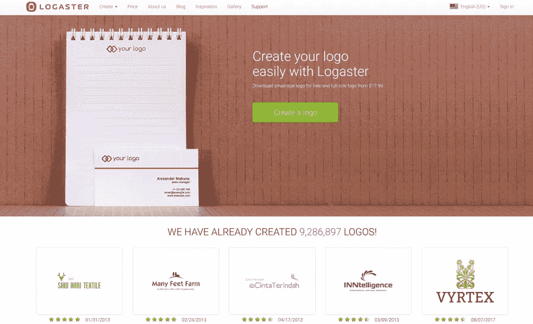
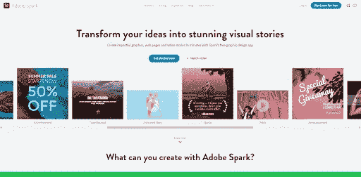
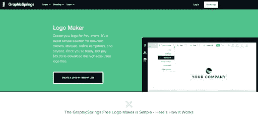
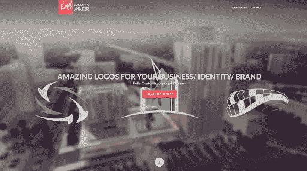

# 5 个很棒的网站为你的企业创建免费标志

> 原文：<https://medium.com/visualmodo/5-awesome-websites-to-create-free-logo-for-your-business-5509d8d56a47?source=collection_archive---------0----------------------->

每个公司都想留在顾客的记忆中。为此，你公司的标志可以帮助你。让我们记住流行公司的标志。它们很简单，不是吗？当然，创建自己的品牌并不是一件容易的事情，尤其是没有设计技巧的情况下。但是现在有很多其他的选择来尝试创造标志。因此，这里是我们的前 5 名免费标志制造商。

# [1 日志记录者](https://www.logaster.com/logo-design/)

Logaster 是一个在线品牌制造商，让你只需点击几下就可以创建一个标志。此外，你可以创建一个简单的标志和一个社会媒体包，不需要任何特殊技能。所有文件都是光栅(JPEG，PNG)和矢量(SVG，PDF)格式。所以你会有一个高分辨率的照片来打印。还可以为你和你的员工制作品牌名片。关注数百万 Logaster 用户，让所有选项受益。

# 2 土坯火花

这个在线工具提供了大量现成的模板。但是它们都有预定的大小。没有任何问题，你可以修改和定制免费的标志。Adobe Spark 的巨大优势在于其工作速度和用户友好的界面。然而，简单的界面可能被认为是一个弱点，因为它需要一些时间来理解如何做这个或那个动作。

# 3 个图形弹簧

图形弹簧是另一个免费的标志制造商。第一眼，每个人都会注意到它漂亮的[界面](https://awards.visualmodo.com/)。然而，这并不是所有可以看到和尝试的选项。该服务有徽标类别，您可以根据不同的标准对其进行排序。您还可以制作不同形状的徽标，如线条、徽章等。一旦你选择了形状，你可以编辑字体，标志效果或文字。

# 4 在线徽标制作者

在这里，你可以找到一个简朴的设计和 Flash 标志编辑器。你可以编辑几乎所有的标志元素:文字，符号，图层，甚至从电脑上下载自己的图片。但是请注意，这个标志制造商没有提供广泛的字体和符号可供选择。所以如果你需要创建一些复杂的东西，你最好使用久经考验的 [Photoshop](https://shots.visualmodo.com/) 。

# 5 标识创建者

这个标志创建器允许为你的[业务](https://visualmodo.com/blog/)制作一个专业的标志。它提供了相当多的特性，你不需要掌握一定的技能来测试所有的特性。您可以选择是否要将任何图像或文本导入到徽标中。此外，该工具根据活动类型提供了许多徽标变体和主题。

正如你所看到的，创建一个标志并不像看起来那样费时，而且是免费的。你不需要有特殊的设计师技能或知识。使用上面列出的徽标制作工具，您可以在几分钟内制作出您想要的徽标。