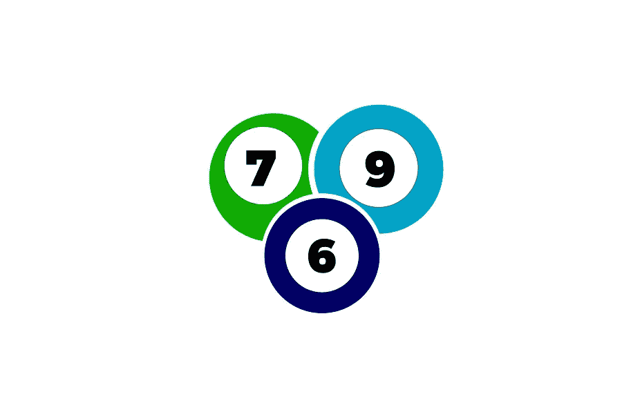

# 5 个设计精美的 Bingos 网站

> 原文：<https://medium.com/visualmodo/5-beautifully-designed-bingos-sites-91173b47ebd7?source=collection_archive---------0----------------------->

虽然在线宾果游戏大约从 21 世纪初中期就已经存在，但直到几年后，随着人们开始了解其好处，它才真正开始流行。自 2010 年以来，现在可以玩宾果游戏的网站数量大幅增加，因此，玩家被宠坏了。在这篇文章中，我们将分享 bingos 网站设计的例子。

# 5 个美丽的 Bingos 网站

这意味着最好的网站必须真正专注于从竞争中脱颖而出，他们做到这一点的方法之一是确保特别关注网站本身的美学，如设计。让我们来看看五个最好的设计，以及它们为什么如此吸引人。

# 科斯塔宾果

拥有一个主导网站主屏幕的横幅总是有风险的，然而，在 CostaBingo 上没有这方面的担忧。玩家可以享受热带天堂般的待遇，如荒岛、蔚蓝色的天空和棕榈树，还有蓝色、橙色和黄色。如果你不知道在哪里可以找到最美丽的在线宾果网站，那么寻找它们会很困难，所以 Costa bingo 绝对是你应该尝试的一个网站，同时你也可以在 Bingo 网站上找到更多。

# 宾果阁楼

在 BingoLoft，玩家会看到一个屏幕，类似于云中的宾果游戏网站，有一个漂亮的白色绒毛背景，顶部有蓝色装饰。网站本身很容易导航，因为他们让事情变得简单，你可以很快找到一切。

# 海员

当你第一次在 SailorBingo 着陆时，你充满了冲击。蓝色和白色的混合完美地描绘了大海。天空，因此，它很容易在眼睛上。由于功能强大，这绝对值得在五个最美丽的宾果网站中占有一席之地。

# 津戈

可以说是最有活力的宾果网站之一。Zingo Bingo 的主屏幕充满了充满活力的蓝色。此外，黄色，白色，红色和紫色，当你向下滚动。所有可用的游戏都以一种真正吸引你的方式出现。每一种颜色都相互补充，从页面的更高处延续这一趋势。

# 888 位女士

包括粉红色，蓝色和白色，这显然非常美丽。所以，很明显已经有了很多想法。此外，888 女士是 888 控股集团的一部分。业内最大的公司之一是哪家？打造品牌的专家也是如此。因此，一个美丽的 bingos 网站的好例子。