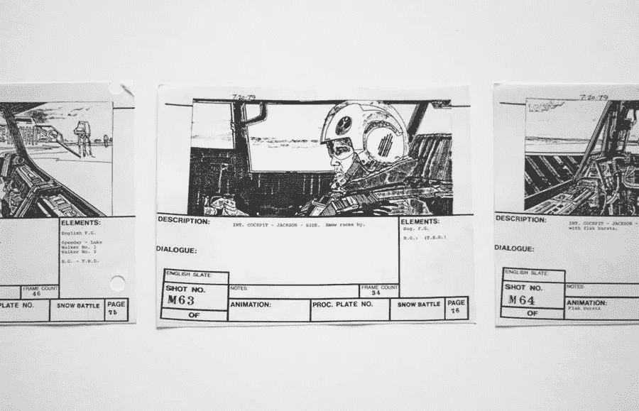

# 图形设计师故事板的 5 个好处

> 原文：<https://medium.com/visualmodo/5-benefits-of-storyboards-for-graphic-designers-8dca98941a61?source=collection_archive---------0----------------------->

建筑工人使用蓝图，卡车司机使用路线图，成功的平面设计师使用故事板。它为设计提供了一个*叙述方向，记录了集体的想法和概念，指导你的项目从构思到完成。对于平面设计师来说，故事板有五个好处。*

故事板既是生产性的又是实用性的，是抽象的又是分析性的——一个你的项目将如何在整个设计生命周期中成长的图形表示。没有一个成功的平面设计师会没有一个。

# 1.故事板为图形设计提供了路线图

平面设计包括 UX 设计、网页设计、标志设计、品牌识别、包装等等。这些专业的设计师通过线性呈现设计目标来概念化项目。故事板优化了这个过程。

把故事板想象成一个路线图，记录图形设计过程的开始和结束。它直观地描绘了项目的范围和时间线。它还概述了设计生命周期的每个元素，包括产品定义、创建、部署和交付。

故事板是你最重要的计划工具。

# 2.故事板让图形设计师讲述设计故事

你不仅仅是一个平面设计师，还是一个讲故事的人。你[创造引人注目的故事](https://visualmodo.com/graphic-design-learning-tips/)，讲述你将如何执行设计项目，然后与同事和潜在客户分享这些故事。

成功的设计师在故事板中使用各种图形元素，包括图像、插图、图表、图形等等。(许多设计师使用 Visualmodo 来制作图片、图标和 SVG 动画。)

结果就像一本有开头、中间和结尾的故事书。图形设计师使用故事板来传达他们的项目将如何从开始到结束。

# 3.故事板是营销工具

故事板不仅仅是你的项目将如何展开的视觉表现。它们也是针对投资者和利益相关者的营销工具。

研究表明，人类处理视觉信息的速度比普通文本快 6 万倍。因此，故事板让投资者更容易将复杂的设计过程分解成易于理解的部分。故事板可以增加投资成功的机会。

# 4.故事板让图形设计者与团队分享设计过程

由于新冠肺炎疫情，许多平面设计师仍然在家工作，无法与同事进行面对面的交流。一些设计师发现很难通过电话或 Zoom 传达设计概念，尤其是抽象的概念。

故事板提供了一个解决方案，让你与团队远程分享设计想法。团队成员可以在整个设计过程中编辑和更改项目元素，并且无论身在何处都可以访问故事板。