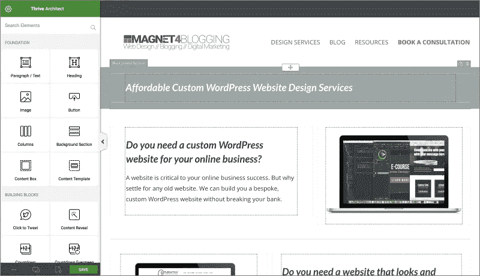

# 5 个最强大的拖放页面生成器

> 原文：<https://medium.com/visualmodo/5-best-powerful-drag-drop-page-builders-ca00efd24027?source=collection_archive---------0----------------------->

## 对于 WordPress

WordPress 是一个很有竞争力的 CMS。它的帖子编辑随时都能完成工作。当然，这只是到你需要基本的文本和图片来创建你的内容帖子。如果你想出一个独特的网页设计，你可能会发现默认的帖子编辑器界面限制。尽管如此，WordPress 仍然是许多人首选的网站编辑器。这是因为它提供了令人惊叹的主题，不仅如此，它还提供了强大的基于拖放的页面生成器。

这些主题和插件一起，把 WordPress 放在 WYIWYG 网站创建的最前沿。凭借有用的编辑功能、响应主题库和客户支持，这些插件将你使用 WordPress 创建网站的体验提升到一个新的水平。在本指南中，我们将介绍 WordPress 的 5 个最具附加值和功能丰富的拖放式构建器。所有的 Visualmodo WordPress 主题都与它完全兼容，我们的主题包中还包括免费的 Visual Composer。

# 5 个最强大的拖放页面生成器

# 茁壮成长建筑师

Thrive Architect 汇集了您希望在真正的 WYSIWYG 编辑器中找到的所有功能，并将它们打包在一个整洁直观的界面中。它支持的元素越来越多。Thrive Architect 处理所有 WordPress 主题，让用户快速看到网站的变化，从而创建漂亮的网站。在 builder 界面中，您可以使用标题、文本、图像等内容元素，甚至可以使用以转换为中心的元素，如 CTA 按钮、倒计时器、推荐框和销售线索生成表。

除了支持拖放的网站编辑器界面，Thrive Architect 还提供了其他有用的功能。创建全幅页面，使用背景层获得完美的外观，添加视频背景，并高枕无忧，因为最终结果是移动响应。Thrive Architect 还为您提供了 100 多个登录页面模板，这些模板被组织成不同的集合，每个模板都有一个选择加入页面、[下载](https://visualmodo.com/)页面和确认页面。该编辑器还为您提供了高亮框、图像和媒体、样式列表、tweet 按钮等功能，以帮助您创建引人入胜、丰富多彩的博客帖子。该插件擅长帮助 WordPress 用户创建完美的登陆页面、销售页面、博客帖子和产品发布页面。

# 海狸建造者

作为最好的 WordPress 拖放编辑器插件之一，Beaver Builder 易于使用，功能丰富。它附带了一个入门体验，可以简化新用户的学习曲线。Beaver Builder 与你现有的所有 WordPress 网站一起工作，帮助你编辑他们的内容，并使用其精彩的实时拖放构建器添加新内容。此外，你还可以得到几十个特别的主题，这些主题都是定制的，可以很好地与 Beaver Builder 配合使用，作为你的 WordPress 网站的基础。除了基本的内容元素之外，builder 还提供了高级元素，比如滑块、背景、内容块、按钮、转盘等等。

使用 Beaver Builder 构建的网站响应迅速。您可以保存自己的模板并在整个网站上重复使用，或者导出它们以在不同的网站上使用。你可以很容易地探索这个插件提供的内容元素的细微差别；只需点击它，并检查其不同的配置和设置。这使得使用 Beaver Builder 创建大型网站变得很容易。使用 Beaver Builder 创建无限数量的网站，如果您在使用它的任何功能时遇到困难，可以享受它的客户支持服务。已经有超过 100，000 个网站成功地使用这个插件在 [WordPress](https://visualmodo.com/) 上进行拖放式网站编辑！

# 元素者

Elementor 插件提供了基于拖放的编辑体验，尽管方式不同。使用 Elementor 编辑器，您可以选择在屏幕上放置几个部分，并在这些部分中使用定制选项。您可以在这些部分中放置小部件，如旋转条、图标列表、进度条等等。Elementor 是一个动态编辑器，这意味着您的更改可以立即在屏幕上看到，无需按任何更新或预览按钮。提供的元素包括帖子、作品集、幻灯片、表格、定价表、翻页框、价目表。区块报价，动画，登录分享按钮。社交媒体嵌入、导航菜单、推荐框等等。

一个很大的优势是，除了它自己提供的特殊主题之外，Elementor 允许你使用任何现有的主题创建全幅页面。在编辑器屏幕中，您可以将小部件保存为全局的，这样可以方便地在整个网站中重用它们。可视化表单生成器也提供了很多便利，因为您可以在不离开正在工作的页面的情况下创建表单。所有元素或主题都有反应。[专业的](https://visualmodo.com/)设计师和开发人员甚至可以在每个元素中添加定制的 CSScode 来创建一个真正独一无二的品牌网站。

# 按站点来源的页面生成器

SiteOrigin 的页面生成器是一个简单而强大的拖放编辑插件。它给你一个看起来很像 WordPress 的界面，同样直观。使用基于拖放的内容元素创建您的网页，并让插件在后端创建代码。页面生成器适用于所有主题，如果您切换主题，内容将转移到新主题。行构建器功能以及对列宽度的精确控制有助于您创建比例优美的网页。

页面生成器支持实时编辑，允许你撤销和重做更改，允许你探索各种行和小部件样式，并使用标准的 WordPress 小部件。Page Builder 也因推出插件的升级和新功能而闻名，让用户保持兴奋、兴趣和快乐。

# WPBakery 页面生成器—以前称为可视化生成器

想要在 WordPress 平台上获得无拘无束的拖放式网站创建体验，请选择 WPBakery 页面生成器。该插件为您提供了 50 多种优质内容元素，让您从 100 多种预设布局中进行选择，并与 200 多种第三方插件配合使用。毫无疑问，WPBakery 页面生成器是 WordPress 中最强大的拖放生成器插件之一。有了 40 多个网格设计模板，你每次都可以使用这个插件创建独特的网站。忘记编码，WPBakery 页面生成器为您提供无限的资源，只需使用其拖放功能即可创建令人惊叹的网站。

WPBakery Page Builder 创建 SEO 友好的网站，可以通过 API 轻松扩展，拥有不断增长和全面的知识库，甚至提供视频教程。另外，请注意，它是少数几个(可以说是唯一一个)同时提供后端和前端编辑的插件之一。因此，你可以在后台开发你的网页内容，或者快速地进行在线编辑。它适用于所有 WordPress 主题，兼容 Yoast SEO，支持视差和视频背景，提供图像过滤器，并提供多站点支持。

# 结束语

通过切换到拖放式 WordPress builder 插件，创建一个好看的网站所需的时间可以减少到原来的一小部分。这些插件帮助你第一次获得正确的设计，在发布之前了解网站的外观，并提供你可以使用的专业设计的主题。他们使其与众不同，并增加价值。选择 WordPress 的 5 个拖放构建器插件中的一个。

## 作者简介

我是一名专业作家、网络开发人员和 [WebBuildersGuide](http://www.webbuildersguide.com/) 的首席执行官。4 年来，我一直从事网页界面开发，在网站开发方面有丰富的经验。此外，我喜欢摄影和营销，当然，写文章。我的作品发表在不同的流行在线杂志上。你可以在[谷歌+](https://plus.google.com/u/0/112081053781731534924) 上关注莱斯利