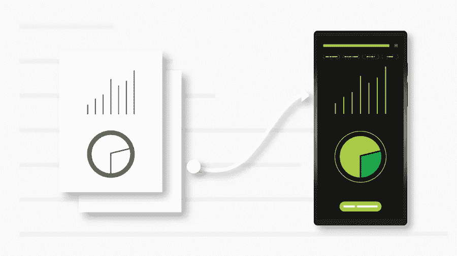

# 提高 UX 和提升搜索引擎优化的 5 个最佳工具

> 原文：<https://medium.com/visualmodo/5-best-tools-to-improve-ux-and-boost-seo-291a5f75154?source=collection_archive---------0----------------------->

用户体验是提高网站有机排名的重要因素之一。像谷歌这样的搜索引擎重视 UX，并推广为用户提供无缝体验的网站。在这篇文章中，我们将分享五个最好的工具，以改善 UX 和提高搜索引擎优化。

根据研究，88%的访问者离开网站是因为糟糕的用户体验。优化用户体验可以让用户坚持你的网站，从而提高流量和转化率。

以下是提高 UX 和提升 SEO 的五个最好的工具:

1 *— GTMetrix*

*GTMetrix 是一个 we*b 站点速度和性能监控平台。它提供了速度、核心网站重要指标得分和性能得分等指标。该工具提供了提高分数的建议。

到目前为止，GTMetrix 已经分析了超过 10 亿个网页。它被惠普、PayPal、Twitter、GoDaddy、三星、Spotify 和微软等知名品牌所使用。

## 顶级功能

*   您可以设置提醒，以便在网站表现不佳时通知您。
*   其次，GTMetrix 允许用户使用四种类型的图表来直观显示性能:页面计时、性能得分、Web 活力和页面大小/请求计数。
*   用户可以通过 65 台服务器在 22 个地点检查网站速度。包括温哥华、圣安东尼奥、芝加哥、钦奈和迪拜。
*   您可以通过 20 多种不同型号的手机上的模拟设备选项，在移动设备上测试您的网站速度。
*   您可以在不同的连接类型和速度上测试您的站点，例如 3G、LTE、拨号和有线。

## 提高 UX 价格的工具

GTMetrix 提供四种定价方案:

*   免费:每月 0 美元(一个域名的每日站点监控和三个月的数据备份)
*   solo:10 美元(包括三个域名的每日站点监控和六个月的数据备份)
*   起步价:20 美元(每小时 6 个域名的站点监控和 6 个月的数据备份)
*   增长:40 美元(每小时 12 个域的站点监控和 6 个月的数据备份)

*以上所有计划均包含 PDF 格式的报告。*

2 —芬特萨

Finteza 拥有超过 50 个 CMS 支持，是领先的网站和应用程序分析平台之一。此外，Finteza 还提供对网站和应用程序的高级分析，包括 bot 检测、位置跟踪、IP 地址跟踪、设备跟踪、漏斗创建和转换分析等功能。

## 顶级功能

*   首先，你可以创建针对不同细分市场的漏斗，包括页面、UTM 标签、流量来源、关键词和广告横幅。
*   其次，它可以让您识别和过滤 12 种类型的不良流量。
*   Finteza 是 WordPress、Drupal、Joomla、Shopware、PrestaShop 和其他几个领先的 CMS 平台的插件。
*   Finteza 可以让你绕过广告拦截器，帮助你增加你的印象。
*   您可以使用 15 个指标来分析流量，包括设备类型和转换。
*   最后，您可以实时访问分析，以提高 UX 和增加转化率。

## 提高 UX 价格的工具

Finteza 为每月最多 10 万独立用户提供 25 美元的定价计划。Finteza 还提供 1 个月的试用期，费用为 12.5 美元，每月最多 5 万名用户。

3 — Zendesk

Zendesk 是一款屡获殊荣的客户服务软件，受到 Mailchimp、优步、乐购、可汗学院和西门子等知名公司的信任和使用。Zendesk 支持文本、电话、电子邮件、社交媒体和实时聊天等通信模式。

## UX 工具的主要功能

*   Zendesk 提供了数百个应用集成，如 Shopify、ActiveCampaingn、GetResponse 和 Notify。
*   有了人工智能机器人，你可以为问题构建自己的个性化答案。
*   答案机器人支持超过 15 种语言，包括英语、阿拉伯语、意大利语和日语。
*   您可以使用 Zendesk 提供的各种数据和报告来帮助您改善客户体验。
*   最后，通过“群发消息”，您可以联系或添加其他团队成员，以提供最佳的客户服务。

## 提高 UX 价格的工具

Zendesk 提供三种定价方案:

*   套件团队:每月 49 美元(语音、电子邮件、短信和实时聊天支持)
*   增长:每月 79 美元(最多 100 个人工智能自动回答)
*   Suite Professional:每月 99 美元(最多 500 个人工智能自动回答)

4 —优化

Optimizely 是一个领先的体验优化平台，提供 A/B 测试、多页面实验、服务器端测试和多元测试等选项。而且优化支持渠道，包括网站、app、电视 app、IoT。像 IBM、HP、Sky、易贝、GAP 和 American 这样的知名品牌使用 optimize 来优化用户体验。

## UX 工具的主要功能

*   首先，你可以使用工具对你的网站和应用进行严格的 A/B 测试，以提高 UX。
*   其次，optimizely 允许您实时更新应用程序，而无需等待谷歌和应用商店。
*   借助易于使用且简洁的用户界面，您可以在一个位置管理所有版本和更新。
*   Optimizely 提供了一个开源的 SDK，支持 Javascript、Go、Java、Swift、PHP、Python、Ruby、C#和 Docker 等语言。
*   您可以使用“标志”功能来降低新推出的风险，因为通过使用此功能，您可以在检测到任何错误或性能问题时随时通过关闭切换进行回滚。

## 提高 UX 价格的工具

您需要联系客户支持了解价格。

5 —尖叫的青蛙

尖叫青蛙是一个网站搜索引擎优化审计软件，可用于 Windows，Mac 和 Ubuntu。因此，它被苹果、谷歌、Seer、亚马逊和迪士尼等大品牌和机构用来优化他们的网站以获得更好的 SEO。

## 改善 UX 的顶级功能工具

*   首先，尖叫青蛙提供了一个网站的搜索引擎优化的不同指标的分析，包括服务器代码错误，标题标签，低内容页面，以及缺少页面标题和描述。
*   其次，你可以找到大小超过 100kb，没有任何 alt 标签的图片。
*   尖叫青蛙允许你批量上传文件，你可以进一步与你的开发者和团队分享。
*   您还可以执行重定向审计，以查找网站上的临时和永久重定向。
*   最后，您可以使用“noindex”和“nofollow”等标签查看 robots.txt 文件阻止的 URL。

## UX 工具价格

尖叫青蛙提供了两种定价方案:

*   免费:0(最多可抓取 500 个 URL)
*   付费:每年 149 英镑(无限制抓取)

# 改进 UX 结论的工具

UX 和 SEO 是网站优化必不可少的部分。为 UX 和 SEO 优化您的网站可以帮助您降低网站的跳出率，因为如果您的网站结构合理，易于导航，用户会采取措施提高收入。