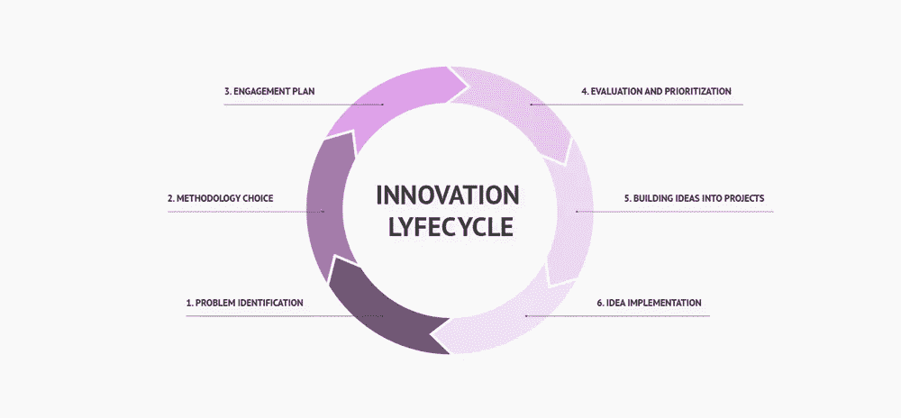

# 产品创新周期的 5 个基本步骤

> 原文：<https://medium.com/visualmodo/5-essential-steps-for-the-product-innovation-cycle-609e6a89d819?source=collection_archive---------0----------------------->

一个产品要推向市场，必须经历产品创新的全过程。更新现有产品和将旧产品推向新市场也包括在产品创新的定义中。这包括分析市场需求、构思产品、创建产品路线图、发布产品、收集反馈等。产品创新循环过程分 6 个步骤

# 产品创新周期中的问题识别步骤

识别问题的根本原因是解决问题的第一步，也是识别在这个过程中需要解决的问题的第一步。一旦你提出了一个[值得解决的问题](https://visualmodo.com/top-7-digital-marketing-positions-that-will-hit-2021/)，你的机会就会变得显而易见。

# 方法论选择

这一新产品开发阶段旨在深入研究您发现的客户问题。

以下是你应该问自己的一些问题

首先，潜在市场的规模有多大？你认为这是一个值得解决的问题吗？

其次，在今天，这个问题还能怎么解决？

是什么让我们有别于我们的竞争对手？到底为什么我们处于解决这个问题的最佳位置？

最后，你认为这是一个值得解决的问题吗？

# 产品创新周期的参与计划步骤

产品创新周期的第三步是参与。此外，客户参与战略是通过更积极地与客户互动来提高客户满意度的计划。因此，它可以通过任何媒介，包括面对面、在线和电话。[采用正确的策略，客户 I](https://visualmodo.com/emerging-technologies-driving-warehousing/)n 参与可能会从被动变为主动。

# 评估和优先排序

产品评估是确定为客户使用而制造的产品的适宜性和安全性的过程。产品评估取消有两个主要原因:

1)保证产品符合适用标准

2)检测和纠正制造或设计缺陷。

优先化是产品管理中评估工作相对重要性的系统过程。此外，在给定产品创新周期步骤的一系列限制的情况下，消除浪费行为并尽可能快地为客户提供价值的想法和要求。