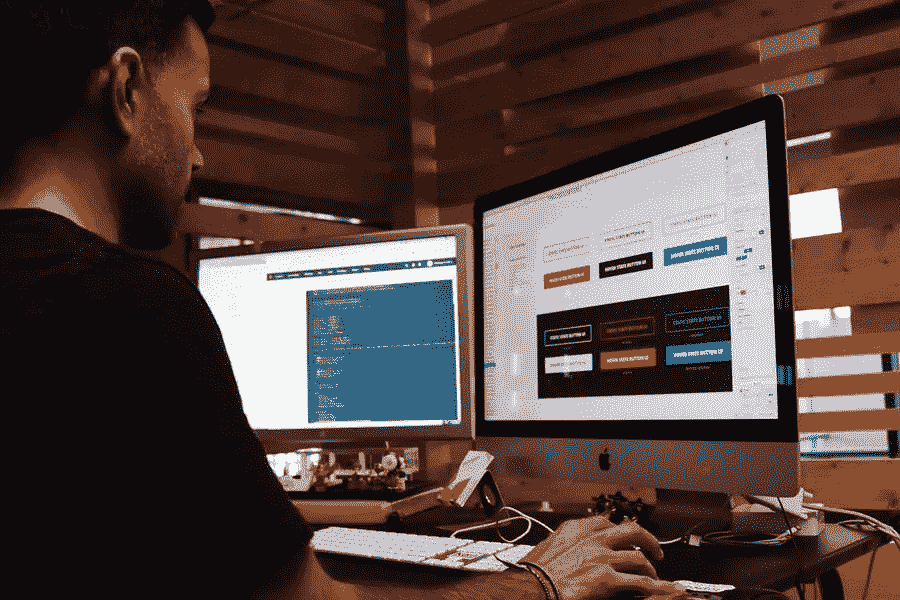

# 非设计师建立网站的 5 个基本技巧

> 原文：<https://medium.com/visualmodo/5-essential-tips-for-non-designers-building-a-website-92aa2fe2b3f8?source=collection_archive---------0----------------------->

55%的消费者会在购买前进行在线调查。这并不奇怪。由于互联网已经成为一切事物的首选资源，人们很自然地会求助于它来获取关于从哪些公司购买以及哪些产品最适合他们的需求的信息。在这篇文章中，你会看到非设计师建立网站的 5 个重要技巧。

不幸的是，许多公司仍然没有完全过渡到数字世界，大约一半的小企业没有网站。

但是，尽管许多人害怕与建立一个网站相关的成本和挑战，精明的营销人员发现，几乎任何人都可以做到这一点，包括以前没有网页设计或编码经验的人。

所以，如果你需要帮助来开始你的第一个网站项目，让我们来看看你应该考虑的一些最重要的提示。

# 不要担心域名

当你建立一个网站时，你将面临的第一个障碍是选择一个域名。对许多人来说，这个障碍成为阻碍他们前进的最大挑战。

毕竟，为你的在线品牌选择一个名字是很困难的，因为你承诺了一个以后很不方便改变的名字。

即使你已经有一个企业名称，你仍然需要确保该域名是可用的。如果没有，你要么花一大笔钱去买，要么干脆换个名字。

然而，这些担忧大多是没有根据的。

如果你问任何一个成功的企业家，他们会告诉你，虽然名字可以发挥作用，但如果有任何名字意味着你的网站可以更快地建立和推出，那就更好了。

而且你也不用担心要花上几千美元。如果你愿意创造性地使用域名、无用的普通扩展名，或者简单地添加一个给你更多选择的额外单词，即使是最便宜的域名也会一样有效。

克服这个障碍不会花你超过几天的时间。如果你感到停滞不前，就积极主动地向你的朋友或家人征求意见——你可能会发现他们会提出很多新颖而吸引人的选择供你考虑。

# 让你的网站易于导航

如果你想让你的网站使用方便，你必须像一个设计师一样思考如何构建它。所以，给非设计师建立网站的一个很好的建议。

构成整体浏览体验的每个部分都必须有一个目的，并且必须引导网站的访问者走向他们旅程中的下一个逻辑步骤。

考虑不同页面上内容的结构和层次，考虑你想让读者走什么样的自然之旅，并为下一步点击哪里提供清晰的指南。

拥有一个逻辑结构对于 SEO 来说也是必不可少的，因为谷歌需要了解你的网站是关于什么的，如果它要对你的网页进行各种关键词的排名，它是如何组合在一起的。

虽然有许多潜在的方法可以构建导航。通常最好坚持简单的解决方案，避免用华而不实的图形使事情过于复杂。虽然它们看起来很漂亮，但各种影响会恶化用户体验，并导致设备之间的兼容性问题。

# 最小化:给非设计人员建立网站的建议

就像导航一样，你的网站设计也应该尽可能简单。每一个不必要的细节都只会分散注意力。虽然你可能想探索可用的可能性。你应该试着并非常警惕什么会被淘汰。

简单、中性的文本背景是必不可少的，因为你希望阅读愉快。便捷的体验，而不是通过重叠的视觉效果。

你也应该考虑你使用的字体。选择在任何设备上都通用且易于阅读的尺寸和样式。

# 选择合适的平台

当你没有网页设计师或开发者的经验时。你需要使你的过程尽可能简单。好消息是，设计一个漂亮的网站有很多选择。即使你是一个完全陌生的人，并且正在想办法解决问题。

如果你以前研究过网站平台，你可能不止一次遇到 WordPress。它拥有 2700 多万用户，是迄今为止全球最大、最受欢迎的平台，为超过三分之一的网站提供支持。因此，对于非设计人员来说，建立网站是一个很好的建议。

当你使用 WordPress 时，你会在简单性和高级特性之间获得完美的平衡。该平台允许你自己定制网站，或者简单地利用各种主题和模板。这为您完成了大部分工作。

事实上，如果你选择一个[高级 WordPress 主题](https://visualmodo.com/wordpress-themes/)，你不仅可以立即获得高级功能，还可以找到一个完美概括你的业务的设计。

如果你想探索各种选择，你也可以看看 Wix，Squarespace，或者其他一体化的网站构建器。但是考虑到虽然它们在某些情况下可能更加用户友好。它们也会有局限性和更高的价格。

# 继续优化:给非设计师建立网站的建议

当你设计你的第一个网站时，克服困难并尝试快速上线是你最好的方法。如果你不想中途停下来。

然而，一旦你启动了，重要的是要记住这是你的第一个网站。这意味着你可能不会马上做好每一件事。

为了避免给你的观众提供不合格的体验。你应该采取积极主动的方法，寻求反馈。关于你的网站做得好的地方和你可以改进的地方。

通过进行调查，从你的清单中寻求反馈，或者甚至自己寻找问题，你可能会找到许多方法来进行[稳步改进](https://visualmodo.com/site-url-explained/)，特别是当你[获得更多经验](https://visualmodo.com/the-power-and-benefits-of-buying-expired-domains/)和更好地理解什么是最好的时候。

# 给非设计师的网站建设小贴士

创建你的第一个网站似乎是一项艰巨的任务。但是有了今天可用的工具。即使是完全的初学者也可以创建一个功能强大的网站。

如果你遵循上面列出的步骤。所以，你应该能够克服大多数障碍，创建一个网站。然后你可以继续工作，直到它成为强大的在线营销工具。