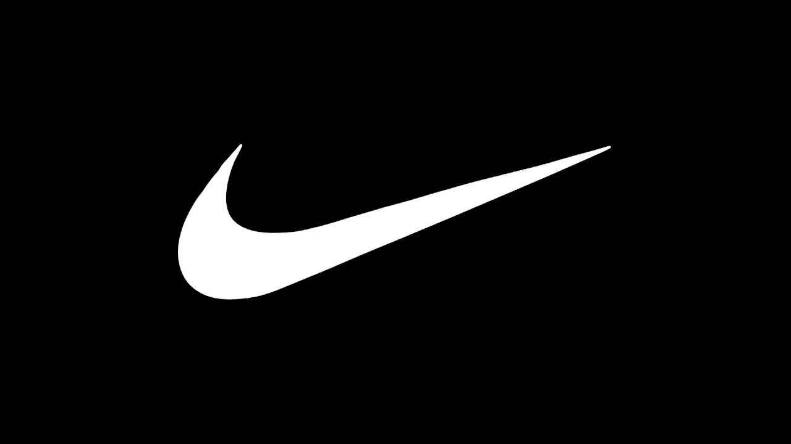

# 创建徽标的 5 个绝佳技巧

> 原文：<https://medium.com/visualmodo/5-excellent-tips-to-create-a-logo-22419c5fa195?source=collection_archive---------0----------------------->

几年前创业的时候，我觉得设计一个 logo 是一件很简单的事情。我可以在几个小时内完成，在电脑上编辑并打印出来，这样我就可以把它贴在我产品的正面。这就是我所做的。几天后，我见到了我的一些朋友，他们创办的企业后来取得了成功。

我告诉他们，我已经在一天内完成了标识的制作，我准备开始招聘和销售我的产品。他们惊呆了！我认为我做了一些英雄的事情，只是为了让他们告诉我重新考虑我的标志。“什么鬼？”我问自己。一个 logo 里有什么重要的东西要思考几天？事实上，他们甚至建议我找一个商标设计师来帮我。

后来，我意识到在设计商业标识时花时间的重要性。我在这里告诉你，你也应该这样做。为什么？当客户想从你这里购买产品时，他或她首先会看什么？你的[企业](https://visualmodo.com/)的 logo。慢慢来，研究世界各地成功的大公司的标志。你会意识到他们花时间设计他们的标志。

# 创建徽标的 5 个绝佳技巧

他们学会了如何根据潜在顾客的喜好来调配颜色。他们甚至聘请了专业的标志设计师为他们提供相应的建议。像耐克、苹果、星巴克、可口可乐和百事可乐这样的公司就是对他们的商标非常关注的例子。你可以亲眼看到结果。

没有好商标的企业无法在市场上长久生存。如你所知，你在商标上使用的颜色类型会影响你的[顾客](https://awards.visualmodo.com/)的购买决定。你可能已经注意到，即使是孩子也会受到颜色的影响。当你带你的孩子去商店或超市时，注意他或她力劝你为他或她购买的产品类型。只有那些商标的形状和颜色融合在一起的产品才会被购买。

也许你开了一家公司，你像我一样对 logos 一无所知，现在你想改善它。或者你即将开始你的生意，你想知道如何创建有效的标志。不管怎样，这篇文章会给你五个最好的提示来帮助你为你的企业创造一个优秀的标志。请继续阅读！

# 创建一个独特的标志

在你成长的过程中，你的父母或监护人可能告诉你，这个世界上没有人的外表或行为像你。简而言之，你是独一无二的，特别的。你的标志也应该如此。标识的目的是帮助你的消费者区分你的产品和你的竞争对手的产品。

为什么要尝试抄袭别人的 logo？你是一个非常有创造力的人。你相信你的事业。通过你的标志向你的消费者展示你有多相信它。花点时间想象一下商业标识会是什么样子。边走边想。睡一觉。你思考的时间越长，这个标志看起来就越好。写下你的想法，并与你的同事分享。一个标志不仅仅是一个组织提供的产品或服务的代表。这是生意的本质。

# 了解你的品牌

商标可以被认为是介绍你的品牌的图像。这是真的。标识的目的是帮助你容易到达你的目标市场。在设计商标时，你必须记住这个事实。你觉得你的品牌怎么样？写下来。

在互联网上做你的研究。不要复制其他企业，忠于你的品牌个性。你的标志是什么意思？你能向五岁的孩子描述一下并帮助他或她理解吗？你的品牌和标志应该完全匹配。为你的品牌创造一个简单而独特的标志就足够了。

# 颜色创造差异

当考虑你的品牌时，你将使用的形象说明了你的业务的一切。花时间思考你的标志的每一个方面是非常关键的。在这些方面中，你使用的颜色是如何混合在一起的。重要的是要知道每种颜色都有自己的信息。

伴随着信息而来的是各种各样的感受。80%的[购买决定是基于情感](https://www.psychologytoday.com/intl/blog/inside-the-consumer-mind/201302/how-emotions-influence-what-we-buy)。不要把你的鞋带系在一起，摔个嘴啃泥。不要仅仅因为你喜欢一种颜色就使用它。记住，你不是消费者。

我意识到，最成功的企业主会制作调查问卷，并发给他们的潜在客户。他们填完问卷后，会给他们一份免费的礼物。在调查问卷中，顾客被问及他们认为最能代表企业的颜色。然后，企业主花时间将这些颜色混合在一起。就像作家使用 essaygeeks.co.uk 的 T4 来写伟大的文章一样，企业主也使用专业标志设计师的服务。

根据颜色心理学，这里有一些不同颜色的含义的例子。

*   红色——大胆、充满活力
*   黄色——乐观，阳光
*   绿色—有机
*   蓝色——值得信赖，专业
*   黑色——强大、权威
*   白色——纯净、简单
*   橙色——友好、年轻

# 你名字的含义

一个标志由两部分组成，基本上是一个符号和文字标记。在你决定用任何类型的符号来代表你的企业之前，重要的是要注意你将不得不使用大量的资源来做广告，以便你的目标市场能够识别它。梅赛德斯就是这种组织的一个很好的例子。

你也可以选择一个独特的标识，这只是你的企业名称。可口可乐或 IBM 就是一个很好的例子。如果你决定使用一个通用的，那么你需要想出一些独特的东西，这将有助于人们区分你的业务与他人。

避免过于时尚的字体和大空间。请记住，简单是创建一个标志的关键。有一些网站可以帮助你想出一个有吸引力的字体，并寻找标志，例如字体松鼠。

# 成功是每天赢得的

你今天欣赏的每一个简单而独特的标志都不是从成功的标志开始的。它曾经处于最底层，需要花费大量的时间和精力来普及它们。成功的企业高管会告诉你这一点。耐心总是有回报的。

不要仅仅因为你的商标看起来不受欢迎就放弃。最终，市场将决定你的业务表现如何。这并没有错。总有改进的余地。对你来说，最简单的事情就是在创建你的标志时理解并执行基本原则。

你一定会成功。不要不停地快速更换你的标志。在市场上给它一些时间。市场反应缓慢，但它总是会做出反应。

# 结论

俗话说，罗马不是一天建成的，你在这方面的成功也是如此。成功是每天都可以获得的。如果你发现自己被困在某个地方，一定要记得使用在线工具。

与雇佣专业的标志设计师相比，他们会便宜很多。与你最亲密的朋友或伙伴讨论你的想法。也听听他们的想法。最后画 logos 的时候，时不时的想想怎么改进。记住，简单是成功的关键。