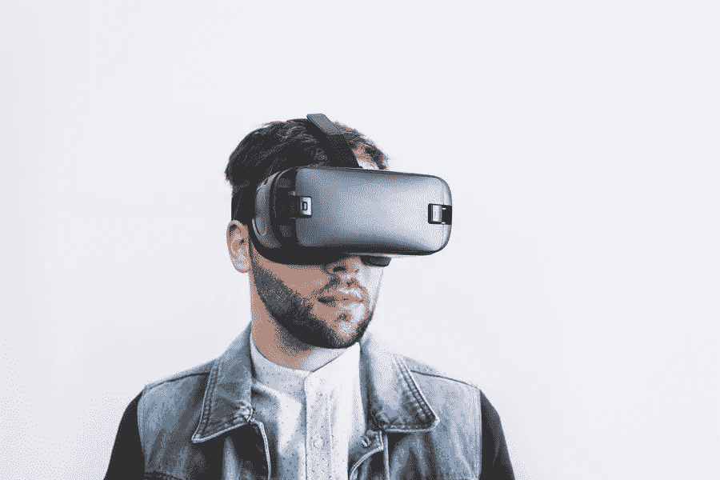

# 2020 年令人激动的 5 大教育技术趋势

> 原文：<https://medium.com/visualmodo/5-exciting-edtech-trends-in-2020-97196b675acd?source=collection_archive---------0----------------------->

技术发展没有放过生活的任何领域，包括教育。著名作家迈克尔·富兰(Michael Fullan)声称，“在教学过程中，教学法是驱动力，技术是加速器”，这一点很难反驳。从黑板和电视到智能板和交互式白板，从厚重的书籍到平板电脑上的整个图书馆，从嗡嗡作响的录音机到漂亮的立体声系统。这份教育领域积极变革的清单可以一直列下去。在本文中，我们将探索 2020 年最令人兴奋的 5 大教育技术趋势。

# 2020 年令人激动的 5 大教育技术趋势

如今，孩子们不能说分数列表丢失了，因为系统跟踪每个学生的学习表现。教师可以轻松处理物理成绩记录，家长也可以随时了解孩子的表现。但这并不意味着技术进步只对教育系统和控制家长有利。学生和其他人一样受益匪浅:众多的应用程序、教程、指南、网站、定制论文写作服务——这些额外的好处极大地促进了学习和家庭作业的准备。这些都是众所周知的事情，不能被认为是创新，但教育技术有许多其他令人兴奋的趋势，请继续阅读，了解更多有关它们的信息。

# 加强远程学习

这不是什么新鲜事，但最近变得比以往任何时候都更紧迫。世界试图适应一种新的生活方式，教育也是如此。这就是为什么远程学习领先于潮流的原因。学术机构采用不同的学习形式:当教师与学生一起进入系统并进行教学时，采用实时形式；当学生需要处理现成的讲座并完成相关任务时，采用记录形式。

除了学校和大学，许多学习平台支持远程教育，为在线课程提供折扣或完全免费。对于那些已经在学术机构注册的人和那些想要掌握新技能的人来说，大规模开放在线课程(MOOCs)是一种补充活动。一些大学与在线平台密切合作，以便在 Coursera 和 EdX 上提供顶级学院和公司的课程，并且仍然是用户中受欢迎的远程学习类型。

# 将 3D 打印融入学习过程

3D 打印本身就是一件令人兴奋的事情，同时也是一个很好的学习工具。如果你很难想象这项技术在学校科目中的应用，你会惊讶地发现，学生们已经为化学课建立了分子模型，在器官、骨骼结构和其他生物制品模型的帮助下学习解剖学，为学校活动制作装饰品，甚至重现恐龙骨架。在教育过程中实施 3D 打印可以让学习变得更加有趣和生动。除了提高计算技能之外，学生们还可以发展想象力、解决问题的技能，并与尖端技术合作。因此，一个伟大的教育技术工具。

# 个性化学习的人工智能技术实现

为了让你理解它是如何工作的，想想 Youtube Music 提供的个性化推荐和选择，以及网飞建议观看的内容。这个想法是向用户推荐他感兴趣和感兴趣的内容。同样的方法也适用于教育。

传统的教育体系不能提供一种一刀切的方法来接触每一个学生，满足他们的需求和特点。在这种情况下，个别辅导更有效，但它也不能取代小组学习，因为学生缺乏与同学的社交互动。班级不能有更少的学生和更多的老师，以达到更强的个人方法。解决方案是通过在人工智能技术的帮助下集成个性化学习，使教育对学生更加友好。一个由人工智能驱动的应用程序可以评估每个学生的优缺点，以优化作业，并提供相关资源来澄清复杂的问题。

这种以学生为中心和帮助教师的技术仍在开发中，但它的版本已经被一些学术机构使用。例如，卡内基梅隆大学[应用了一个基于 AI 的数学学习软件](https://www.businesswire.com/news/home/20190813005078/en/Carnegie-Learning-Continues-Simplify-Enhance-Teachers%E2%80%99-Lives)，为数学学习者提供个性化辅导。

# 教育技术趋势:教育中的虚拟现实技术:通过体验学习

学习和记忆一些东西不是通过阅读，而是通过亲身经历，就好像它们在实践中发生过一样。虽然 VR 技术还没有共享。我们无法理解这些影响。一些学术机构开始逐渐将 VR 融入培训过程。例如，去年，哈佛大学的学生与浙江大学合作，利用虚拟现实软件探索了吉萨金字塔。参与者呆在教室里，使用虚拟现实耳机，检查非洲北部的古代象形文字。

除了学习古代文明的生活方式，学生们还可以沉浸在水下世界，遨游太空。从内部探索解剖到最小的细节。令人惊奇的是，这既是一种很好的学习方式，也是一种娱乐。这些技术的实现仍处于初始阶段。但是，经验表明，虚拟现实开启了新的学习机会，让身体残疾的学生更容易获得，并有助于提高教育质量。

# 面向多设备社会的数字课程

通过书本和小屏幕电视上的电影作为学习工具的日子已经一去不复返了。随着设备成为日常生活不可或缺的一部分，而不再是奢侈品。在学习过程中实施它们会带来许多好处，并将数字课程置于其他教育技术趋势之中。

在目前阶段，数字课程包括使用老式的 PowerPoint 演示文稿。通过应用谷歌教室等有效工具来加强课程。数字智能板的使用促进了交互活动、屏幕共享和多设备集成。在这种形式下，测试和测验会更好。

# 结束关于教育技术趋势的思考

技术和学习齐头并进，导致教育系统的显著改善。它使教师能够优先考虑他们的职责，简化班级管理，并进行有趣的互动课程。就学生而言，他们可以无限制地获取学习资源和材料。伟大的应用程序和网站，使备考更容易。

现代教育技术趋势包括真正令人兴奋但尚未为所有学术机构所普遍接受的事物。然而，这些趋势的成功维持。在一些学校和大学，这意味着他们将很快在其他学习场所采用。通过在学习中融入新技术。我们为探索世界的新机会铺平了道路。吸收知识，发展对高科技未来生活有用的技能。