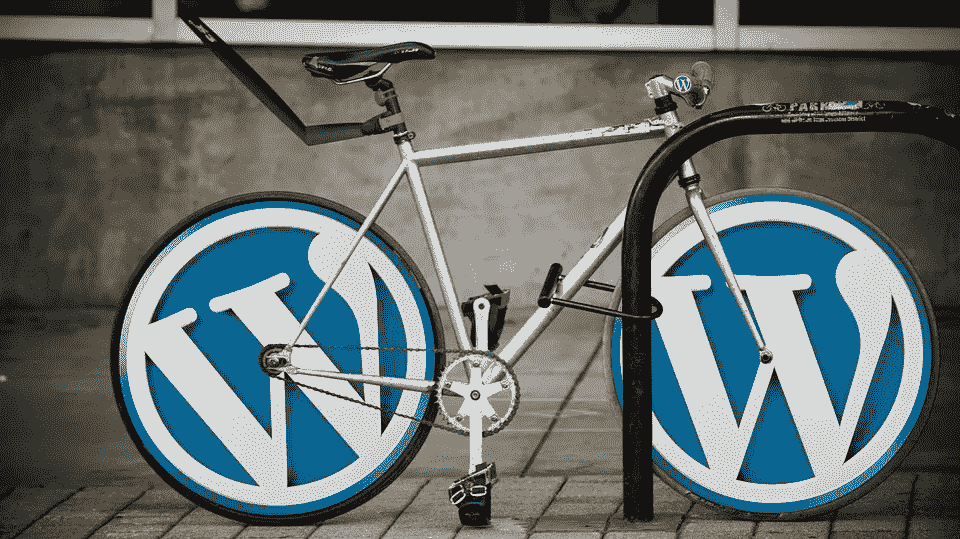

# 选择托管服务需要知道的 5 件重要事情

> 原文：<https://medium.com/visualmodo/5-important-things-to-know-about-choosing-a-managed-wordpress-hosting-service-ac3b1f7d07f0?source=collection_archive---------0----------------------->

对于任何 WordPress (WP)网站所有者来说，考虑“选择哪家虚拟主机提供商”是一个重要的决定大多数新的网站所有者和小企业主谁是来与他们的商业网站在这方面感到困惑，他们中的许多人往往会失败，在他们试图找到正确的，这造成了麻烦。有这么多主机提供商可供选择，但并不是所有的都是一样的。

自托管 WordPress 是一个选项，它很容易安装，并且有许多强大的托管选项。您还可以完全控制您的网站，并可以处理网站的所有方面。更进一步，WordPress 特有的托管服务也提供托管服务选项，这意味着当你更专注于开发一个有着受欢迎内容的令人惊叹的网站时，主机会维护你的服务器并管理好它。

在这篇文章中，我们将讨论托管 WP 主机。如果你正在建立一个 WordPress 网站或者期待着托管一个，托管的这些基本要素的知识将会对你有所帮助。

# 什么是托管 WordPress 主机？

为了更好地理解托管的概念，您可以将它视为拥有一辆汽车。汽车是一台大机器，它有许多可以比作一个网站的部件。你需要好好保养你的车，让它保持良好的运行状态，发挥最佳性能。就维护它而言，您有两种选择。

一种选择是你自己照看你的车，或者你也可以考虑偶尔把它送到车库进行保养。一个典型的网站也以同样的方式工作。您可以将托管主机视为车库，它提供了一种维护 web 服务器的实践方法。也有许多非托管主机，这主要是通过简单地提供托管空间来将管理网站的责任放在你身上。

由此可以推断，你必须为托管服务支付额外的费用。然而，如果你签约了一个[专业](https://shots.visualmodo.com/)和专门的托管服务，那么支付的溢价是完全值得的。一个好的托管将为你提供机会，让你更专注于创建受欢迎的内容，并赚取更多的钱，而不是需要始终专注于维护和故障排除。

# 寻找托管 WP 主机时需要考虑的事情

既然您正在寻找理想的托管服务，我们将在这里讨论一些需要考虑的关键因素。这个概述可以帮助你选择合适的主机，然后计划他们提出的各种选项，以提高您的网站的性能和影响力。

# 1 可靠的支持

当你的网站由第三方托管时，可能经常需要寻求帮助。所以，让主机提供商被接受的首要因素是一流的客户支持团队。支付一笔可观的托管费用，您就有权利获得 24×7 全天候的可靠支持，以确保最大限度的正常运行时间和对您的技术问题的即时故障排除。考虑以下几个方面:

*   他们的客户支持渠道是什么？
*   他们提供了哪些额外的帮助资源？
*   客户支持的速度和准确性如何？

如果他们有一个资源中心，检查是否有一个全面的知识库，你可以在那里找到所有常见问题的答案，以及内容是否很好地呈现。

# 2 令人放心的反馈和用户参考

尽管知名度不是选择服务提供商的唯一标准，但如果你在寻找品牌公司或托管服务，它肯定是他们质量的可靠指标。最受欢迎的解决方案也不一定总是最好的，因此通过收集客户反馈、评论和其他人的参考来进行一些基线研究是非常重要的。你可以看看其他类似的 WordPress 推荐了什么，尤其是如果你的网站预计会有更大的流量。

# 3 灵活性和可扩展性

任何有价值的托管服务都可以根据客户的需求提供广泛的解决方案。如果是这样的话，你可能需要根据你手头的主机需求来寻找最合适的计划，但是要考虑到未来升级计划的潜力。就主机而言，要考虑的一个主要问题是，坚持使用同一个主机总比不时更换主机要好。因此，在与任何提供商签约之前，服务的可扩展性是首要考虑的事情。

# 4 提供商在各种行业、利基市场和处理更大网站方面的专业知识

继续上述观点，您还应该能够从他们提供的不同计划中进行推断，并确定提供商在处理重负载和流量方面的优势和经验。即使您最初有适度的目标要实现，您也可以通过了解您的站点处于一个更安全、运行时间更长的状态来享受内心的平静。也寻找主机提供商的客户群，看看是否有任何主要客户也会给你的提供商的专业知识和质量的思考。

# 5 关注速度和性能

在网站管理方面，速度是一个杀手锏。除了确保最佳的用户满意度，速度现在也是一个重要的 SEO 元素。如今，网站速度慢是网站的死刑。因此，对于网站所有者来说，找到一个托管的 WordPress 托管服务是很重要的，它可以优化加载速度和网站性能，从而提高流量水平。任何提供商的主页都会简单地吹嘘它，所以你可能会更好地看看下面的元素，如他们的服务器运行的 PHP 版本，服务器的位置，以及他们采用的其他加速技术。

总之，人们不应该仅仅基于外围元素就决定采用托管服务。更重要的是，在选择托管服务之前，你需要考虑他们的核心属性，如上文所讨论的，以及真实的反馈和客户对他们服务的评价，这是你网站成功的关键。