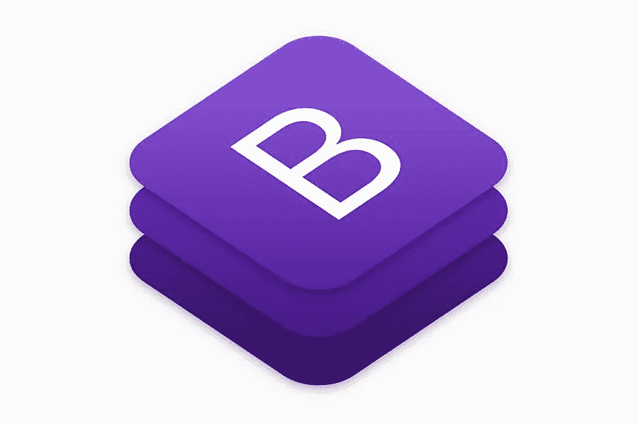

# 2021 年要尝试的 5 个现代引导模板

> 原文：<https://medium.com/visualmodo/5-modern-bootstrap-templates-to-try-in-2021-5e68096ed50c?source=collection_archive---------0----------------------->

你正在为你当前的网站添加新的元素或内容吗？看起来您唯一的选择是重新开始构建过程，这可能会花费大量的时间、金钱和精力。然而，还有另一个解决方案。现代的引导模板可以让你在网站上添加或更改项目，而无需花费大量金钱或占用大量时间。

当[定制网站](https://visualmodo.com/psychology-modern-day-web-design/)不是正确的解决方案时，引导模板是一个很好的选择。这些模板易于定制，任何人都可以使用。Bootstrap 框架有很好的文档记录，得到了很好的支持，并受到了全世界企业所有者、开发人员和设计人员的赞赏。

# 关于引导模板你应该知道什么

统计数据显示，Bootstrap 是网站使用最多的框架之一。在互联网上 100 多万个顶级网站中，超过 20%的网站在其图书馆的某个地方使用 Bootstrap。众所周知，在你制作一个以移动为先的网站，专注于前端 web 开发的情况下，它非常有用。

Bootstrap 于 2011 年推出，此后一直得到更新和支持。虽然它在 2013 年的市场份额不到 2%，但已经增长了 12 倍。Bootstrap 的最大特点之一是它非常灵活。它可以与各种 UI 工具包一起使用，并与设计语言系统集成。

Bootstrap 是创建一致代码和维护设计模式的优秀资源，但它对代码也是如此。这不仅是一个受欢迎的工具，而且是一个不断增长的、经常使用的 HTML、CSS 和 JavaScript 代码库。

# 选择引导模板的主要原因

Bootstrap 提供了各种各样的工具，包括为网站创建各种用户界面的选项。这些元素可以是简单的表单，也可以是更高级的项目，比如下拉列表、导航栏、选项卡和表单。

Bootstrap 允许你制作模板，创建插件，或者在页面上你喜欢的任何地方放置内容。响应式网页设计中涉及的所有项目，如 PSDs 或图形网页设计，都可以在 Bootstrap 中轻松转换。正是这一点使得创建引导模板成为可能。

Bootstrap 提供的顶级实用工具之一是一个适用于任何设备的网页设计快速路径。您可以在引导模板中使用的所有组件都可以调整到任何屏幕尺寸。

还有一个网格系统，可以更容易地定位和调整屏幕上不同元素的大小。由于系统本身可以处理浏览器窗口或屏幕大小的变化，因此它可以将内容分布到一到十几个栏中，以实现响应性设计。

# 引导模板的主要功能

Bootstrap 的基本框架是它最显著的优点之一。它允许您在 HTML 元素的整个范围内在基本样式定义中应用不同的颜色、大小、网格和字体。这为容器和元素创造了统一的外观。在大多数情况下，开箱即用的风格工作良好，但也可以修改或编辑，以满足您的需求。

通过 JavaScript 和 jQuery 插件添加 JavaScript 元素还会添加额外的 UI 元素，如滑块、工具提示和对话框。Bootstrap 包括一个 HTML 结构、额外的 JavaScript 代码和一个 CSS 声明，该声明允许使用各种界面元素实现更强大的功能。

现代引导模板中的布局工具也是必不可少的，并且使用 CSS 网格布局。这种布局由列和行定义，已经成为设计人员和开发人员的行业标准。

# 2021 年最佳现代引导模板

自从 Bootstrap 模板出现以来，它们变得越来越流行，并且每年都在流行。可用的模板可以适应各种业务类型，同时使任何人都可以简单地开发和设计网站，而无需雇用专业开发人员。

这个列表中的引导模板可以帮助你在建立网站时降低成本，节省开发时间。由于市场上有数百种可用的模板，我们希望将重点放在能够通过简单的安装、定期更新和快速发布内容的能力为您的业务提供最大帮助的各种模板上。

Designmodo 启动模板

Startup Framework 使用块模型系统，使设计人员和开发人员可以选择以各种组合使用 100 多个不同的内容块来创建一个独特的网站。这个引导模板有免费和付费两种版本，因此用户可以在决定是否为额外功能付费之前试用该软件。

模板的免费版本可以访问所有的特性，包括一个演示模式，提供免费的 Figma 源代码，并提供广泛的支持。这个引导模板增益定期更新。最近的一些更新包括元素的可编辑类和属性，改变背景和图像的能力，以及与整个团队共享项目的选项。

# 诺贝尔最小和通用多概念模板

这个引导模板有一个极简主义的，但多才多艺的设计，侧重于设计中的照片和其他图像。有五种不同的登录页面设计可供选择，四种投资组合布局，以及几乎无限的自定义幻灯片。对于一个摄像师或摄影师来说，这是一个非常好的选择。它有一个不寻常的布局结构，非常适合这类网站。

该模板支持 YouTube、Dailymotion、Vimeo 和 Wistia 的视频。它附带了一个 30 页的用户指南，包括示例代码截图，使使用它变得简单。模板中包含的所有内页都有投资组合风格网站所需的最重要的组件。

# 信息素智能多概念模板

2021 年可用的另一个最通用和功能最丰富的引导模板是信息素模板。这是一个多用途的模板，主要关注网站的内容。它包括 80 多个 HTML 文件和一系列其他文件。极简设计非常适合那些想要建立网上商店、博客、作品集或公司网站的人。

有超过 25 个带有模板的主页样式，包括商店布局和完全响应的设计。它支持最新的 jQuery 和 Bootstrap，提供终身免费更新，并允许 CSS 动画。它带有单页和多页演示，对编码人员和设计人员来说非常友好。

# 模板 Flip Awesome 应用程序模板

Awesome App 是另一个现代的引导模板。此外，它的一些功能来自于文件包 2。它是一个登陆页面，你可以在这里展示你的软件、应用或其他产品。它提供了包括价格表、应用程序截图、下载和推荐的部分。该模板适用于任何大小的屏幕，并能轻松适应各种窗口大小的变化。

该模板带有字体很棒的图标，可以与应用程序功能一起使用。还有一系列应用商店图标、社交图标和下载按钮，因此您可以轻松显示您的 Twitter、脸书和 Instagram 个人资料。该模板有一个免费版本，但高级版本附带了 1000 多个 UI 组件。

# 和/或响应单页和多页投资组合 HTML 模板

Andor 是一个专注于提供优雅、现代和简单设计的模板。它可以是自由职业组合，展示创造性的数字作品，或销售在线服务和产品。它在 Bootstrap 上，所以它提供了健壮的特性，包括令人敬畏的字体图标、Ajax 组合和工作联系表单。

该模板有 13 种不同的主页风格和 100 多种 HTML 页面可供选择。它包括同位素过滤平滑效果和投资组合的细节，而没有带来一个新的页面。那些喜欢使用 WordPress 的人也会喜欢这个博客系统的模板版本。

# 根据您的需求选择完美的引导模板

因为有许多可用的引导模板，所以在选择模板时需要注意一些事情。最佳引导模板将满足以下标准:

*   一个经验丰富的技术机构创造了它。如果制作模板的公司已经存在几年了，你可以预期产品会更加专业。
*   利基市场。Bootstrap 主题越具体，为您的目的定制就越简单。如果模板中有您需要的页面，那么需要的编辑工作就会少一些。
*   模板是由技术援助。虽然现代的引导模板是用户友好的，但是能够在你需要的时候得到支持是至关重要的。出现技术问题时，快速处理它们通常是必要的。知道如何获得支持应该是你决策的考虑因素。

引导模板有各种类型，并且易于学习使用。尽管这项技术很受欢迎，但 Bootstrap 很可能会存在很长一段时间。从专业公司选择一个符合你需求的模板会给你最好的基础。给 Bootstrap 一个机会，看看建立一个完美的网站有多容易。