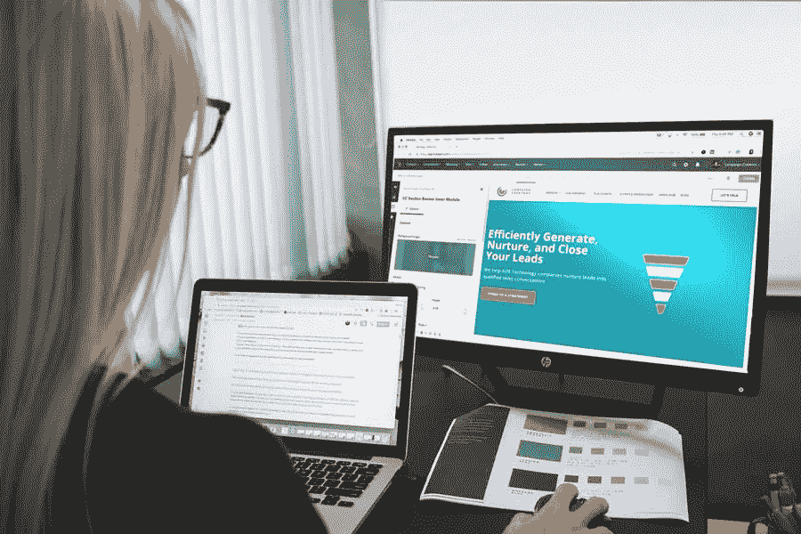

# 2021 年 WP 用户最感兴趣的 5 个网页设计趋势

> 原文：<https://medium.com/visualmodo/5-most-intriguing-web-design-trends-of-2021-for-wp-users-4e378859c2cf?source=collection_archive---------0----------------------->

新冠肺炎强加给我们的家庭订单中有一线希望。网页设计师们被拉出了他们的舒适区，他们的任务是创建网站，让远程工作感觉就像与人近距离工作一样。在这篇文章中，你会看到 WP 用户最感兴趣的五个网页设计趋势。

网络创作者已经全心全意地接受了这一挑战。我们现在看到新的[网站趋势](https://visualmodo.com/logo-design-changes-social-media/)，包括大胆的配色方案，为在线购物者提供的 3D 产品，让你想查看网站的排版，以及更好的移动兼容性。

这里有一些你可能想尝试的流行网站设计。

# 独特的字体耐人寻味的 WP 网页设计趋势

网站创建者小心使用字体的日子已经一去不复返了。如今，我们越来越多地看到在非正式场合使用无衬线字体。因为我们现在看到更多的空白空间，这是更大的屏幕的结果，杂乱的方面都消失了。如果有设计软件包，比如 MasterBundles 提供的软件包，那就更好了。在 master bundles 中，您可以购买一次性的在线产品，其中包含各种模板和字体，供现在和将来使用。

随着时间的推移，主题会发生变化，甚至可能欢迎新的目标年龄组进入网站。你可能需要在网站设计后做些调整。拥有这样的设计包可以确保您以后不必承担额外的成本。

# 舒适的颜色

这些天我们在笔记本电脑上花了太多时间，这导致了眼睛疲劳。网站创建者正通过使用对眼睛更友好的暖色来纠正这一点。我们也看到了较暗的谷歌幻灯片主题，其中很多主题都是白色的。此外，柔和的调色板，如微妙的绿色，柔和的蓝色，温暖的棕色和浅粉色是黑暗和白色色调之间的中间地带。