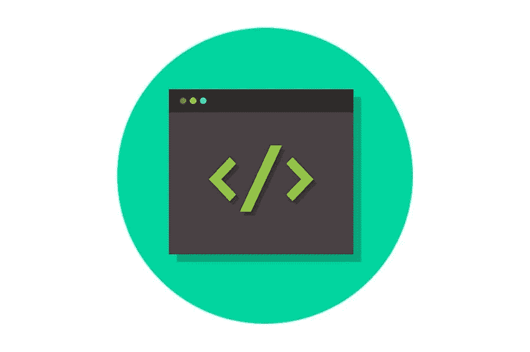

# 质量保证和软件测试为什么重要的 5 个原因

> 原文：<https://medium.com/visualmodo/5-reasons-why-quality-assurance-and-software-testing-are-important-90b26d9d007?source=collection_archive---------0----------------------->

企业通常需要对他们的软件产品进行质量保证(QA)测试，以定位和修复任何错误。然而，这个过程比诊断软件错误有更多的好处。这个过程是软件开发的核心，确保产品的可靠性和功能性。以下是为什么您应该让软件测试人员对您的软件产品进行频繁的质量保证和测试的一些原因:

# 1 性价比高

有缺陷的软件在几个方面都是昂贵的。首先，如果产品没有按预期运行，它可能会产生负的投资回报(ROI)。这经常在开发人员和 QA 测试人员的争论中被引用。QA 过程识别阻碍产品功能的小故障，并在吓跑用户之前修复它们。

其次，作为产品所有者，你可能会被迫补偿那些在与你的产品交互时遇到故障的用户。此外，额外的成本可能来自软件测试，但很容易被回报所掩盖。成功的品牌往往会在测试并成功修复 bug、升级产品后发布产品[更新。](https://visualmodo.com/increase-ecommerce-store-sales/)

# 2 增强的安全性:质量保证和软件测试

网络犯罪行业正处于历史最高水平，每年从黑客攻击中净赚数百万美元。加强你的软件免受黑客攻击的一个方法是进行频繁的测试和质量保证。如今，客户选择那些可以保护他们的投资和个人信息免受黑客攻击的产品。软件测试和质量保证增加了产品的可信度，并为您节省了保险单中的麻烦。

测试你的产品是否有漏洞不仅能保护你免受网络犯罪的侵害，还能保护用户的生命安全。例如，1994 年，中国航空公司空客 A300 上的一个软件缺陷导致了一次坠机。导致 294 人丧生。