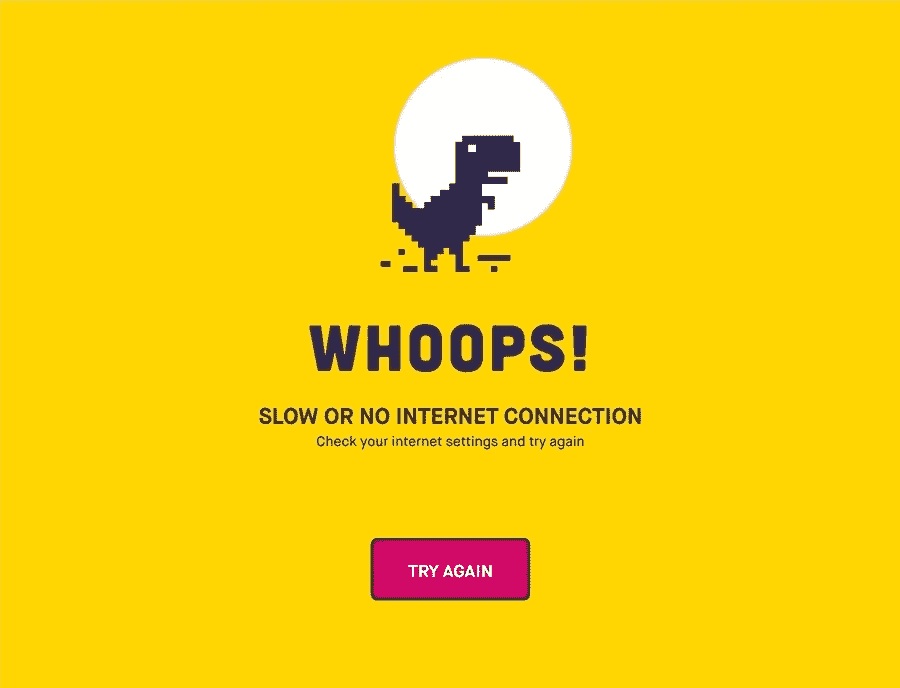

# 糟糕的网页设计公司的 5 个标志

> 原文：<https://medium.com/visualmodo/5-signs-of-a-bad-web-design-agency-2caf1c7ec5b5?source=collection_archive---------0----------------------->

你的网站对你的业务至关重要。在这个数字时代，大多数人在购买之前都会先在网上查看产品或服务。无论你是一个小企业主，从事中等规模的电子商务业务，还是一个主要在线市场的商业卖家，都有必要有一个专门的网站来展示你的品牌，并作为潜在客户的参考点。在这篇文章中，你将学会如何判断一个糟糕的网页设计公司的标志。我们开始吧！

一个成功的网站始于你寻求雇佣一个好的网页设计公司——一个值得信赖的、可靠的、值得信赖的网页设计师，他将帮助你创建一个反应灵敏的、功能齐全的、有吸引力的网站。你怎么知道你在和一个好的还是坏的网页设计师一起工作？

# 糟糕的网页设计代理标志

*   **没有要展示的投资组合**

网页设计被认为是一门艺术，同时也是一门科学，所以你希望你的网站是专业制作的，以确保高成功率。一个好的网页设计师对有吸引力的网页设计有很好的眼光，并且精通技术，就像一个可信的、有声望的[网页设计代理公司 Melbourne](https://www.straightoutdigital.com.au/website-development/) ，他们会很乐意向你展示他们的作品。如果一个网页设计公司不能展示他们的作品，那么可能有以下原因:

*   一个糟糕的网页设计公司不能展示一个作品集，尤其是如果这是他们的第一个项目。将你的网站委托给一个完全没有经验和未经测试的新人是非常冒险的。
*   一个网页设计公司不能展示作品集的另一个原因是他们在过去已经建立了糟糕的网站。
*   **要价过高或太便宜**

网页设计服务没有受到高度监管，所以网页设计师可以随意收费。一个糟糕的网页设计代理可能收费过高或过低，但是一个好的网页设计师会尽可能地检查当前的价格和平均价格。以下是需要记住的几点:

*   网页设计师有不同的层次(例如，迎合非营利组织或小型企业)。
*   网页设计师也根据他们的经验、作品以及是否有办公室来收费。在线代理机构往往评级较低，因为他们不支付办公室租金和拥有物理办公室的其他昂贵方面(如清洁服务)。
*   网页设计服务的费用取决于你想要的网站的安全性、吸引力和功能性。
*   **提供无合同工作**

虽然没有合同意味着没有繁文缛节，有讨价还价的空间，避免要价过高，但也意味着没有有保证的保护。网页设计合同可以保护你和网页设计师，防止将来出现纠纷和重大问题。一家糟糕的设计公司不会提供合同，这意味着你甚至不确定这项工作是否会在约定的日期完成。

什么是好的网页设计合同？

*   规定网页设计师的时薪或工资
*   显示网站的最终价格和服务细目
*   包括任何修订，作为您的口头协议和初始合同的一部分
*   设定明确的期望(例如， [WordPress 主题](https://visualmodo.com/wordpress-themes/)、布局、速度、字体大小等)。)
*   **无法展示实体模型和原型**

一个糟糕的网页设计代理会阻止客户要求或询问大量的修改，所以他们不能展示模型和原型。你应该能够在启动前的各个阶段检查你的网站，以便检查和解决任何问题。在启动你的网站之前，一个好的网页设计师应该能够呈现以下内容:

*   你网站的静态模型
*   网站的工作原型
*   最终原型(看起来完全像最终推出的网站)
*   **沟通能力差**

一个糟糕的网页设计师无法用通俗易懂的语言很好地解释技术术语。一个好的网页设计师了解网页设计的趋势，并有能力展示他的想法，并将它们与你的结合起来。如果一个网页设计师说行话，你怎么能完全理解这个过程？你最终可能会有不明确的期望、怀疑和失败的结果。问一些相关的问题，这样你就可以在雇佣一个网页设计师之前证明他的沟通能力。这里有一些你可以问的问题:

*   是什么造就了一个有吸引力的网站？
*   网站将如何突出我最好的产品？
*   你学过的网页设计技巧和课程有哪些？
*   你能详细解释一下设计过程吗？
*   为什么你们的服务这么贵？

# 结论

作为一个网站所有者，你必须确保你的网站将是功能性的，有吸引力的，易于导航的，快速的，可靠的，移动响应的。它应该代表你的[品牌](https://awards.visualmodo.com/)或者目的。一个糟糕的网站设计公司不适合做这项工作，他们提供的交易好得不真实，可疑，没有记录。在雇佣中介时，牢记这五个标志，远离这样的中介。