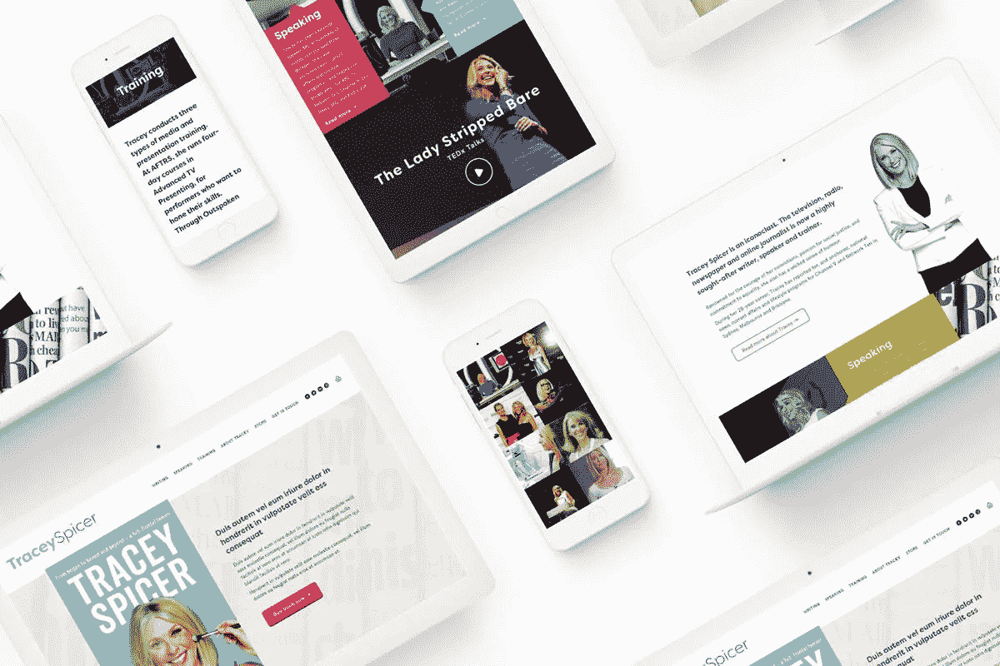
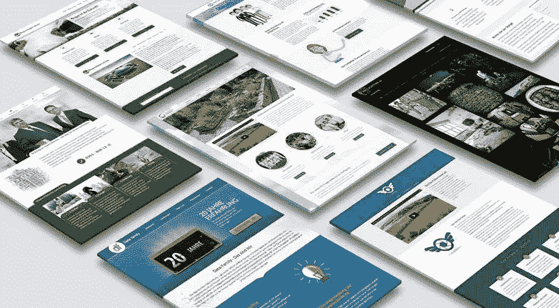
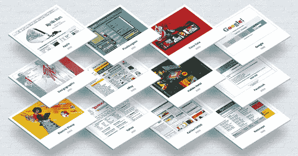

# 挑选最佳网页设计公司的 5 个步骤

> 原文：<https://medium.com/visualmodo/5-steps-to-pick-out-the-best-web-design-company-357fa59cdea6?source=collection_archive---------0----------------------->

制作一个伟大的网站不仅仅是编写 HTML 代码。无论你的主题是什么，你都需要成功地以有趣的方式表达你的想法。因此，对于每个个体企业主或刚起步的企业家来说，网站是必不可少的。在你决定建立一个免费网站或其他在线免费服务之前，你需要对网页设计公司的存在三思。

# 挑选最佳网页设计公司的 5 个步骤

每当你搜索网页设计公司，你应该获得关于网站设计公司的重要性的知识。

# 为什么选择最佳网页设计公司？

选择[最佳网页设计公司](https://www.creaadesigns.com/home.php)需要考虑一些因素，其中一个是公司的能力。

最好的公司有一个投资组合，它告诉你的服务比专家告诉你的还要多。寻找一家能够提供服务的网页设计公司的任务从未像今天这样艰巨。因为失败和成功之间总是有一线之隔。

因此，你需要小心选择网页设计服务提供商。以下是选择最佳设计公司的 5 个简单步骤。

# 你必须知道你想要什么

大多数企业主认为他们对网页设计了解不多，没有理由建立一个网站。这是把所有工作留给网页设计公司的主要原因。这是接触网站设计机构时最容易犯的错误。

一般来说，你必须清楚什么该放在网站上，什么不该放。因为公司的宗旨和目标对于您的在线和离线业务平台都是一样的。

因此，最好知道你想在网站上发布什么，这完全是你的责任，而不是别人的。

# 了解你的商业价值和你的预算

最好是固定预算，尤其是网站设计。在你选择之前，你必须知道网站设计服务的大概费用。

现在，大多数网站开发商很少在他们的网站上包含他们的服务费，而很少有人在[网站](https://visualmodo.com/)上包含基本费用。

# 工作质量

这并不是要让你的网站看起来有创意，但你需要确保它是发达国家和呈现技术先进。例如，如果你的[客户](https://visualmodo.com/)访问你的网站以了解更多关于你的业务，他/她必须得到所有需要的关于你的服务的细节。

所以，在开发你的网站时，你要寻找最好的网页设计公司，它能提供你需要的服务来改善你的业务。

很少有像 Creaa Designs 这样的公司，能够给你提供你所需要的东西，让你的网上形象更加真实。

# 对过去工作的快速回顾

在选择完美的一个之前，不要忘记检查他们过去的工作，并将你的要求与他们的工作进行比较。你还需要检查他们的推荐信。因为没有什么比满意的顾客更重要。

这样做，你可以完全信任他们的能力的网站设计供应商。

# 识别交互设计——它是有意义的

一个[设计](https://visualmodo.com/)的组织拥有良好的设计知识是非常重要的。在大多数情况下，作为一个客户，你需要明白设计网站不仅仅是填充颜色，它还应该说话和互动。

专业的设计专家非常了解网页设计的所有方面以及标准的设计原则。

# 最后一个音符

如果你正在孟买寻找最好的设计公司，Creaadesigns.com 是你的最佳选择。他们为您提供业务所需的各种服务和帮助。

[Visualmodo](https://visualmodo.com/) 也提供基于 WordPress 的网页设计服务，价格合理，拥有 12 年的经验和非常好的用户界面。