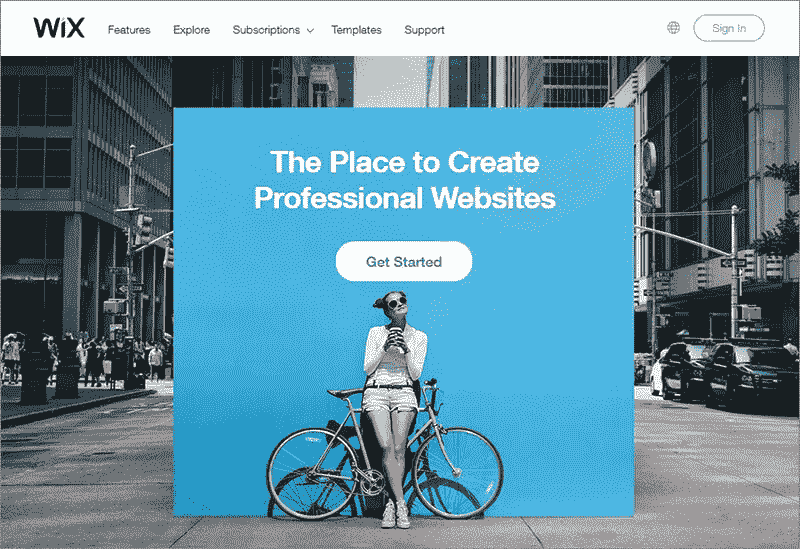
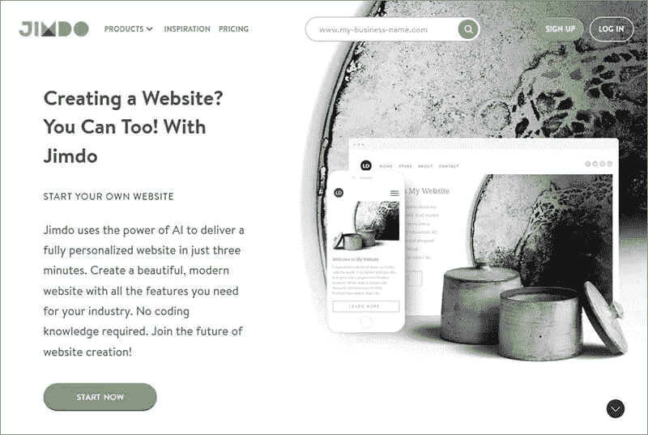
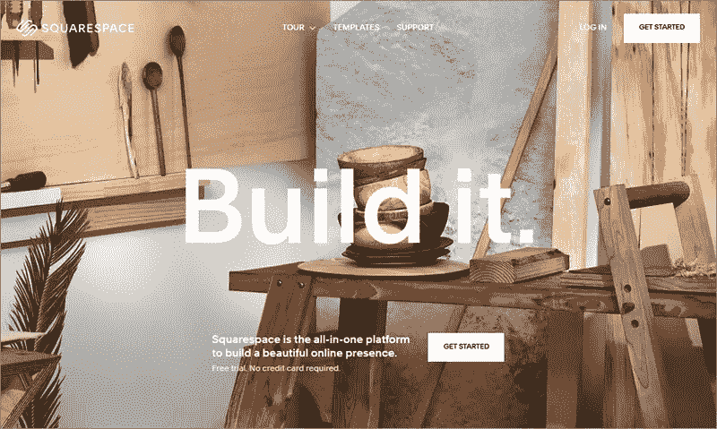

# 5 个最好的移动友好网站建设者

> 原文：<https://medium.com/visualmodo/5-the-best-mobile-friendly-website-builders-f0050edde040?source=collection_archive---------0----------------------->

智能手机已经占据了我们生活的方方面面，这是理所当然的。它们小巧、方便，并与主导市场的最新技术兼容。有几项调查和研究证实了这样一个事实，即目前大多数用户使用手机浏览互联网。因此，为手机优化你的网站成为了企业家们的一个强制性标准。以下是五大手机友好的网站构建工具，你可以看看:

# 5 个最好的移动友好网站建设者

# 威克斯

Wix 是市场上最知名的免费网站建设者之一。Wix 配备了 WYSIWYG 界面和独特的 ADI 框架，可以满足所有内容创作者和开发者的需求。ADI 系统会根据您的偏好自动为您生成一个网站。

该编辑器与手机兼容，主题都针对 Android 设备进行了优化，图形支持 retina 并可针对所有屏幕尺寸进行定制。在 Wix，你可以编辑网站的移动版本，控制帖子的可见性，隐藏内容等等。

# Weebly

Weebly 是目前市场上最简单、最用户友好的网站建设选择之一。简而言之，移动编辑器是一个相当新的平台。Android 应用程序是一个受欢迎的额外津贴，可以提高建筑商的可信度。

在这里，您的网站或商店的移动友好版本会自动生成并与桌面版本一起上传。此外，这两个版本是相互关联的。举个例子。你在桌面版本中所做的任何改变都会在应用程序中反映出来，反之亦然。

最后，Weebly 有一系列现成的布局和预设主题，都是为手机优化的。加上坚实的电子商务支持和商店建设选项是一个伟大的补充。免费的 SEO 工具和谷歌分析集成使 Weebly 成为开发者的可行选择。

# 吉姆多

Jimdo 提供了大量的模板和吸引人的主题，只需很少的编辑，在任何平台上看起来都很棒。而在更早的时候，他们有专门的移动编辑器。此外，新版本有一个标准的拖放界面和移动响应工具。

移动网站生成器是初学者的绝佳选择。仪表板中有许多可视元素可以改变尺寸。形状和配色方案，您的网站在几个简单的点击。此外，Jimdo 还为客户提供实时预览和实时编辑选项。即使网站已经上传到服务器上，您也可以对其进行更改。强大的搜索引擎优化工具。CMS 解决方案。SSL 加密元素。因此，它可以让你绝对控制你的网页的范围和可见性。

# Webnode

Webnode 是市场上一家响应迅速的网站构建商，迄今为止拥有超过 3000 万注册用户。开发者可以用 20 多种语言建立 Android 友好的网站。这里也支持多语言平台，让你有机会让你的内容真正国际化。

拖放界面带有一个实时编辑器和一个充满可定制工具的仪表板。一旦你将桌面版本上传到服务器上，Webnode 就会自动创建一个移动版本的网站。

Webnode 快速、方便且易于启动。这是业余爱好者和初露头角的商人的绝佳选择。他们没有足够的技术专长来使用代码构建网站。还有其他额外的好处，比如 SEO 增强工具、CMS 支持和电子商务解决方案。另外，使用 Webnode 可以创建的页面数量没有限制。

# 方形空间

Squarespace 可能没有移动编辑器，像上面的其他开发者一样，但它以其响应迅速的移动友好主题弥补了这一点。该界面为用户提供了一系列专业主题，每个主题都可以定制，并与 Android 设备兼容。它们在移动屏幕上看起来非常好，无缝地适应屏幕分辨率和大小。

还有其他网站建设工具和元素，使建设者一个灵活和多才多艺的企业家的选择。例如，Squarespace 支持谷歌用于博客文章的开源软件 [AMP](https://visualmodo.com/website-mobile-seo-wordpress/) 。此外，还附带地图、字体和分析工具来监控您网站的性能。

你可能没有机会创建一个专门的移动网站。但是，所有元素都允许您在多个设备和屏幕上展示您的内容。此外，Squarespace 带有一个所见即所得编辑器，不涉及编码，也不需要任何技术专长。

# 额外的移动友好构建选项:Visualmodo

最后，Visualmodo 为 WordPress 提供了移动编辑器选项，这是网站创建者最常用和最简单的选项。除了神奇的工具。此外，Visualmodo 有先进的和扩展的文件和视频教程库。总之，在你使用 WordPress 的情况下，这是最好的选择。

# 选择哪些手机友好的网站建设者？

总之，找到一个好的网站建设平台并不像看起来那么容易。每天都有越来越多的建筑商冒出来，声称自己是下一个大事件。只有少数人能够兑现这些承诺。我们上面讨论的网站构建器是可伸缩的。最后，坚固并提供足够的稳定性，以帮助开发人员扩展其业务的范围和性能。因此，我们向初次接触者推荐 Visualmodo、Wix 和 Weebly 等平台，向电子商务专业人士推荐 Squarespace。