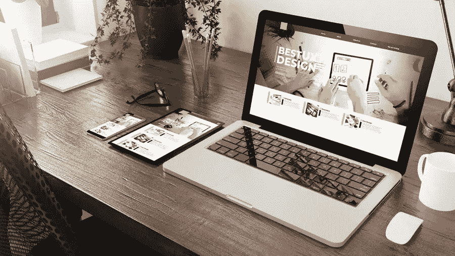

# 设计网站时需要考虑的 5 件事

> 原文：<https://medium.com/visualmodo/5-things-to-consider-when-designing-a-website-4b0bfab84a6e?source=collection_archive---------0----------------------->

你的网站是你的互联网角落。你希望它能反映出你是一个怎样的企业，让你向潜在客户展示你能为他们提供什么。一个伟大的网站不会凭空出现。要设计一个伟大的网站，必须考虑很多因素。以下是设计网站时需要考虑的 5 件事。

# 设计网站时需要考虑的事情

# 1.观众

谁是你的观众可以彻底改变你的网站设计。从决定你为谁做网站开始。这应该与谁被定义为您的客户保持一致。一旦你知道你的网站的目标是谁，你就可以设计你的网站来吸引他们。关于你的听众，你应该问自己以下几个问题:

*   谁是我们的观众？
*   他们在找什么？
*   他们为什么访问我们的网站？
*   他们想从我们这里得到什么？
*   我们如何增强他们的体验？

本质上，你的网站应该致力于改善你的客户体验。通过关注谁是你的受众，你可以设计一个满足他们需求和期望的网站。

# 2.功能

你的网站可以提供许多功能。它可以只是提供信息，它可以产生线索，它可以产生销售。理解你想要的功能是网页设计难题的关键部分。没有定义你希望网站如何运行的设计会导致延迟，最终花费更多。以下是在确定网站功能时需要考虑的一些事情:

*   这就是我们网站的目的。
*   我们的观众在期待什么？
*   关于从头到尾的客户体验。
*   网站上需要有哪些元素？

不同的功能需要不同的网页设计元素。例如，如果你的主要功能是销售，你将需要像购物车和信用卡处理器这样的元素。另一方面，如果您的功能是生成销售线索，您将需要一些元素，如联系表单、简讯注册等。

# 3.航行

没有什么比去一个网站却找不到你想要的东西更令人沮丧的了。这就是为什么在设计你的网站时，仔细考虑你的导航是至关重要的。你希望你的访问者能够快速方便地在你的网站上找到他们想要的东西。当涉及到您的网站导航时，请记住以下几点:

*   让回家变得容易。将你的徽标链接到你的主页。这样做可以帮助你的用户回到起点，让他们少受些挫折。
*   使用基本菜单。用户希望能够找到他们正在搜索的内容。避免为你的“关于我”页面和其他类别和页面使用花哨的名称。另一个好的经验法则是按照重要性从左到右排列项目，并把菜单放在标题中。
*   有一个“返回页首”按钮。这将有助于你的访问者快速回到页面顶部的主菜单。
*   最重要的信息放在“文件夹上方”。将最重要的信息放在网页的最上方，这样访问者就不用向下滚动就能看到。
*   注意杂物。拥有太多的信息会让你的网站不堪重负，难以浏览。不要怕空；它实际上可以帮助用户处理页面上的信息。

# 4.明确的行动要求(CTA)

当你设计你的网站时，你需要决定你希望访问者采取什么行动。你想让他们给你他们的电子邮件吗？想让他们购买吗？你想让他们学到更多吗？你想让他们留下评论吗？决定当客户在你的网站上时，你希望他们做什么。

你不仅需要决定你想让客户做什么，还需要让它一目了然。以下是一些让顾客明白你想让他们做什么的方法:

*   CTA 按钮使用对比色。这使得按钮突出，并防止它们与页面上的其他信息混合在一起。
*   使用创造积极行动的短语。“点击这里”是最糟糕的！相反，选择像“立即下载”、“开始”、“了解更多”等短语。
*   练习一致性。保持你的 CTA 设计在整个网站上的一致性。这将使他们很容易辨认。
*   保持 CTA 可见。这对于较长的页面尤其重要。您希望您的客户能够快速知道该做什么，因此请确保在页面上包含多个 CTA。
*   把 CTA 放在每页上。客户总是在寻找下一步是什么，所以在每个页面上提供 CTA 可以给他们这种指导。另一个重要原因是，客户可能会在不同的点进入你的销售漏斗。通过在每一页上放置 CTA，客户将知道您希望他们做什么，无论他们从哪里进入漏斗。

# 5.移动友好

这里有一个有趣的事实:81%的美国人拥有智能手机。这意味着拥有一个手机友好的网站是绝对必要的。有几种方法可以做到这一点。一种方法是使用一个设计用于桌面、手机和平板电脑的响应主题。另一个选择是对网站元素进行调整。设计网站时，你可以关注的一些事情包括:

*   避免闪光灯。Flash 不仅对 SEO 不利，而且还会消耗大量的加载时间，而且它在许多浏览器上都无法运行。如果可以，最好完全避免。
*   使用 Viewport Meta 标签。这段简单的代码与浏览器通信，将网页的宽度调整到查看网页的屏幕宽度。
*   选择大按钮和字体。更大的按钮和更大的字体使你的网站在移动设备上更加用户友好。
*   压缩你的图像。这将有助于增加您的加载时间，这对于在移动设备上正常运行至关重要。
*   允许访问者在移动和桌面视图之间切换。有时候用户更愿意使用你网站的桌面版本。给他们这个在两者之间轻松切换的选项是让他们体验更好的一个小方法。

# 设计前考虑

设计你的网站既有趣又刺激。然而，在进行网页设计项目之前，你必须考虑你的实际需求、时间表和预算。

我们都见过未能满足我们期望的网站，或者设计令人畏缩的网站。这往往是没有先思考的结果。另一方面，一些网站在设计之前，显然已经仔细考虑了他们需要什么。该网站用对比色突出了他们的 CTA，无论是在移动设备上还是在桌面上，都有一个易于导航的响应网站，并且功能与消费者预期的一样。

# 设计时要考虑的最后一句话

当你准备好开始设计你的网站时，记住列出的注意事项，你一定会得到一个不可思议的网站。