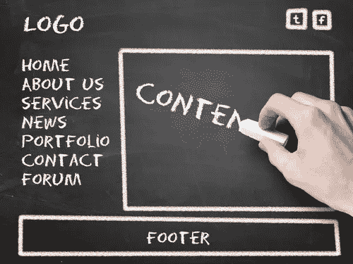

# 建立成功网站的 5 个技巧

> 原文：<https://medium.com/visualmodo/5-tips-for-setting-up-a-successful-site-b841a63abdec?source=collection_archive---------0----------------------->

互联网改变了多少个人挣钱。小企业正在走向全球，更多的人正在学习如何成为在线企业家。无论你用哪种方法在网上赚更多的钱，建立一个 WordPress 网站是专家给出的普遍建议。你可以用它来写博客或开展电子商务业务，从而在网上赚更多的钱，而且它非常灵活，可以满足你的需求。这里有 5 个技巧可以确保你建立一个成功的 WordPress 网站。

# 建立一个成功的 WordPress 网站的 5 个技巧

# 在你的网站上有所有必要的信息

在你的网站上有完整的基本信息可以确保你的观众认出你。这也有助于新观众找到你。转到设置区域并填写您的信息。

*   **你的博客/企业的名字** —你现在或即将推出的博客或企业肯定有一个名字。几乎总是不可能忘记把这个放进去。
*   **你的标语**——你的博客或商业标语将帮助你的受众了解你品牌的要旨。这是一个将与你、你的产品或服务联系在一起的短语。如果你还没有，确保你的口号以一种吸引人的、吸引人的、容易记住的方式来表达你的品牌。
*   你的 WordPress URL——搜索引擎会对 www.yourdomain.com[和 yourdomain.com](http://www.yourdomain.com)采取不同的方式，尽管在搜索排名上没有区别。这更多的是个人选择，但切记要始终如一。在此区域，放置您在其他[平台](https://visualmodo.com/)上共享网站时使用的内容。

# 使用符合你目的的主题

虽然 WordPress 主题可以让你的博客或企业看起来更好，但只有当你使用一个能提供你网站目的的主题时，它们才会看起来很棒。例如，当你想创建一个在线摄影作品集时，选择一个为电子商务商店优化的主题并不是一个明智的选择。此外，高级主题比免费或默认主题看起来更好，运行更快，所以花时间寻找完美的主题并投资于它。

# 安装最好的插件

许多专家和初学者喜欢 WordPress，因为有数百个插件可以帮助扩展他们网站的功能。一些插件吸引访问者，推动流量，或产生更多的销售。根据你建立网站的目的和你的目标，你可以选择各种插件来帮助你。不管你的网站是关于什么的，一些重要的插件是:

*   SEO 插件(SEO plugin)—这是一个有助于搜索引擎排名的工具，因为它告诉 Google、Bing 或 Yahoo 你的页面是关于什么的，并且应该与其他 SEO 实践一起使用。SEO 插件的例子有 Yoast 的 WordPress SEO、Google Keyword Planner 和 SEMrush。
*   **备份插件**——这在最糟糕的情况下非常有用，会丢失你的网站和你创建的所有内容。一些例子是 BackupBuddy、BackUpWordPress、WP-DB-Backup 和 UpdraftPlus。
*   **安全插件**——除了确保默认的管理员名称和密码被更改，安装安全插件对保护你的网站也很重要。结帐 WordFence，Sucuri，和 iThemes 安全。
*   联系表格插件 —联系表格对你的业务非常重要，因为潜在或现有客户会联系你。流行的有 WinForms，Ninja Forms，FormCraft 等等。
*   **缓存插件**——因为 WordPress 可能很慢，所以大多数网站所有者都使用缓存插件。你可以试试 WP Super Cache，W3 Total Cache，Comet Cache，或者 Cachify，还有其他评价不错的。

# 不要在你的工具条上倾倒东西

不要把你的边栏当成你想存放所有东西的地方。确保这不会成为你在家里犹豫要不要打开的储藏室，因为所有的东西都会掉下来。在你的侧边栏上只放一些必需品，而不是用你所有的社交媒体图标、广告、顾客评论等来包装它。

# 定期在你的网站上发布

既然你的目标是赚钱和建立一个成功的 WordPress 网站，定期发布内容是必须的。如果你通过订阅或广告赚钱，你需要的内容将比一个通过公开工作或电子商务产生收入的网站更多。WordPress 作为一个内容管理系统(CMS)也很出名，因为它对用户非常友好，不需要程序员或代码专家。考虑以下因素，为您的网站内容创建一个策略:

*   你打算多久发布一次
*   你打算在特定的日子或时间发布什么样的帖子？
*   你会在哪个社交媒体平台上分享你发布的帖子？
*   多样化你的内容——切换图片、视频、音频内容或博客

虽然建立你的 WordPress 网站需要花费时间和精力，但是一旦它成为一个成功的 WordPress 网站，肯定会有回报的。不要犹豫去比较主题、插件和工具，或者实验你的内容策略，同时在你的网站上提供完整的信息来启动你的 WordPress 网站。