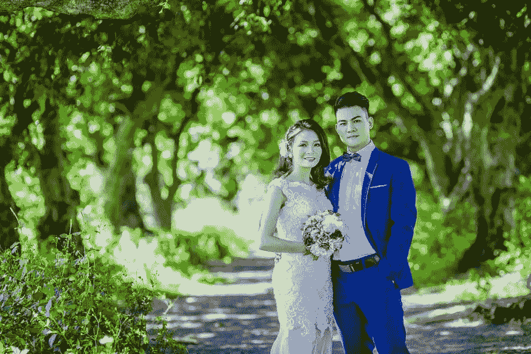

# 如何选择婚礼摄影师的 5 个技巧

> 原文：<https://medium.com/visualmodo/5-tips-how-to-choose-your-wedding-photographer-88e53ab20de7?source=collection_archive---------0----------------------->

你的大日子与众不同。选择婚礼摄影师可能是你一生中最艰巨的任务之一。为什么不应该呢？毕竟这是一生一次的大事。有人说得对，“蛋糕会被吃掉，鲜花会凋谢，但婚纱照会永存。”在这篇文章中，我们将分享如何选择婚礼摄影师的五个技巧。

考虑到摄影师在那一天要扮演的角色，让你退后一步，真正理解你首先需要什么变得更加重要。这是一件大事，关注细节至关重要。

我们为你提供了一份全面的指南，告诉你在雇佣婚礼摄影师的过程中需要考虑什么。

# 如何选择合适的婚礼摄影师的 5 个建议

你可能会想摄影师有什么大不了的，为什么需要这么多的思考和考虑。只是点击照片，对吧？

但不，这才是大事。你的婚礼摄影师将会在你宣誓和招待客人的时候一直站在你身边。摄影师做的不仅仅是拍摄一整天。凭借其独特的风格和视角，他们给你的婚礼故事赋予了不同的意义，这将是你一生的经历。

因此，雇佣婚礼摄影师是一个重大的决定，你肯定需要做很多功课。

让我们开始吧。

# 1.早点开始搜索，选择你的婚礼摄影师

为什么你想把一切都留到最后一分钟，从而增加你的[婚礼计划](https://visualmodo.com/best-wordpress-theme-for-weddings-engagements-and-newlyweds/)的压力？你应该尽早开始寻找婚礼摄影师，以避免最后一刻的失望。

开始与你的朋友或家人交谈，向他们寻求建议。与此同时，你也可以开始在网上搜索你所在地区的知名可靠的摄影师。首先不要考虑价格或时间表。首先，开始你的搜索，剩下的可以以后再做。

在搜索阶段的另一个优先任务是决定你的大日子想要的摄影风格。是的，这不是摄影师可以建议或决定的，它必须完全来自你。

充分利用你的网上冲浪技能，通过彻底浏览来发现别人在他们的大日子里做了什么。开始记下最吸引你的风格。你可能已经为你婚礼的其他方面做了这件事，选择你的婚礼摄影师也不例外。

# 2.决定你想要的婚纱摄影风格

摄影比大多数人想象的要多得多，尤其是在决定你的想法、地点、风格和那些坦率的个人照片时。

对于那些不知道摄影风格意味着什么的人，做一个快速的调查。你不必成为决定风格的专家。你可以选择

主要目标是选择一种能反映你的视野和个性的风格。以下是一些你应该考虑检查的顶级婚纱摄影风格:

1.  传统婚纱摄影:这种摄影风格绝对不会错。这些是那些完美的可以载入相册的图片，你可以珍藏一辈子。在这种风格中，摄影师的首要任务是捕捉最经典的瞬间，比如新婚夫妇的初吻。
2.  **自然婚纱摄影:**有些婚纱摄影师更喜欢在自然光下工作。如果你打算举办一场户外婚礼，这种类型的摄影非常适合你。这些婚纱照大多出现在通常所说的“黄金时间”。

# 选择婚礼摄影师的额外话题

1.  **复古风格婚纱摄影:**这种风格现在很流行。情侣们更喜欢那种怀旧的感觉，希望他们的结婚照也能反映出这种感觉。虽然摄影师可以使用不同的滤镜来营造这种氛围，但一些夫妇更喜欢在乡村拍摄，以便在照片中营造这种氛围。
2.  黑白婚纱摄影:这种风格还会出错吗？我们说绝不！喜欢简单而不繁琐风格的夫妇总是喜欢这种简单风格的婚纱摄影。这是一种常青的风格，摄影的主要焦点只在物体上。更多的时候，一些摄影师将他们的彩色照片变成黑白照片，以隐藏一些明显的缺陷。
3.  这是你可以选择的最迷人的摄影风格之一。照明在这里扮演着重要的角色。摄影师必须非常擅长使用不同种类的灯光，最终才能在照片中创造出美丽的光影效果。如果你选择这种风格，你需要非常自信你的摄影师能够掌握这种使用相机外闪光灯的技术。

# 3.列出你的最爱

既然你已经决定了你想要选择的风格，是时候进行真正的对话了。面对面的会议总是比虚拟会议更受欢迎。然而，这并不总是可能的，因此做你认为最适合你的事情。但是要记住一件事，应该是你采访摄影师，而不是相反。