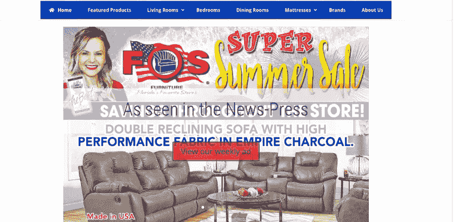

# 提高顾客对你的电子商务商店信任度的 5 种方法

> 原文：<https://medium.com/visualmodo/5-ways-to-improve-customer-trust-on-your-e-commerce-store-29bb82006251?source=collection_archive---------0----------------------->

现在学习如何正确诚实地提高客户对你的电子商务商店的信任。这里有 5 个最好的简单方法。互联网零售是增长最快的市场之一，因此，发展电子商务商店的潜力是巨大的。网上零售有其优势，如更大的灵活性，突出的客户拓展，降低运营成本，更快的交易，更广泛的产品线和舒适的家庭购物的整体便利性。

不过，有一个问题:首先，你必须获得目标受众的信任，并向他们保证通过你的网站与你做生意和进行交易是安全的。如果你能最大限度地降低在你的网站购物的风险，那么你就能战胜行业内的激烈竞争。否则，你将面临低流量和更低的转化率。

# 提高客户对你的电子商务信任的 5 种方法

# 1.让您的买家有安全感

网上购物可能是一件冒险的事情。由于购物者非常依赖无现金交易，因此数据的安全性极其重要。为了防范网络攻击，我们可以认为网站安全就像安装 SSL(安全套接字层)证书并将您的网站迁移到 HTTPS 扩展是必不可少的。

通常，客户可能会退出没有 SSL 证书的网站，因为所有合法网站都有 SSL 证书。此外，如果您的网站运行的是不太安全的 HTTPS 版本，即 HTTP，那么您的客户的数据也很容易被第三方访问，从而使他们的个人信息容易遭到破坏。

如果我们谈论 SSL 证书，有许多类型，包括扩展验证证书(EV SSL)、组织验证证书(OV SSL)、域验证证书(DV SSL)等等。

然而，EV SSL 证书是电子商务企业的完美选择，因为它提供了最高级别的加密和绿色地址栏，以确保客户的信任。

EV SSL 证书的一些最重要的好处包括:

*   绿色地址栏可以提高客户对您的[电子商务商店](https://visualmodo.com/theme/seller-ecommerce-wordpress-theme/)的信任度
*   几乎所有的网络浏览器都能识别
*   提供高级别的加密
*   身份保证

今天的购物者对这些信息非常了解，谷歌也倾向于标记非 HTTPS 的网站。因此，通过在您的电子商务网站上安装 SSL 证书，可以避免任何可能永远损害您声誉的安全漏洞事件。

# 2.用户友好且整洁的用户界面

据统计，如果一个网站的内容或布局没有吸引力，38%的人会停止与该网站接触。

所以，当你的客户进入你的网站时，吸引他们是很重要的。简单友好的用户界面是做到这一点的第一把钥匙。访问者失去了兴趣，因为他们被要求注册，填写详细资料和其他事情，他们不想做，然后他们检查网上商店。保持第一次互动最小化，充满机会。

你的产品线在网站上的定位也很重要。而对颜色、字体、图片的正确使用一定是非常专业的。看看以下网站的界面:

你不觉得这看起来很劣质吗？文字杂乱，配色不搭配，整体布局不专业。现在，这是另一个例子:

这个更优化，配色更好，看起来更专业。你更信任哪一个？当然，第二个。确保你的客户看一眼后就觉得你的网站是专业的。否则，他们绝不会放心通过你的网站付钱。

# 3.在你的网站上添加评论和推荐

人们通过评论来判断一个产品或服务，这就是为什么在你的网站上添加透明真实的评论是很重要的。看看这张[信息图](https://www.impactbnd.com/blog/word-of-mouth-marketing-strategies-infographic)，了解点评和推荐的重要性:

如今，人们相信脸书的建议和其他人对一件事情的看法。因此，电子商务网站必须确保客户的价值，并增强他们在网站上的体验。如果客户没有发现足够的价值，他或她可能会马上离开，甚至不会给你的产品一个机会。

即使是一个负面评价也会造成伤害和潜在的收入损失。因此，最好的处理方式是每笔交易都要透明。

# 4.提供激励和忠诚度计划

产生忠诚度的最好方法是确保回忆和认可。想出能再次吸引你的顾客的交易。许多忠诚度计划通过为客户提供长期利益，在更长的时间内锁定客户。但是，要确保你向合适的受众提供合适的激励。

例如，如果你的目标受众包括千禧一代和更老的年龄组，那么你必须确保你提供的东西符合这两类人的需求。

定制是必不可少的，让你的客户感到重要和特别。在现代技术和人工智能的帮助下，有可能了解每个客户，并通过定制和个性化的方案和优惠吸引他们到您的网站。

# 5.赢得客户忠诚度(和信任)

虽然竞争变得越来越激烈，但在市场上只有几种生存和维持的方法。你必须多走一步，通过提供额外的东西来赢得客户的信任和关注。

我们在每个网站上都看到相当大的折扣。因此，提供低成本和高价值不再是一件大事。赢得游戏的唯一方法是提供额外的东西。许多著名的在线零售商通过提供服务或独特的体验来吸引顾客。一个突出但增值的“额外”将使你的电子商务网站与众不同。这就是策略发挥作用的地方。

战略的核心是权衡；你不可能两全其美。相反，你必须确定你的客户群，并以一种能为他们的购买过程和需求增加价值的方式来定位你的网站。

# 客户信任总结

在你开始之前，花些时间计划你想如何使你的电子商务网站与众不同，以及你想让它代表什么。

一旦你确定了你的定位和目标受众，你的工作就完成了一大半。尝试通过不仅提供最好的交易，而且以最好的方式提供好的交易来玩游戏，这样客户就会被你提供的体验所吸引，并帮助你在长期内赢得市场份额。最重要的是，关注你的电子商务网站的安全性，以获得客户的信任。