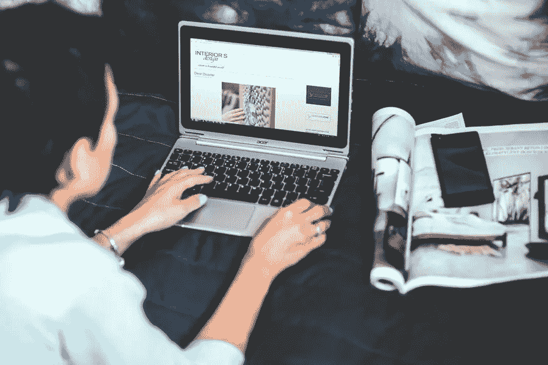

# 改进你的博客的 5 种方法

> 原文：<https://medium.com/visualmodo/5-ways-to-improve-your-blog-b4b42e234ba5?source=collection_archive---------0----------------------->

截至 2019 年 3 月，美国有[3120 万博主](https://www.statista.com/statistics/187267/number-of-bloggers-in-usa/)。在 WordPress 这个众多平台中的一个上，用户平均每月创造[6950 万篇新博文](https://blogging.org/blog/how-many-websites-and-blogs-are-on-the-internet/)。在这种竞争中，知道如何让你的博客与众不同并脱颖而出是很重要的。这个简短的指南将介绍你可以做的五件最重要的事情，从新鲜的内容到使用移动 VPN 服务等关键工具提高安全性。这些小小的调整将会走很长的路，确保你的博客超越其他人。

# 1)创造新鲜内容

如果你想增加你的受众，了解一些基本的 SEO 策略是很重要的。谷歌和其他搜索引擎通过它们的算法运行一系列测试。表现最好的网站排在最上面。有许多不同的策略来实现这一点，但最重要的是创造新鲜的内容。

你的网站应该是人们想经常访问的地方。最受欢迎的网站每天都会发布几次新的博客文章。你可能没有那么多时间。最低限度，争取每周至少一个新博客。其他有助于提高排名的小事情包括对整个网站的细微调整和编辑。

# 2)图像必不可少

比起文字，人们更喜欢图片。通常情况下，图片会将他们吸引到特定的作品中。如果他们感兴趣，那么他们会阅读博客文章。因此，你需要确保你的博客上有优秀的、高质量的图片。如果你需要库存图片，使用像 [iStock](https://www.istockphoto.com/) 和[存款照片](https://depositphotos.com/)这样的网站。他们有数百万张免版税或低价图片。你可以用它们来找到最适合你的品牌的照片。

# 3)针对移动优化

2018 年，[全球 web 流量的 52.2%](https://www.statista.com/statistics/241462/global-mobile-phone-website-traffic-share/)是移动的。这比 2017 年增加了 2%，并且这一数字每年都在继续增长。随着高性能平板电脑和其他设备的兴起，移动和网络流量之间的界限已经开始模糊。出于这个原因，你需要确保你已经为移动流量优化了你的博客。你可以在 [WordPress](https://visualmodo.com/wordpress-themes/) 或 Squarespace 中使用手机兼容的主题。此外，用[谷歌的移动友好工具](https://search.google.com/test/mobile-friendly)检查你的网站，看看你的博客加载情况如何，是否有任何问题。

# 4)安全是每个人的头等大事

如果谷歌因为安全问题标记了你的博客，你就可以和你的大部分读者说再见了。包括 Chrome、Firefox、Safari 和 Edge 在内的所有主流互联网浏览器都将试图阻止用户访问不安全的网站。在设计、维护和宣传你的博客的每个方面，你都需要牢记安全性。首先要确保一切都是最新的。你总是需要你的虚拟主机平台和连接的应用程序的最新更新。最后，你需要首先采取措施防止黑客进入你的网站。

最好的方法是使用移动 VPN。VPN，即虚拟专用网络，对您的网络连接进行加密和匿名。没有它，黑客可以很容易地获得您的个人信息，包括登录您的博客的凭据。他们可以利用这一点来收集所有用户的数据。通过在智能手机上使用移动 VPN，并在笔记本电脑上安装一个，你会让自己和你的博客更加安全。

# 5)检查你的分析

从任何角度来看，理解你的分析都是必要的。这对新博主来说尤其重要。利用许多惊人的免费工具，可以帮助你了解你的博客做得有多好。WordPress 和 Squarespace 都提供内置的分析功能，但还是那句话， [Google](https://analytics.google.com/analytics/web/) 才是王道。

它们显示哪些内容受欢迎，哪些不受欢迎。你的分析也揭示了更多关于你的用户的具体细节。这包括人们访问你网站的时间以及他们的地理位置。所有这些信息可以帮助你创造更好的内容，不仅可以增加你的观众，还可以提高你的搜索排名。

你的博客就像一个活的有机体。你越照顾它，它就越茁壮成长。不用担心；这不是太多的工作。你需要做的就是保持你的内容新鲜，使用高质量的图片，并确保你的博客在桌面和移动平台上都能正常运行。

在后端，您需要时刻牢记安全性。你可以通过使用移动 VPN 来保护你的[博客](https://visualmodo.com/blog/)以及其他在线账户的登录凭证。最后，一定要跟踪你的分析，这样你就可以看到什么内容是有效的，什么是无效的。现在你已经拥有了创建一个令人惊叹的博客所需要的一切。