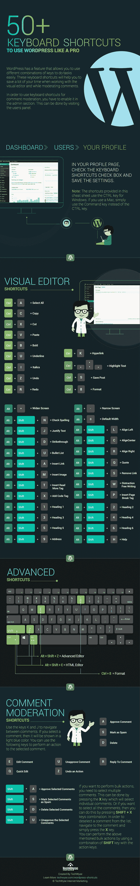
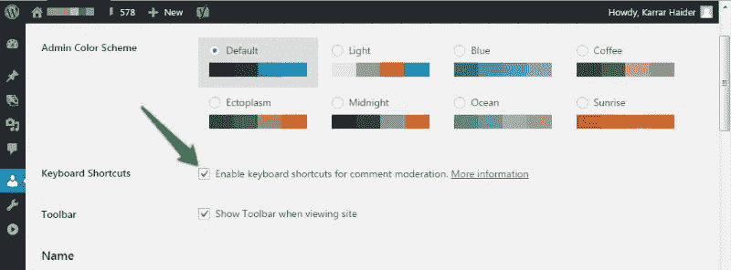

# 50 个键盘快捷键让你的生活更轻松

> 原文：<https://medium.com/visualmodo/50-wordpress-keyboard-shortcuts-to-make-your-live-easier-bd720a058ad8?source=collection_archive---------8----------------------->

# 了解电脑的键盘快捷键可以提高工作效率。类似地，如果你知道某些键盘快捷键有多有用，你在 WordPress 上工作的效率也会得到一个瞬间的提升。特别是对于不喜欢在键盘和鼠标之间不断切换的人来说，这些键盘快捷键简直是一种福气。

50 个键盘快捷键让你的生活更轻松

有几十个快捷方式用于**编辑内容，采取某些行动**或者只是在 WordPress 中导航。所以，让我们来看看我为想要高效完成工作的用户准备的几乎所有 WordPress 键盘快捷键的综合列表**。**

# 基本导航

浏览 WordPress 和它的选项就像浏览其他网站一样。

你只需要 Tab 键**、**箭头**、**回车键和退格键。下面解释了如何使用这些键进行导航。

标签

当您按 Tab 键时，它会从顶部开始**将您移动到页面上的下一个可点击链接/选项**。您可以多次按下**从一个选项移动到另一个选项**。如果您想向后移动，请按住 Shiftand 并按 Tab。

箭头键

←、→、↑和↓会让你**滚动浏览帖子内容**。

进入

当您想要**确认一个对话框或访问一个选项**时，只需按 Enter。

退格

退格键**让你回到上一页**。您可以按住 Shift 并按 Backspace 向前移动一页。

# 事后编辑

这就是乐趣的开始。学习所有的帖子编辑器快捷键将帮助你快速编辑和格式化你的内容。以下是在 WordPress 上创建内容所需的所有内容管理、编辑和格式快捷方式。

## 内容管理

突出显示每个字符的内容 Shift+←/→突出显示每个单词的内容 ctrl+Shift+←/→突出显示上面/下面的行 Shift+↑/↓；选择所有内容 ctrl+a 粘贴内容而不格式化 Ctrl + Shift + V

## 内容格式化

删除线文本 Shift +Alt+d 插入链接 ctrl+k 删除链接 shift+Alt+s 应用标题 1 shift+Alt+1 应用标题 2 shift+Alt+2 应用标题 3 shift+Alt+3 应用标题 4 shift+Alt+4 应用标题 5 shift+Alt+5 应用标题 6 shift+Alt+6 应用段落格式 shift+Alt+7 开始项目符号列表 shift+Alt+u 开始编号列表 shift+Alt+oblock quote shift+Alt+q 应用代码格式 shift+Alt+x 应用地址格式 shift+ Alt+9 对齐 center shift+Alt+CAlign right shift+Alt+r align left shift+Alt+ljustify shift+Alt+JAdd media shift+Alt+m toggle toolbar shift+Alt+z 插入分页符标记 shift+Alt+pin 插入阅读更多标记 shift+Alt+TEnable/禁用无干扰模式 Shift + Alt + WOpen helpShift + Alt + H

# 评论

WordPress 也有**专用的评论审核部分**的快捷方式，使得管理评论变得容易。然而，在使用之前，你必须首先**启用评论审核**部分的快捷键。以下是如何做到这一点:

进入你的 WordPress 用户档案，启用选项**“启用评论审核快捷键”**。这将激活我下面列出的所有快捷方式。请记住，每个用户配置文件在使用之前必须**手动启用这些快捷键**。

## 注释导航

j 和 K 键是你浏览评论时唯一需要的键。

按下 J **将在注释中下移**，如果没有选择注释，则第一个将被选择，K 将在注释中上移**。**

**同样，如果你到达底部，J 将**移动你到下一页**。然后 Kwill **将您带回到**上一页。**

## **注释操作**

**以下是一些**单键快捷键**，当一条或多条注释高亮显示时，这些快捷键将会起作用:**

**批准评论标记为垃圾邮件移至垃圾邮件执行最近操作批准评论回复至评论可快速编辑打开评论编辑屏幕 e**

## **批量应用操作**

**您可以使用一些快捷方式来应用批量操作来管理评论部分。您可以在下面找到这些内容:**

**选择所有注释 shift+x 批准所有选定的注释 shift+a 撤销选定的注释 shift+t 永久删除选定的注释 shift+d 将选定的注释标记为垃圾注释 shift+s 批准选定的注释 shift+u 恢复选定的注释 Shift + Z**

# **结束想法**

**当你通过 WordPress 管理你的网站时，这些键盘快捷键肯定会帮助你提高效率。在编辑内容时，我很少使用鼠标，除了在突出显示内容时会有微小的延迟；我从来没有任何问题。**

**如果你知道其他有用的 WordPress 键盘快捷键或 [WordPress 提示和窍门](http://www.hongkiat.com/blog/40-most-wanted-wordpress-tricks-and-hacks/)，请在评论中与我们分享。**

**[如何给你的网站添加快捷键](http://www.hongkiat.com/blog/keyboard-shortcuts-website/)**

**让你的生活更轻松的 50 个 WordPress 键盘快捷键——visual modo 来源【https://visualmodo.com/ **