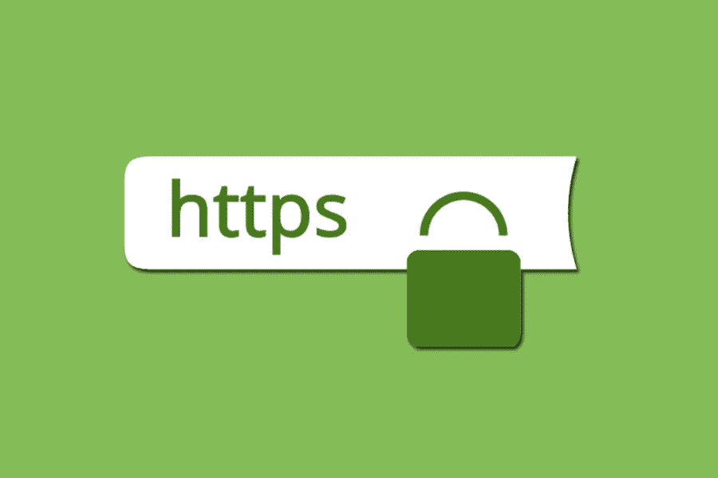

# 关于 SSL 证书的 6 个常见误区

> 原文：<https://medium.com/visualmodo/6-common-myths-about-ssl-certificates-6df959ed880a?source=collection_archive---------0----------------------->

在今天的文章中，我们将讨论 SSL 证书的神话及其背后的事实，这样你就可以有一个更安全的网站。普通人对尝试新事物持怀疑态度。不确定性使他们感到恐惧。已知的安慰哄骗他们。当他们被迫尝试新事物时，他们倾向于坚持神话来避免决策。这种墨守成规、不去尝试新事物的固定思维模式弊大于利。

就像围绕 SSL 证书的神话一样。购买便宜的 SSL 证书让网络变得更安全。但是，围绕它们有几个数不清的神话，使得它们的采用率低于实际可能的水平。

这些神话必须被打破，事实必须被揭露出来。这构成了这篇博客的前提。我们详细讨论了围绕 SSL 证书的许多神话及其背后的事实。

# 谣言:HTTPS 让一个网站变慢了

事实: HTTPS 比 HTTP 效率高

出于几个原因，页面加载速度是 web 管理员非常关心的问题。缓慢的页面加载速度会影响用户体验，并对搜索引擎页面结果中的页面排名产生不利影响。

HTTPS 网站在发送或接收数据前必须加密。这绝对比 HTTP 网站要做的多一步。但是，如果 SSL 证书配置正确，页面速度实际上会增加而不是减少。拥有一个[安全网站](https://visualmodo.com/make-secure-wordpress-sites/)还有一个额外的好处。综上所述，HTTPs 肯定比 HTTP 效率高。

# 误解:SSL 证书很贵

**事实:** SSL 证书就像健康保险

你必须支付从几美元到几百美元的费用来购买 SSL 证书。几百美元的 SSL 证书是高端证书，通过扩展验证来保护网站及其几个子域。它们的好处，如增强客户信任、PCI 合规性、SEO 优势，都超过了成本障碍。还有，买 SSL 证书更像是买健康保险。定期投资价格适中的保险比以后支付巨额损失要好。

# 误解:每个 HTTPS 站点都需要有自己的 IP 地址

事实:你可以拥有任意数量的子域

根据它们保护的域的数量，有两种类型的 SSL 证书—单域和多域 SSL 证书。单域证书，顾名思义，只保护购买它们的一个域。另一方面，多域证书能够保护其下任意数量的域和子域。因此，没有必要每个 HTTPS 网站都必须有自己的 IP 地址。它可以有许多子域，多个 IP 地址用同一个 SSL 证书保护。

# 误解:SSL 证书安装或迁移很麻烦

事实:这很复杂，但你只能做一次

让我们面对现实吧。你正在设置一些东西，旨在保护你的网站在相当长的一段时间内免受各种新奇的网络安全攻击。现在，如果您可以毫不费力地安装这样的安全机制，那么它一定有问题。一个精心制作的流程确保我们不会错过流程中的任何设置。

此外，SSL 证书安装过程是一个复杂的过程，但不会让您花费几个小时或几天的时间。这是你必须集中精力去做的事情，也许还需要专家的帮助。就像生活一样，安装一次 SSL 证书，就不用再做了。

# 误解:所有 SSL 证书都是一样的

**事实:**安全级别因 SSL 证书类型而异

像基于域的 SSL 证书一样，还有几种其他类型的证书。其中最主要的是基于验证的 [SSL 证书](https://visualmodo.com/https-ssl-migration-guide/)。SSL 验证由证书颁发机构(SSL 证书的发行者)提供。它们提供不同级别的验证，即组织验证、域验证和扩展验证。

组织验证(OV)在组织级别审查证书申请人的背景信息，而域验证(DV)在网站域级别进行审查。扩展验证是可用的最高验证，它在颁发 SSL 证书之前检查申请人的完整背景信息、他们的域名所有权和业务位置。换句话说，并不是所有的 SSL 证书都是一样的。它们可以是具有不同验证和安全级别的 OV、DV 或 EV。

# 误解:没有 SSL 证书是可以的

**事实:** SSL 证书是避免被列入黑名单所必需的

博客或多供应商电子商务商店的单页网站，每种类型的网站都需要 SSL 证书。SSL 证书是网络安全防御的基本形式。然而，它的基本性质并不意味着它没有先进的好处。

SSL 证书可以带来几个好处，比如更好的搜索引擎优化排名和在网络浏览器中加入白名单。例如，自 2018 年以来，谷歌浏览器就开始将 HTTP 网站贴上“不安全”的标签。但是，使用 SSL 证书时，“不安全”标记将不会出现。该网站将是安全的，将有一个更好的时间花在网站上，转化率更高。

# 概括起来

SSL 证书不再是网站的好选项，而是强制性的安全机制。它们帮助网站所有者保护他们的网站数据，并让客户相信他们正在处理一个安全的网站。对于这个世界上的每一个神话，都有一个事实可以说明真相。SSL 证书也是如此。有神话，也有事实。了解事实，这样您就不必再回避投资可以保护您网站的 SSL 证书。