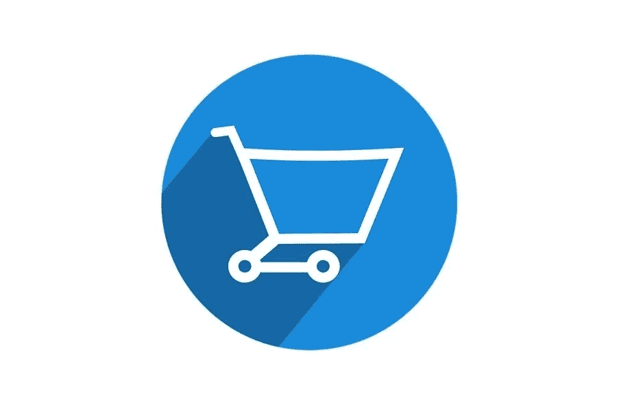

# 您的电子商务商店的 6 种链接构建策略

> 原文：<https://medium.com/visualmodo/6-link-building-strategies-for-your-ecommerce-store-a4ca13299073?source=collection_archive---------0----------------------->

当你开办一家电子商务商店时，你的主要目标是获得更多的流量、信任和销售。为了实现这一切，您需要专注于生成入站链接。在本文中，我们将为您的电子商务商店探索 6 种链接构建策略。

为什么链接建设如此重要？因为它有助于提高你的搜索引擎优化分数，并最终增加你的有机流量。当然，如果您能聘请一家提供优质链接建设服务的专业公司，那将是理想的选择。然而，如果您负担不起，我们将提供 6 种链接构建策略，您可以将其添加到您的搜索引擎优化库中，以提高您的商店的知名度并促进您的销售。

# 1 改善您网站的 UX

如果你想让人们链接到你网站的页面，你需要确保他们是值得链接的。换句话说，您可能需要升级您的电子商务商店，以便能够生成更多的链接和共享。

有很多方法可以调整你网站的 UX，但最好先关注深层链接页面。确保您的类别和产品页面:

*   设计良好且无错误
*   针对搜索引擎优化和客户进行优化
*   独一无二，来自您品牌的声音。

# 2 与影响者合作

通过与有影响力的人合作推广特定产品，您可以创建产品页面的反向链接。他们可以是社交媒体影响者、名人、博客作者，也可以是流行品牌博客、行业专家和思想领袖。

然而，与有影响力的人合作的好处不仅仅是产生自然的反向链接。影响者提及也有助于提高品牌知名度和参与度，同时提高您的搜索引擎优化排名，并最终帮助您接触新客户。

# 3 开始写博客:为电子商务商店建立链接

虽然博客内容有很多优势，但许多电子商务零售商把他们的博客放在次要位置。只有大约 60%的顶级时尚网店有活跃的博客。然而，忽视博客内容的高投资回报率可能是一个大错误。研究表明，每月发表 15 篇以上文章的品牌产生的流量是前者的 3 倍。

拥有一个充满高质量、有价值内容的博客是每一个搜索引擎优化策略的重要组成部分。它不仅可以帮助你在自己的领域成为专家，还可以给你一个机会去创作其他博客想分享和链接的内容。这里有一些想法可以帮助您通过博客获得更多链接。

*   保持一致。确保定期发布新博客，但关注质量而不是数量。最好从慢开始(一个月一篇帖子)，然后逐渐积累。
*   创建独特的案例研究和研究博客帖子或网页内容。Buzzsumo 的一项研究发现，原创研究内容的反向链接率要高得多。
*   创建常青的内容，也就是说，在一段时间内保持相关性的内容。这包括重要的案例研究、信息图表、购买指南和操作指南。
*   避免销售和促销内容，因为它不会建立你作为一个值得信赖的品牌或让你得到你想要的链接。
*   链接到其他相关内容，为您的读者增加价值，并通过更长时间地保留网站流量来提高您的整体 SEO。

# 4 参与和社交:电子商务商店的链接建设

社交媒体平台对你的链接建设策略至关重要。首先创建带有相关在线商店链接的个人资料。最起码，你还应该在你的联系页面上添加封面图片描述和链接。

除了社交媒体，你也应该考虑活跃在 Reddit 和 Quora 这样的论坛上，因为它们提供了巨大的流量机会。尽管这些链接是不追随的链接，但拥有不同的链接(追随和不追随)向搜索引擎表明真实性是很重要的。

更不用说，这些论坛为您提供了一个很好的机会，与那些询问与您所在行业相关的具体问题的人进行交流，同时为您提供了一个展示专业知识的地方。通过在产品页面、博客内容和有用的指南中包含相关链接，你不仅可以向提问者展示你的权威，也可以向访问这个问题的数百万网站访问者展示你的权威。

# 5 建立品牌大使计划

让已经喜欢你的品牌的人在各种平台和网站上发布关于你的帖子也是一个很好的链接建设策略。

给你的忠实客户一个分享产品页面链接和增加流量的激励。把它想象成用户生成的内容和某种形式的微观影响。确保您还:

*   诚实坦率。
*   确保你的客户服务是优秀的。
*   个性化他们的购物体验
*   鼓励反馈
*   提供奖励
*   创建忠诚度计划
*   送出惊喜的好东西。

# 6 利用视频:电子商务商店的链接建设

说到内容，视频绝对是王道。除了在你的博客和社交媒体页面上发布高质量的视频，别忘了利用顶级视频平台(和第二大搜索引擎)YouTube。创建常青树视频内容，比如教程，可以让你在你的利基市场上嵌入更多的内容。

更重要的是，在你的电子商务网站上放置视频内容对搜索引擎优化有很大的好处。视频内容可以增加访问者在您的页面上花费的时间，同时有助于提高页面相关性和质量。以下是一些帮助你利用视频推广反向链接的技巧:

*   与其他有影响力的人和博客建立伙伴关系。当他们链接到你的 YouTube 视频时，你可以联系他们，在帖子中插入你的电子商务网站的链接。
*   在各种视频分享平台上创建帐户，并定期分享视频内容。
*   评论其他相关视频，包括评论中的相关链接。但是，注意不要看起来太垃圾。确保包含高度相关的链接。

# 链接建设的电子商务商店最后的话

链接建设对任何网站都很重要，尤其是对于刚刚起步、需要吸引顾客的网店。没有万能的方法总是有效的，但遵循这 6 个技巧可以帮助你产生一些高质量的入站链接，这将帮助你更好地排名，获得新客户，并最终发展你的在线商店。