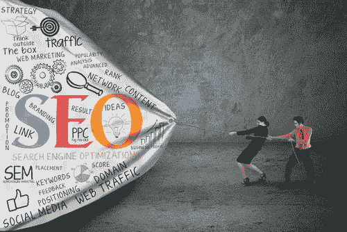

# 你的网站需要 SEO 的 6 个原因

> 原文：<https://medium.com/visualmodo/6-reasons-why-your-website-needs-seo-7f89d75bb62e?source=collection_archive---------0----------------------->

你已经建立了一个网站，为它创建了内容，并提供了很棒的图片。但是，如果你的网站刚刚起步，你不能指望它从一开始就获得适当的流量，直到你采用搜索引擎优化。现在看看你的网站需要 SEO 的原因。

搜索引擎优化或 SEO 是一种技术，它允许您通过在搜索引擎上优化您的网站，使其出现在搜索结果的顶部，从而从搜索引擎获得流量。如果你不知道如何去做，有像 KISS PR 这样的公司可以帮你做。

以下是你的网站需要搜索引擎优化的六个重要原因:

# 为什么你的网站需要搜索引擎优化？

# 1-使您的网站在搜索引擎结果中排名靠前

例如，如果你有一个旅游业务，一个潜在的客户在网上搜索，这并不能保证客户会因为你有一个网站就马上看到你的网站。要做到这一点，需要实施一些 SEO 策略，比如使用相关关键词、地理定位、提高页面速度、[撰写](https://visualmodo.com/blog/)相关内容。如果你不做 SEO，没有人能找到你的网站，你也不会有任何销售。

# 2 —增加有机交通

有机流量是互联网用户访问一个网站的次数，是自然产生的，这意味着这些是不付费的。当你在搜索引擎上进行查询时，你会在结果的顶部看到付费广告，这些广告被清楚地标注出来。点击这些广告对网站的排名没有帮助。然而，当你点击广告下方的结果时，这就转化成了有机流量。点击多了，流量就多了，你的排名也就多了。

T4 网站设计公司 KISS PR a Dallas 的首席执行官 Qamar Zaman 说，如果你希望你的网站能够产生销售线索，SEO 是很重要的。

# 3-帮助建立网站信任和可信度

当一个网站获得更多的流量，这意味着人们信任它，因为它是可信的。当这种情况发生时，搜索引擎，如谷歌，将返回搜索结果，包括相关网页在您的网站上。有一些因素会影响一个网站的信任度和可信度，比如高质量的反向链接、社交档案和良好的现场 SEO。现场 SEO 是优化一个网站的单个页面的过程，这样搜索引擎就能理解这个页面的内容。

# 4 —让您比竞争对手更有优势

几乎所有的企业都有竞争对手。如果你的竞争对手在做 SEO，那么你也应该这样做。SEO 将帮助你的网站在搜索引擎结果中排名更高，这将使你比你的竞争对手更有优势。包括关键词研究在内的搜索引擎优化策略将决定你的竞争对手用什么关键词来转化销售。然后，您可以使用这些关键字和实施更好的策略，使您的网页排名更高。

1.  包括更好的用户体验

当你的网站上有访客时，用户体验会对将访客转化为销售额产生巨大影响。网站布局、页面速度和信息都起着很大的作用。如果布局不够用户友好，访问者不知道如何浏览网站，他或她会离开你的网站，转到下一个网站。当一个页面需要很长时间加载或者访问者需要的信息很难找到时，也会发生同样的事情。

人们很忙，他们需要快速找到他们想要的东西，这就是为什么改善用户体验对销售转化至关重要。

# 6-搜索引擎优化是可量化的，这将有助于你的业务增长

有许多搜索引擎优化工具可以帮助你跟踪和分析数据，如谷歌搜索控制台，谷歌分析，Moz，SEMRush 和 Woorank。每次你实施一个 SEO 策略，你都可以跟踪它是否有进展，它在哪里产生了最大的影响，以及需要多长时间。如果你只是单纯的做数字营销而没有实施 SEO 策略，你就无法知道这些事情，这将阻碍你学习如何让你的[业务增长](https://awards.visualmodo.com/)。

# 结论

应用 SEO 有很多好处。以上提到的只是其中的一些优点。你只需要记住，你的最终目标是尽可能多的接触到你的目标受众，而不需要花费你那么多钱的最好方法就是通过 SEO。你可以学习诀窍，或者你可以支付一点现金，并聘请一个有信誉的搜索引擎优化公司为你做这件事。