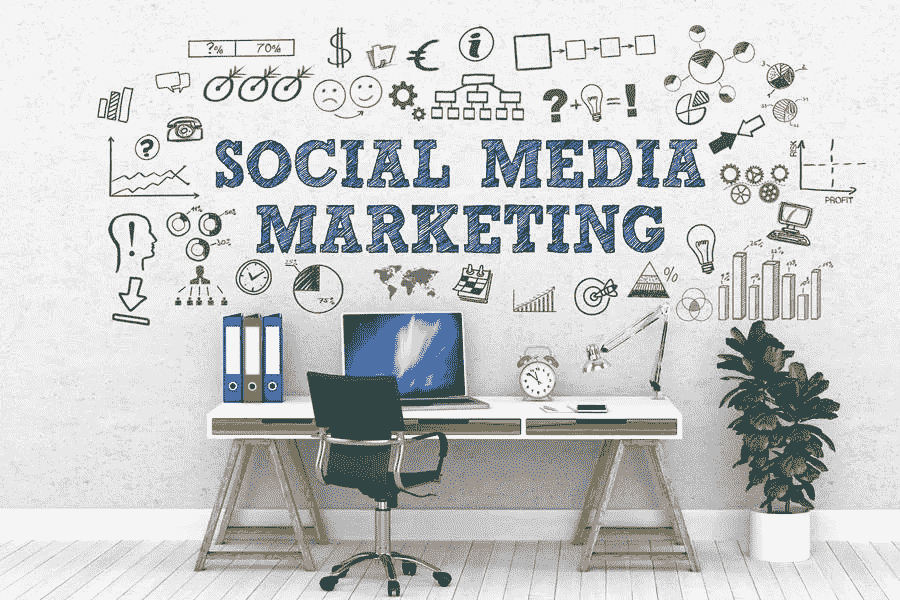

# 2020 年的 6 个社交媒体营销策略，你今天就应该尝试

> 原文：<https://medium.com/visualmodo/6-social-media-marketing-strategies-for-2020-you-should-try-today-fa5fa54a0c5a?source=collection_archive---------0----------------------->

了解并保持在社交媒体的前沿将确保你拥有所有正确的工具和营销策略，所需的技能，当然，还有最新的信息来充分利用它。对于营销人员来说，今年这样做比以往任何时候都更重要。

如果您希望增加订户和参与率，以及通过各种社交媒体帐户提高销售额，请继续关注。本帖将带你看看 2020 年你绝对需要知道的六个社交媒体营销策略。请继续阅读。

# 1 建立一个社区

当消费者花时间浏览 Instagram、Twitter 和脸书等网站时，他们能够与和他们有相同兴趣的人交谈是至关重要的。请记住，人们现在平均每天在社交媒体平台上花费两小时二十二分钟。这使得激发他们参与的倾向更有影响力。

参与你的社交媒体帖子肯定能显著提高你的品牌知名度。讨论可以以评论的形式进行。问题是，只有少数用户愿意整天挂在特定业务的社交媒体页面上与其他人交谈。相反，你可以做的是建立一个类似脸书集团的社区。如果你有一个团队在积极引导消费者，利用像 Greenfly 这样的内容协作和分发平台，你将会看到一个显著的增长，不仅在你的参与度上，而且在订阅者上，全年都是如此。

# 2 与影响者合作:社交媒体营销策略

与有影响力的人一起工作的趋势不会很快消失。有人说，影响者营销将主导 2017 年。2018 年晚些时候，甚至去年也强调过。事实上，这已经不是什么新策略了。然而，2020 年不仅仅是关注与有影响力的人合作，而是变得更有针对性。没错，影响者营销 2.0 来了。

那么，影响者营销 2.0 版是怎么回事呢？嗯，这意味着与纳米影响者和微影响者合作。纳米影响者拥有 1000-5000 名追随者。他们已经建立了非常密切的粉丝关系，这对像你这样的营销人员来说是一件积极的事情。类似地，微影响者指的是对特定话题充满热情的普通人，他们已经积累了大约 5 万名像样的追随者。与这些有影响力的人一起工作只意味着一件事——相当高的参与度。

# 3 视频依然是王道

如果你能制作引人入胜的视频，那么没有比这更重要的时间来制作视频了。现在，在大多数社交媒体平台上，短视频和长视频内容都被大量消费。然而，视频根本不是新趋势，但它继续变得高度相关。当某样东西起作用时，为什么要改变它？2020 年，视频仍然是王道，在提高观众参与度方面，它绝对是最有帮助的内容之一。因此，一个伟大的社会媒体营销策略

# 4 最大化互动故事

像[直播](https://visualmodo.com/which-social-media-platform-will-dominate-live-streaming-in-2020/)这样的故事是在过去几年出现的。Instagram 和脸书故事正在主导这一社交媒体现象。仅脸书的故事每天就有大约 5 亿用户。在参与度上也和 Instagram 不相上下。今年，社交媒体故事将会加速发展，营销人员的机会也随着 Instagram 的“关于你的故事”、“增长洞察”和其他新业务功能而扩大。

# 5 拥抱社交媒体多样性

给社交媒体的发布和推广带来更多的多样性正在成为社交媒体营销策略的一种趋势。精明的营销人员开始使用其他平台，如 Quora、Snapchat、Reddit 和 Tiktok 等，而不是专注于三大平台。因此，今年一些事情可能会发生重大变化。那些在社交媒体上的促销活动上墨守成规的品牌应该跟上，否则就会落后。他们必须给其他社交媒体平台一个机会。当然，由于竞争水平较低，较小的网络提供了相对低成本的广告环境。这是营销人员可以利用和享受的额外好处。

# 6 添加客户服务选项

今年在你的社交媒体商业档案上实施客户服务是一个很好的主意。你可能已经知道，许多消费者喜欢用问题来标记或引导信息。他们中的大多数人实际上希望你在两个小时或更短的时间内在社交媒体上回复他们的消息。这肯定会影响你的生意。如果你今年错过了客户服务部的一些好机会。

在这个即时信息时代，营销人员和企业主需要快速适应消费者。许多分析师认为，消费者为他们的担忧发送社交媒体消息的趋势是由于可访问性。高达 79%的用户现在可以用智能手机访问商业档案。如果你不愿意回答问题，他们会找到竞争对手。帮助解决您社交媒体帐户上的客户支持问题。

# 社交媒体营销策略总结

随着业务的增长，你必须继续调整你的社交媒体营销策略。坚持这样做，你就会看到成功。这篇文章中提到和讨论的策略可以帮助你更多地了解你的受众。因此，提高对你的品牌的信任，增加你的曝光率，当然，还能增加销售额。