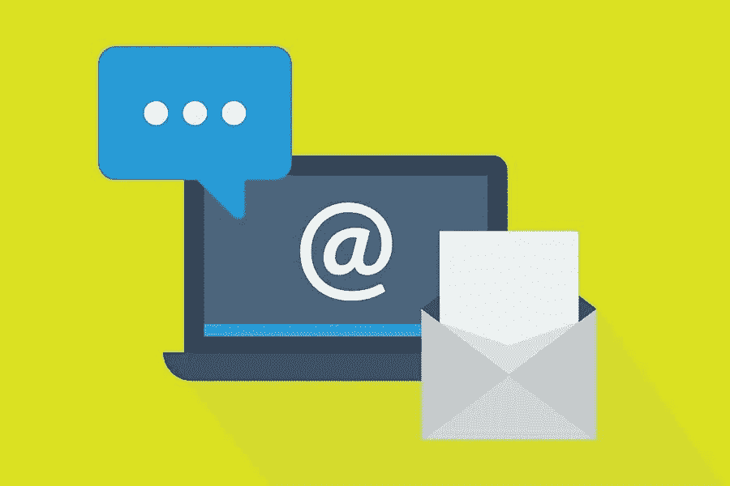

# 创建最佳产品和服务更新电子邮件的 6 个技巧

> 原文：<https://medium.com/visualmodo/6-tips-to-create-the-best-product-and-service-update-emails-118c2f212328?source=collection_archive---------0----------------------->

产品和服务更新电子邮件是营销和产品团队合作的时事通讯。在本文中，您将学习如何创建最好的产品和服务更新电子邮件。

它不仅提供关于产品或服务改进的信息，还在推广新功能和增加网站流量的同时吸引客户。简而言之，产品和服务更新电子邮件都是关于介绍系统内发生的全新变化和升级。

然而，平均每人每天会收到 126 封商务邮件，在客户拥挤的收件箱中脱颖而出并不是一件容易的事情。因此，让你的产品和服务电子邮件模板令人兴奋和有启发性，以吸引客户的注意力就变得势在必行。你可以通过展示关键的改进、推广产品，并试图将客户带到一个[登录页面](https://visualmodo.com/product-positioning-for-marketing-optimization/)来实现。简而言之，你需要向前迈进一步，将你的商务邮件模板中枯燥的细节转换成令人兴奋的，而不是包含枯燥的文档和关于错误修复的信息。

# 创建完美产品和服务电子邮件更新的最佳实践

# 1 在你的主题线上工作

不要去寻找一个普通的“产品更新”主题行，向前迈一步，发挥创意。简而言之，让它吸引人，鼓舞人心。你可以从下面的例子中得到一些启发:

*   *这是你的新产品，有附加功能。*
*   先睹为快的新更新。
*   顾客喜欢这项新功能。
*   我们的产品线刚刚变得更好。看一看。
*   你不能错过这些新功能/更新。
*   全新的产品概述。

这些是美化你的主题和吸引你的客户的许多方法中的几个。这是今晚*酒店发来的产品更新邮件*，标题很有创意*“更多优惠”。这封电子邮件也是说明性的和信息性的。*

此外，您还可以通过突出更新最令人印象深刻的功能来充分利用您的主题行。像苹果那样做，用一个简单但令人印象深刻的主题行*“ai rpods Pro 在这里”*接着是一个最小的副本和单色电子邮件设计。

# 2 确保你的更新值得发送

你可能已经在产品更新上努力工作了。从计划到开发和部署，您的团队一定花了数周时间。所以，与你的订阅者分享这个消息是很自然的。然而，你的客户却不是这样。

换句话说，如果他们收到很多小更新的邮件，他们生气的几率会更高。因此，在您发送任何产品或服务电子邮件更新之前，请询问您的电子邮件模板开发人员它是否真的重要或值得发送。从 ***指挥*** 发来的这封产品更新邮件中得到一些提示。

这封电子邮件通知用户添加的新功能，并告诉他们如何从这些功能中受益。总而言之，简单有效，值得吸引客户的注意力。

# 3 创建相关内容

在撰写产品更新邮件之前，你必须对自己的目标有一个清晰的认识。您想将某些变化通知您的订户吗？你想推广任何教育或宣传工具吗？如果这些是你的目标，你可以包括相关内容，如:

*   充分利用新功能的指南。
*   产品描述。
*   欢迎信息。
*   功能列表。
*   反馈。
*   交叉销售和追加销售产品。
*   更新的原因。

以下是 ***Readdle*** 如何通过告知用户 Spark 中引入的电子邮件模板来充分利用产品更新电子邮件。它还简要概述了新的功能列表。

# 4 注意传达创建产品服务更新电子邮件的好处

通过向您的订户群清楚地传达产品的好处，您可以使您的产品电子邮件更新具有吸引力和影响力。因此，根据您销售的产品类型或您提供的服务，让您的客户知道他们将如何从最新的更新中受益。查看来自 ***FilmSupply*** 的这个例子。

了解他们如何将产品更新电子邮件分成不同的部分，以精确清晰的方式传达优势。

# 5 包含互动元素以加速参与

全文本邮件通常是无聊和乏味的。然而，当涉及到视觉上吸引人的电子邮件时，它们有能力引起更多用户的兴趣。你知道在邮件中添加视频可以让你的点击率提高 300%吗？因此，如果您希望加快订户参与度，在产品电子邮件更新中加入互动元素是关键。交互式元素包括 gif、视频、可折叠菜单、滑块和手风琴等等。

借助这些元素，你可以直观地告知你的客户你的产品或服务是如何运作的。简而言之，你可以通过向他们展示它是如何工作的来吸引他们检查你的最新更新。看看 ***Nest*** 如何利用视频向用户群展示他们的新型烟雾报警器。

# 6 请客户尝试测试版，以创建产品服务更新电子邮件

企业使用测试版来测试处于开发阶段且尚未正式发布的产品和工具。你可以对你的新产品和服务做同样的事情，并获得客户将如何看待它的第一手经验。开始时，请少量客户测试您的产品，然后逐渐增加测试人员的数量，以达到最佳数字。

此外，确保你只发送这样的电子邮件给你真正感兴趣的订户。这会帮助你得到有用的反馈。下面是 Mailchimp 如何为他们的新网站建设者向用户提供早期访问。

# 包裹

产品和服务电子邮件更新都是关于与您的客户群直接沟通，并告知他们每次更新带来的好处。从说明您的订户如何开始使用新的更新，到通过博客文章链接让他们了解更多关于更新的信息，有很多方法可以帮助您获得产品和服务电子邮件更新。

所以，利用上面提到的技巧和诀窍，看看你是如何释放你的创造力的，同时创建这样的电子邮件，一下子引起用户的兴趣和参与。