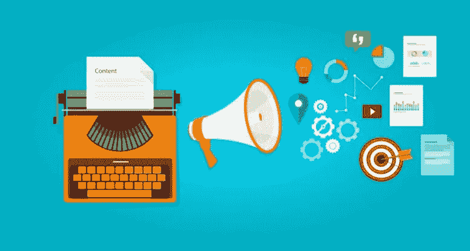
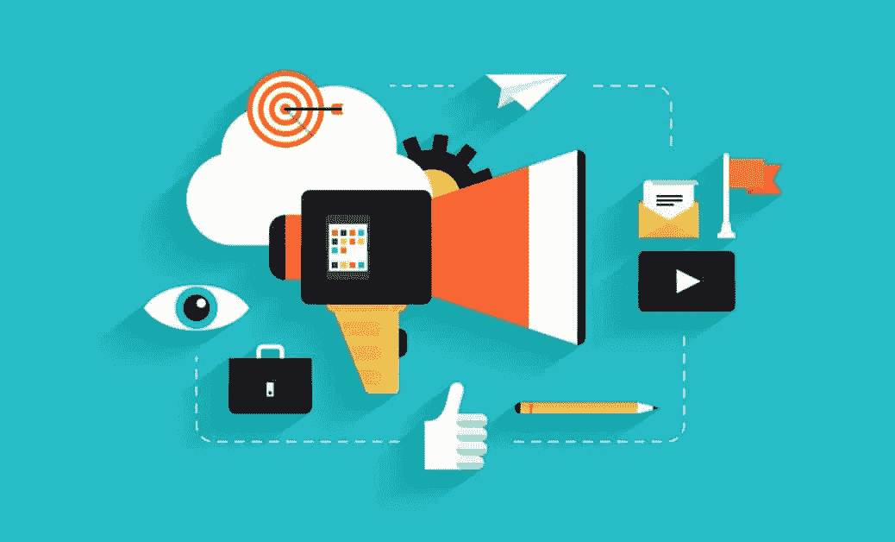
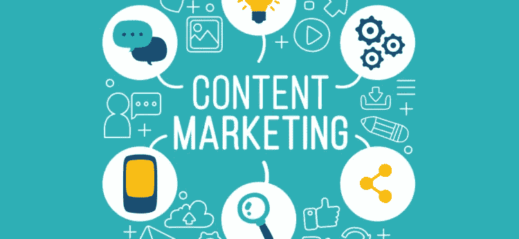

# 确保内容营销和网站设计创造转化的 6 个技巧

> 原文：<https://medium.com/visualmodo/6-tips-to-ensure-content-marketing-website-design-create-conversions-254149503e56?source=collection_archive---------0----------------------->

你已经建立了一个网站，接下来呢？内容营销是一种越来越受欢迎的提高品牌知名度、增加网站流量和潜在客户的方式。但是，仅仅发布内容是不够的——它需要以精确的方式进行定向，以确保良好的转化率。仅有独特的点击是不够的。

第一印象至关重要——网站的设计必须符合你选择发布的营销内容。每个页面的结构，结合其功能，将点击转化为转化，为您的业务增加有形的价值。

营销内容应该[战略性地](https://visualmodo.com/)放置，确保购买过程的每个阶段都得到充分满足，从认知到行动。遵循下面的每一个提示将确保您的网站流量，同时突出您的营销内容的选择。

# 内容营销技巧

网站设计

第一印象至关重要，不容忽视。每个新的[访问者](https://visualmodo.com/)的初始进入点将立即决定他们是否会继续阅读或返回那里。他们知道你的品牌，但你如何确定他们的兴趣？

中性的背景和简约的设计为你的观众带来舒适的体验，确保它们与内容相匹配。

# 写作风格

这听起来可能很简单，但你选择的字体类型和大小可以非常有效地吸引潜在客户。记住，这是关于在他们的第一印象中保持他们的兴趣。它需要干净。它需要是脆的。

“除了字体的类型，你还需要考虑它的大小。大多数人会同意最小尺寸为 14 是优选的。记住，你的营销内容越容易获取，你的网站就越有意思，”Marquita Vega 解释道，她是 resume resume[的数字战略家和 Huffingtonpost](https://resumention.com/) 的作者。

# 页面结构

重要的是以一种清晰的方式构建你创建的博客，还有 feed。

将你的博客分成小段，用粗体逐点浏览材料，可以让读者很容易地消化信息。此外，添加图形、图表和其他支持信息图有助于更好地说明您向读者提供的信息。

提要决定了如何访问内容，如何对内容进行分类和过滤。这需要简单和用户友好——设计需要方便访问。当潜在客户看你的营销内容时，他们应该能够选择使用哪篇文章。

# 用户友好的功能

这里有一些简单的事情需要考虑。对于初次使用的用户来说，避免不必要的弹出窗口是关键。拥有多次参与博客的成功记录的用户更有可能注册更多内容——但在他们第一次访问时，这是对他们体验的破坏。

可以说，最有影响力的一点是你的内容的移动可访问性。在不损失任何质量的情况下，内容在移动设备上的加载速度和效率如何？随着大多数人通过手机访问内容，他们希望能够立即访问这些内容。

# 格式化

没有适当的格式，就无法提供成功的内容。我们已经提到了结构和功能，现在让我们看看语法。请记住，您的内容反映了您的业务，应该同样小心处理。以下是我们推荐使用的一些工具:

*   [Academadvisor](https://academadvisor.com/) 为内容作者提供了优秀的格式指南。
*   [Essayroo](https://essayroo.com/) 是一款非常有用的校对工具，对于内容营销来说必不可少。
*   Citeitin 和 [Ukwritings](https://ukwritings.com/) 是聪明的语法检查工具，可以确保你写的内容符合标准。
*   Easywordcount 是一个有用的工具，可以让你的内容简洁明了。
*   [academialized](https://academized.com/)将允许你简单地添加参考文献以确保准确性，并且已经被赫芬顿邮报[推荐到这里](https://www.huffingtonpost.co.uk/mary-walton/is-it-legal-to-buy-an-ess_b_14633902.html)。

# 订阅和内容参与

您已经抓住了用户的兴趣，现在是时候将他们的愿望转化为可行的商业客户了。

你的订阅可以保持你网站的流量。虽然用弹出窗口激怒你的客户并不是一个好主意，但是每篇文章的底部都应该包含一个“订阅”的行动号召。如果用户阅读并喜欢你的文章，他们可能会选择订阅并继续关注你博客上的内容。

分享是另一个需要考虑的重要工具。通过社交媒体分享营销内容是大多数人访问你的网站的媒介。据脸书报道，用户每天花 50 分钟喜欢新的内容和材料。这是一个重要的方式来确保流量继续通过你的网站。它需要干净，符合人体工程学，并放在博客的结尾或标题中，温和地鼓励用户分享它。

# 大局

营销内容不仅仅是建立[兴趣](https://visualmodo.com/)，而是创造转化。一个干净的网站设计结合清晰的文字材料反映了业务——潜在的客户将利用这种印象来决定他们是否想继续与你打交道。