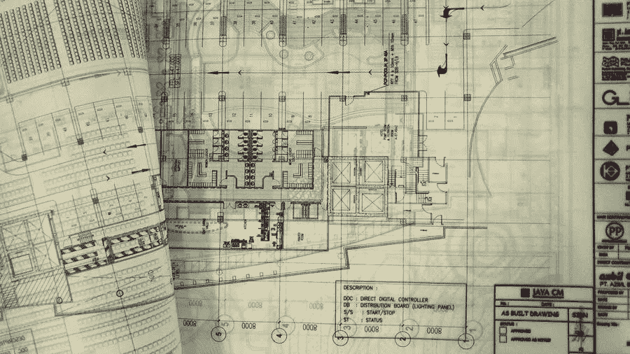

# 每个工程企业需要的 6 种保险

> 原文：<https://medium.com/visualmodo/6-types-of-insurance-every-engineering-business-needs-7ce138692ef3?source=collection_archive---------0----------------------->

工程是一个有利可图的职业，有很多机会，但也有很多责任。每个负责任的工程师都会得到一份业务保险。

如果你没有为你的工作和你使用的设备投保。所以，你永远无法获得客户的信任。会失去很多潜在的利润。更不用说如果你犯了一个错误或者弄坏了一个设备。因此，你将不得不自掏腰包。

要有安心和很大的保障，只需简单几步就可以获得工程险，这个保险会保障你不同的风险。让我们来看看工程师的不同类型的保险，以及你为什么需要它们。

# 职业责任保险

不管你是在工程公司工作，还是作为独立工程师自主创业。所以，你需要的最重要的一种保险是职业责任保险。你也可能知道它作为错误和遗漏保险，或简单的 E&O 保险。

职业责任保险的目标是保护需要处理诉讼财务责任的企业。这发生在错误之后，也称为责任诉讼。

工程企业经常在高风险的项目上工作，在这种情况下会有很多错误。延误和意想不到的成本，因此客户的责任诉讼是相当普遍的。这些诉讼并不能反映你的专业水平，因为错误是必然会发生的。

您的 E&O 保险也将涵盖由于设计缺陷造成的损害和伤害。但请记住，你的保险公司只会提供一个覆盖由于专业疏忽。这种保险不包括刑事诉讼的费用。

现在的公司使用技术来提高他们的业绩，但这种做法的负面影响是网络犯罪的增加。被黑客攻击对任何利基企业来说都是灾难性的，因为每分钟都有 290 万美元因网络犯罪而损失。

如果您的数据遭到破坏，您可能会面临诉讼，并因停机而损失大量收入。所以，恢复你的名誉真的很难。当然，你需要尽你所能确保你的网络安全尽可能好。

但万一遭到攻击或破坏。你需要为最坏的情况做好准备，购买网络责任保险，它将涵盖与网络攻击相关的所有费用。

# 工程业务一般责任保险

一些类型的工程专业在靠近公众的地方工作。这主要适用于从事建筑项目的土木工程师。然而，即使是其他类型的工程工作。客户、供应商和潜在合作伙伴通常都有[参观网站](https://visualmodo.com/ecommerce-seo-guide-how-online-stores-can-drive-organic-traffic-in-2020/)的习惯。

由于工程师的失误而导致第三方受伤的情况并不少见。当这种情况发生时，企业在经济上和法律上都要对伤害负责。这就是一般责任险存在的原因。

顾名思义，这种保险保护你免于承担责任。因此，涉及第三方个人的事件可能会导致诉讼，包括以下情况:

*   有人在你的工作场所或附近时造成的意外伤害
*   当您销售或制造的产品对客户造成伤害时发生的产品损害
*   您的一名员工在项目中造成的财产损失
*   因诽谤或中伤而导致您的业务受损的名誉责任

# 工伤保险做工程业务

工程可能是一个非常危险的职业。大多数工程专业人员需要操作和使用重型机械。在各种天气条件下的危险环境中工作的强大设备。

无论你如何努力避免工伤。你至少会有一个员工，但可能更多，会在工作时受伤。这可能是小伤，但工程师也可能在工作时致残甚至死亡。

如果你雇佣的人在工作场所受伤或死亡。你将承担他们的治疗费用，这就是为什么你的企业需要工伤补偿保险。