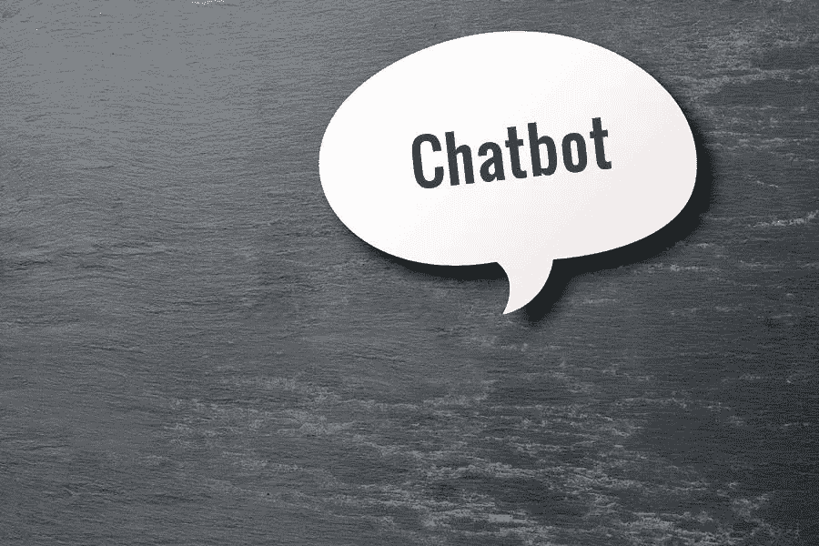

# 聊天机器人营销可以推动销售的 6 种方式

> 原文：<https://medium.com/visualmodo/6-ways-chatbot-marketing-can-drive-sales-e312e29824?source=collection_archive---------0----------------------->

聊天机器人是一种人工智能和机器语言程序，如今被营销人员用作促进业务和增加销售的有效工具。简而言之，聊天机器人营销可以增加一次销售是一种创新的战略，利用聊天机器人程序来促进企业组织的产品和服务。大约 69%的消费者更喜欢聊天机器人，因为它能对查询做出快速即时的响应。

与最好的 SEO 经销商取得联系，为你的企业实施一个特殊的高级聊天机器人程序。营销人员可以将聊天机器人用于他们的多种营销策略。此外，57%的高管和营销人员保证，聊天机器人营销不费吹灰之力就能带来投资回报。

统计数据显示，约 56%的消费者更喜欢通过短信查询，而不是联系客户服务支持。营销人员利用这个程序为网站开发最好的人工智能聊天机器人，可以回答任何问题。因此，聊天机器人营销可以通过几种方式产生或推动销售。一些课程包括:

# 1 销售线索生成和简单订购:

为你的商业网站进行聊天机器人营销将有助于你联系大量的受众。统计显示，约 67%的 millennia 从提供聊天机器人的在线品牌购买产品。联系如此庞大的目标受众将为你的潜在销售带来巨大的商机。与聊天机器人的一对一互动可以帮助营销机构。因此，吸引网络流量，产生更多关于消费者需求和产品观点的见解。

高级聊天机器人还能让用户轻松点餐。消费者可以向聊天机器人输入产品名称或任何规格。机器人会直接把他/她带到想要的网页上。与那些不使用聊天机器人的企业相比，这种简单方便的程序推动了更多的销售。

# 2 产品和服务推荐:

营销人员使用聊天机器人巧妙地推荐某个品牌的产品和服务。随意推荐产品或服务会降低消费者的兴趣。这就是为什么营销人员使用聊天机器人来参考基于消费者先前购买历史的产品建议。聊天机器人像顾问一样推荐产品，而不是任何咄咄逼人的推销员。这为消费者提供了关于新产品建议的个性化体验。这种通过聊天机器人使用的营销策略增加了你的在线业务的销售额和网络流量。

# 3 条自动发货和交付信息:

消费者总是对电子商务网站的交付、包装质量和发货日期感到好奇。消费者还会从商业网站上寻找关于地点和预计送货日期的及时更新。如果不能得到这些问题的答案，他们可能会对产品失去兴趣。这也可能损害你的商业信誉，客户可能永远不会再访问你的网站。聊天机器人解决了这个问题，并向客户提供关于装运、包装和交付日期和时间的及时更新。营销人员在聊天机器人上添加了常见问题，让它们能够回答消费者的任何问题或询问。