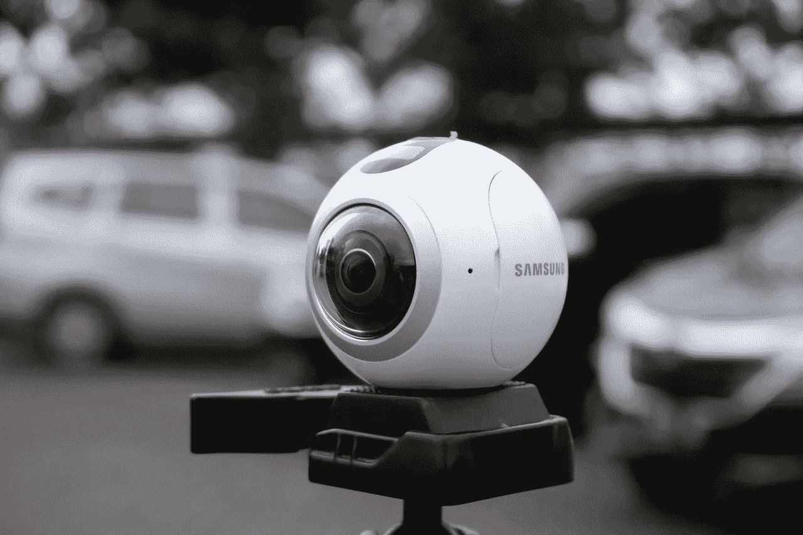

# 获得最佳 360 度产品照片的 6 种方法

> 原文：<https://medium.com/visualmodo/6-ways-to-get-the-best-360-degree-product-shot-f062f3018220?source=collection_archive---------0----------------------->

为了在电子商务行业保持领先，你必须进入 360 度产品摄影的世界。做出这个决定可能会有点令人畏惧，尤其是如果你已经习惯了 2D 的图像。然而，如果你打算留在电子商务行业，那么你可以考虑采取大胆的举措，比如在你的网站上引入 3d 互动图像。它提供了您想象不到的最佳用户体验。

[70%使用 360 度产品拍摄的营销人员表示，这增加了他们业务的参与度。如果你仍然因为成本问题而对使用 360 度产品拍摄持观望态度，那么值得注意的是，整个事情并没有你想象的那么困难和昂贵。以下是 6 种方法，你可以用它们来完美地捕捉你的产品。](/@letsveer/5-benefits-of-360-degree-photos-videos-personal-business-10245e0f4aaa)

# 最佳 360 度拍摄

# 1 快门速度

360 度摄像机的一个令人惊叹的特点是它能够捕捉图像和周围一切的细节。如果你的目标是拍出你的产品和其他细节，确保你考虑到了你的[快门速度](https://en.wikipedia.org/wiki/Shutter_speed)。

出色的快门速度决定了拍摄模糊图像和清晰图像的区别。如果你想让你的产品在人群中脱颖而出，花点时间捕捉你产品的最佳状态，即使这意味着一次拍几张照片。

# 2 选择正确的位置

如果你把相机拿得离产品太近，它会占据四分之一的图像，这样的图像会被浪费掉，因为你不能用它们来销售所说的产品。有时，你可以从离地面几英尺的地方[拍摄照片](https://visualmodo.com/theme/photography-wordpress-theme/)，它可以捕捉 360 度，但未来看到这张照片的消费者会觉得他们好像坐在地板上，这样的照片可能不是你产品的最佳代表。为避免这种情况，请将摄像机对准产品高度，这样观众会感觉自己正在观看产品的完整高度和其他细节。

# 3 足够近

不要假设因为你使用的是 360 度摄像机，你可以从你选择的任何距离拍摄图像。如果您为您的产品拍摄的[图像不够好，那么最有可能的是，您也没有足够靠近。记住，你拍的照片一定要足够有说服力。](https://visualmodo.com/how-to-find-the-best-images-online/)

如果万一他们不是，你可能不会使用该图像进行任何销售。确保将有问题的产品放入框架中。你离得越近，你就越能捕捉到每一个细节，你的图像就越清晰。

# 4 看到光明

这是非常重要的，你发现光是从哪里来的，甚至在你想到举起相机之前。光线可以来自太阳或人工光源，如灯，你可以使用任何一种。此外，试着理解你的光源是如何与你将要拍摄的产品互动的。这是你利用它，让产品形象脱颖而出的唯一方法。

# 5 带灯光的形状

太阳是很好的光源，但并不总是如此。当您在太阳直接位于您身后的情况下拍摄产品图像时，图像上会产生一些令人厌烦的[平面光](https://improvephotography.com/45731/what-is-flat-light/)。所以，既然你打算拿出一个有趣的产品形象，那就用光源向被摄体的侧面或者背后拍摄。

# 6 集中精力

当你用 360 度相机拍照时，你可能会认为相机知道该做什么。事实是，摄像机依靠你去做它需要做的事情。从今以后，你必须全力以赴。

无论是试图[利用神秘购物者](https://www.seelevelhx.com/ways-use-mystery-shopping-improve-business/)改善商店中的用户体验，还是试图在你的网站中嵌入一些 3d 互动，在线或离线购物市场，都取决于用户体验。你在网上平台的销售依赖于你展示的产品图片。利用这一时刻，使用上面的技巧来制作高质量的图片，这将使你的网站以值得称赞的速度增长。