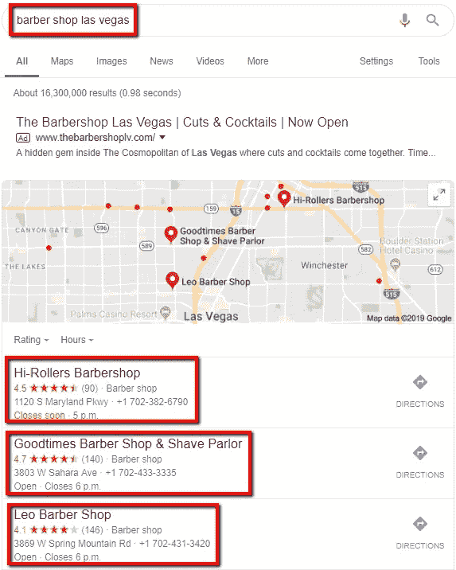

# 7 本地企业的有效数字营销渠道以及何时使用它们

> 原文：<https://medium.com/visualmodo/7-effective-digital-marketing-channels-for-local-businesses-and-when-to-use-them-6e0b4eb8faa0?source=collection_archive---------0----------------------->

有很多选择，当谈到网上营销你的本地业务。问题是决定*使用哪个*通道以及*何时*有效地使用它。我们已经通过我们的[搜索引擎优化服务](https://activebusinessgrowth.ca/)与数百名在线客户合作，以下是我们发现最适合当地小企业的营销渠道。

# 当地企业的最佳数字营销渠道

# 1)你的网站(转化率优化)

当你想到“数字营销渠道”时，这可能不是你想到的第一件事，但在你开始利用下面的任何其他渠道之前，你的网站绝对应该是你优化的第一件事。

这是因为你的网站是你在线业务的枢纽，可以成为与其他数字营销渠道结合使用的极其有效的线索挖掘工具。这就是为什么你要包括联系表格，行动号召，聊天按钮，以及其他任何可以将你的网站访问者转化为你的商业线索的东西。

**优势:**可以通过折扣、促销等方式，有效激励访客成为你企业的潜在客户。

**缺点:**你需要网站访客。这不是驱使人们访问你的网站的一种方式，但是这是一种当访问者真的来了的时候转化他们的方式。

**何时使用:**立即使用。为访问者优化你的网站应该是你开始增加流量之前要做的第一件事。

# 2)点击付费

PPC 广告是一种营销形式，你为你广告的每一次点击付费。这种方法很受欢迎，因为它让你直接面对你的目标客户，但这是有代价的。

**优势:**能够立即开始创造销售线索。如果你的数字有利可图，可以有效地扩大规模。

**缺点:**可贵。你按点击付费。不管是否有人真的购买或成为顾客，你都是在为那个人的点击付费。也就是说，你可以累积广告成本，却看不到哪怕一美元的回报。

**何时使用:**当您刚刚将业务上线，并且正在寻找直接的销售线索时。

# 3)搜索引擎优化

搜索引擎优化是一种有机营销的形式，你可以免费产生线索。如果你恰当地执行 SEO，你的网站将会在 Google 中显示与你的业务相关的关键词。

例如:如果你是一名牙医，一个潜在的搜索者键入“我附近的牙医”，那么你的网站将是谷歌第一页显示的网站之一。如果一个感兴趣的用户点击了你的网站，你不会有任何损失。这是免费的。

**优势:**可以成为一台免费的销售线索生成机器，为您的业务自动驾驶。

**缺点:**耗时长。众所周知，谷歌需要几个月的时间来信任你的网站，让它出现在搜索结果的第一页。不像 PPC，你不能让你的网站立即展现在感兴趣的用户面前。

**何时使用:** SEO 是一个长期的策略。最好立即开始为 SEO 优化你的网站，但不要期望在最初几个月内就有结果。

然而，随着时间的推移，你会开始注意到有机线索免费来到你的企业。当搜索引擎优化真正开始发挥作用时，这可能是一个非常有利可图的营销渠道。

# 4)谷歌我的企业(GMB)个人资料

当用户搜索与你的企业相关的本地关键词时，你的 GMB 档案就是你的企业档案，它会显示在谷歌地图上。这不同于有机搜索引擎优化结果，因为它是你的企业的实际谷歌个人资料，而不是一个网站链接，把游客带到你的企业。

看起来是这样的:

**优点:**自由引线。如果你适当地优化你的 Google My Business 个人资料，那么每一个联系你的企业的潜在客户都是免费的。

**缺点:**耗时较长。就像有机搜索引擎优化一样，谷歌需要很长时间才能信任你的业务，并把它放在搜索者面前。

**何时使用:**立即使用。你想立即利用并创建你的 [GMB 个人资料](https://www.google.com/business/)，尽快开始发布照片并生成评论。

这样，当谷歌*向它的搜索者展示你的企业的 GMB 时，你将拥有一个可以竞争并胜过你的竞争对手的账户档案。*

# 5)社交媒体营销(SMM)

社交媒体营销是指你利用并持续在流行的社交媒体平台上发布你的业务。

**优势:**利用了“网络效应”。如果你发布了一个高参与度的帖子，而你的追随者回复了喜欢、分享和评论，那么你就可以有效地免费接触到大量的受众。你还会被视为这个领域的权威，因为你会不断地发布和展示你在自己领域的专业知识。

缺点:社交媒体是关于一致性的。如果你不能承诺每周发[多篇帖子](https://visualmodo.com/blog/)，那么就很难获得追随者和听众

**何时使用:**如果你抽得出时间，那么最好马上开始使用。社交媒体的美妙之处在于，一旦你发了帖子，它就会永远留在那里。所以越早开始，你就能越早开始建立一个活跃的在线投资组合。

# 6)电子邮件营销

电子邮件营销就是定期通过电子邮件向您的销售线索发送有价值且可操作的信息。

**优点:**自动化。您可以预先设置各种电子邮件活动，发送给您的新联系人。这将创建一个自动跟进序列，在新线索到来时自动培养它们。

**缺点:**你需要一个邮件列表。如果你有很多电子邮件，或者有一个生成大量电子邮件的系统，电子邮件营销会很有效。

**何时使用:**立即设置一个小战役。即使此时你没有电子邮件列表，创建一个简单的入职电子邮件活动来培养你的新线索也是一个好主意。

# 7)在线重定向

“重新定位”仅仅是向那些已经熟悉你的业务或者之前至少有过一次接触的人做广告的行为。无论是网站访问、脸书赞还是 Instagram 关注，这些都是你的目标人群。

这背后的基本原理可以用下面的 Wordstream stat 来最好地描述:

"广告的平均点击率为 0.07%，而重新定位广告的平均点击率为 0.7% . "

这意味着重新定位“暖”线索比“冷”线索平均便宜 **10 倍**！因此，利用重新定位的优势，你将会降低你的广告成本，因为你将会向那些已经对你的工作表现出某种兴趣的人进行营销。

**优点:**可以比瞄准冷引线便宜很多。

**缺点:**你需要一个受众来瞄准。如果你的生意是全新的在线业务，那么你不会有一个受众立即重新定位。

**何时使用:**一旦你有了目标受众。实际的受众规模应该至少为 100 人(例如，100 个网站访问者)。

# 结论

在网上营销你的本地业务可能会很复杂。

有许多不同的渠道可以让你接触到潜在客户。然而，你必须在正确的时间使用正确的营销渠道。如果你了解上面的 7 个数字营销渠道，以及如何和何时使用它们，你将会很好地为你的在线业务创造更多的线索、电话和最终销售。

## 作者简介

> 杰里米·劳洛尔是一名数字营销策略师，拥有 SEO、PPC 和消费者心理学背景。他是活跃业务增长(Active Business Growth)的联合创始人，这是一家专门为本地企业进行搜索引擎优化的精品营销机构。