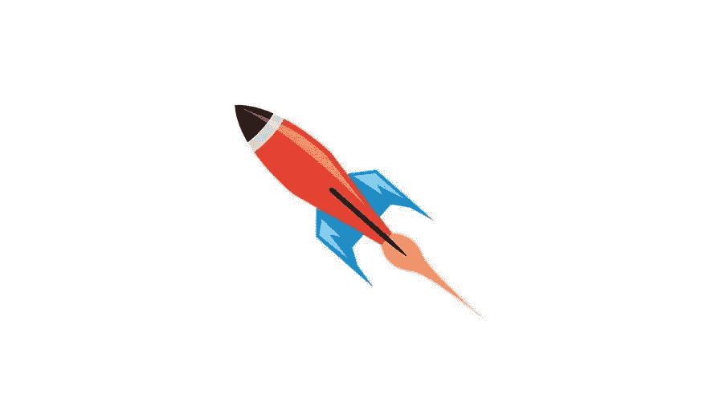

# 7 2021 年登录页面设计趋势

> 原文：<https://medium.com/visualmodo/7-landing-page-design-trends-for-2021-51ce88849bfb?source=collection_archive---------0----------------------->

无论你在 2021 年计划什么样的数字活动，你都需要一个杀手级的登陆页面设计策略。如果你有一个营销计划，而登陆页面设计不是其中的一部分，那么你很可能会错过这个营销工具所提供的好处。正如上面的统计数据所显示的，登陆页面决定结果，尤其是如果你知道如何跟随最新趋势创建和设计一个[高转化率的登陆页面](https://visualmodo.com/creating-high-converting-landing-page/)。

换句话说，你需要创建一个登陆页面，该页面将被优化以增加你网站的流量，并影响人们去执行 CTA 建议的行动。

然而，有一个大多数品牌都犯的错误:创建与竞争对手看起来一样的登录页面。

这篇博文是为了确保你明白你需要做什么来脱颖而出，使用而不是盲目跟随 2021 年的登陆页面设计趋势。

# 大胆一点

有许多方法可以创建一个醒目、漂亮、引人注目的登录页面。但是让我告诉你我最喜欢的两个。

# 排印

当然，这可能是一个老趋势，但大胆的字体设计会一直存在，并且在 2021 年也会继续吸引潜在客户的眼球。

加粗和使用更大的字体是一种让你的 USP 在那里不重复或对你的内容策略做任何实质性的改变来适应你的登陆页面设计的方法。

大胆的排版可以让潜在客户浏览你的登录页面，不要想太多，同时享受你的页面的整体外观和感觉，并遵循你的 CTA 的可操作动词。

Trulia 的 USP 是，它可以让你对你的房子价值进行个性化评估。这是一件大事，而粗体字体恰恰表明了这一点。

# 视频:登录页面设计趋势

你可能会想，“是什么让登陆页面上的视频变得粗体？”。好吧，让我告诉你。

登陆页面上的视频是转化的主要武器。你可以使用多种类型的视频内容创意，从推荐视频、讲解视频，甚至像我个人最喜欢的那样做:

登录页面视频是一个大胆的举动，因为它们总是增加参与度。请记住，视频会像病毒一样传播，比其他形式的内容更容易吸引潜在客户的注意力。只要记住以下几点:

*   您的视频需要针对移动设备进行优化。
*   确保它不会加载缓慢，因为这将使潜在客户远离你的登录页面。
*   高质量的视频会让潜在客户想到高质量的产品，这也是你需要他们想到你能提供的东西。

在 Dollar Shave Club 精美的登录页面视频中，我们谈论的是一个旨在展示品牌及其所有内容的解释者视频。哦，它真的很管用！

48 小时内有 12，000 个订单，视频肯定是最有趣、最有个性的视频之一，它确实做到了！

# 一点信任:登陆页面设计趋势

是的，我知道你在想什么；这是内容而不是设计。但是和我一起。一点信任和基于社会行动主义信念的心态可以走很长的路——鉴于我们过去一年一直在处理的奇怪情况，这是应该的。

# 对社会正义的信任

疫情已经成功地塑造了一个与我们迄今为止所经历的完全不同的营销格局，让人们越来越多地研究和投资于致力于社会变革的品牌。

这种行为的根源是它可以引发的深层情感联系，这种感觉是消费者可以成为彼此的支持系统，在某种程度上。众所周知，支持系统创造了一种纽带和信任。这是什么需要在你的登陆页面明显。

所以，参与进来。无论你是一个非营利组织还是一个电子商务品牌，都要尽可能地参与社会公正事务。这将向你的潜在客户展示你是一个在乎的品牌，同时使用社会证明。

# 信任社会证明

作为一种营销策略，社交证明是利用现有客户对你的产品的体验来增强你的品牌和潜在客户之间的信任的艺术。

社交证明几乎与使用适当的营销工具创建登录页面一样必要，甚至与决定登录页面是为您的企业创造商机的最佳方式一样必要。

再说一次，这不是设计本身，但它会使所有的差异。

你的品牌可以提供客户评价和用户生成内容(UGC)等形式的社交证明。像这样:

如上所述，在第三方网站上可以找到客户评价。他们最好的一点是，他们可以针对特定受众进行高度针对性的宣传，并且可以链接客户评价。这样，潜在客户可以直接点击它们，并确保它们是真实的。

收集可以在你的社交媒体上分享和链接的用户评论和 UGC，并通过你的社交媒体内容将用户引向你的登陆页面。

这种策略可以帮助你在几天内拥有内容，但它也可以像影响者营销一样促进 Instagram 的增长:它显示了属于你想要锁定的受众的人如何享受你的产品并提供现实生活中的价值。

# 唉，唉，天啊！

你的设计可能是周围最好的，但是你有多大把握它会在登陆页面设计趋势上引起你的观众的共鸣？

# 用人工智能个性化

你有多确定你知道是什么让你的潜在客户——就此而言，还有客户——心动了？了解这一点的最佳方法是利用客户细分和个性化体验。

你看，大胆的排版，社会公正，视频内容并不总是答案。尤其是当你的观众不需要这些的时候。

这将是深入研究你的数据并使用人工智能和机器学习的力量的绝佳时机。使用人工智能驱动的工具将允许你创建与每个潜在客户产生共鸣的细分市场——或者几乎产生共鸣。这将为您的登录页面提供尽可能多的变化，最终，它将允许您创建一个将被优化并包含个人外观和感觉的页面。

# 利用 AR 登录页面设计趋势进行创新

这可能是 beyond 2021 最热门的登陆页面设计技巧。

你们都知道 AR 是什么吧？增强现实并不是一个新概念，但它无疑是最令人兴奋和有效的概念之一。然而，这并不能保证对每个人都有效。

例如，古驰开发了一个 AR 功能，允许潜在客户试穿运动鞋，从不同角度查看，拍摄照片并发布到社交媒体上，最重要的是，可以从古驰的网站上直接购买。

这种 AR 技术可以让潜在客户当场做出正确的决定。最大限度地减少他们后悔购买并要求退款的机会。所以，允许品牌利用购买者的冲动本性。

这可以提高品牌的转化率、品牌忠诚度和客户满意度。

# 适应性

你的登陆页面的设计不仅仅需要针对移动设备进行优化。如今，你需要一个能够适应不同屏幕的登陆页面。所以，一定要为不同的屏幕尺寸创建不同版本的页面元素。

例如，不要试图将相同的背景图片放入不同的屏幕。可能行不通。当然，你的登陆页面仍然会有响应，但是看起来肯定不太对。登录页面上的 CTA 按钮和字段也是如此。

想想手机和平板电脑屏幕上的工作方式。与其创建一个响应式的登录页面，不如创建一个优化的、适应性强的登录页面。

您可能需要改变一些元素或完全消除其他元素。当然，但是适应性强的登陆页面意味着更好的用户体验(UX)。更好的 UX 意味着更多的转化。

# 登陆页面设计趋势:外卖

今年有很多变化，当谈到营销人员使用的工具和策略时，我们会看到更多的久而久之。

以上趋势可能对你的品牌有用，也可能没用。没有放之四海而皆准的策略。所以，相信你的数据，做出明智的决定，并且总是 A/B 测试。

毕竟，每个人都可以完全按照指示去做。你需要有足够的创造力来让你的品牌脱颖而出。

# 作者简介:

Téa Liarokapi 是一名为电子邮件营销软件公司 Moosend 工作的内容作家，也是一名痴迷的作家。在她的空闲时间，她试图找到新的方法在她的书柜里塞更多的书和内容的想法-和猫-一起玩。