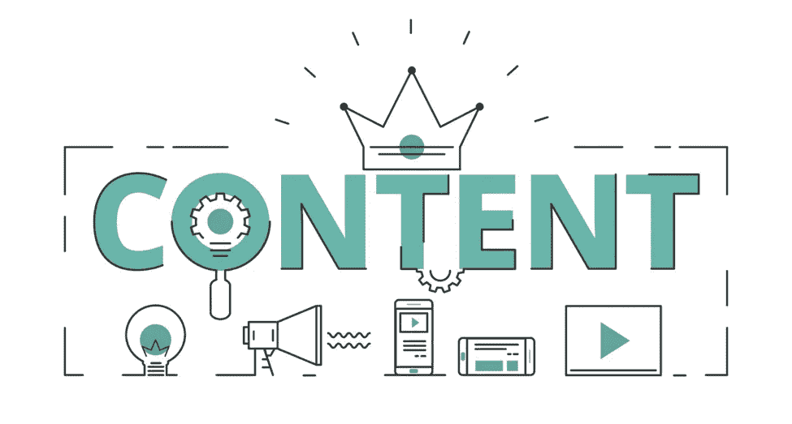

# 7 大内容营销障碍

> 原文：<https://medium.com/visualmodo/7-major-content-marketing-obstacles-9308ee5efae?source=collection_archive---------0----------------------->

要在 2018 年克服

内容营销已经发展到了我们可以放心地讨论一场众所周知的 it 革命的地步。随着 2018 年的到来，我们面前仍有许多挑战。

营销专家将不得不比以往更多地展示他们的创造力，以便与他们的追随者保持联系。考虑到这一点，让我们直接进入 2018 年[营销](https://visualmodo.com/)团队仍然需要克服的主要障碍。

# 主要内容营销障碍

# 1 —内容构思

一天比一天难 [**创作原创内容**](https://www.forbes.com/sites/jaysondemers/2018/01/24/new-to-content-marketing-heres-what-you-need-to-know/) 。已经讨论了这么多网站、文章和话题，内容营销人员还有什么可谈的？

营销专业人士最大的担忧之一是对新颖独特的东西的需求日益增长。流行话题和流行事件只能讨论到此为止。想要脱颖而出的网站和博客将不得不额外关注它们的主题、标题和内容的整体选择。

# 2 —闪电般的周转时间

普通互联网用户的注意力持续时间日益缩短。人们会花几秒钟来决定一篇文章是否值得花时间，然后再继续。

为此，内容营销专家需要尽可能专注于创造“鱼钩”。不仅注意力持续时间变短，而且对新内容的需求持续增长。接下来的第 22 条军规将要求营销人员在保持趣味性的同时，尽快推出新内容。

# 3 —转化激励

人们很少只关注一个网站或社交媒体页面。有这么多的新闻渠道和信息来源，很难订阅另一个。营销内容创作者应该关注他们的行动号召和附加的转化激励。

对订阅、购买或其他互动有直接好处的短信应该成为焦点。诸如 [**TrustMyPaper**](https://www.trustmypaper.com/) 之类的写作服务可以帮助内容创作者撰写有效的行动号召和营销材料，以实现激励性转化。如果你想在 2018 年底前将他们带到你身边，请确保人们知道你在市场上是多么不同和独特。

# 4 —日益激烈的竞争

创建博客、创业公司或内容营销网站比以往任何时候都更容易。不幸的是，不是每个网站都能挺过婴儿期。此外，如果一些营销网站表现出不专业或不负责任的行为，所有营销网站的声誉都会受损。出于这个原因，在一个不断增长、竞争日益激烈的市场中，你通常很难成名。

这就是为什么内容营销专家需要更加关注他们的[品牌](https://visualmodo.com/blog/)，品牌宣传和网站营销。没有品牌广告，内容创作和营销不足以在市场上获得一席之地。为了让一家企业或一个博客在 2018 年取得成功，两者需要携手并进，并将品牌作为内容的一个组成部分进行推广。

# 5 —跟踪和分析

有如此多的变量需要跟踪，很难确定哪些是重要的。即使在 2018 年，搜索引擎优化(SEO)仍然是 web 上 [**优化和排列内容**](https://yoast.com/tracking-seo-google-analytics/) 的关键方法。

然而，更重要的统计数据一直在出现，为内容营销者提供了更多的信息。流量、转化率、加载次数、链接建设、受众反馈和有机增长等因素都发挥着重要作用。成功的内容营销专家通过了解在任何给定时刻哪些统计数据对开发新内容至关重要，从而使自己与众不同。

# 6 —多平台存在

网络浏览器和搜索引擎只是内容营销可用性的冰山一角。越来越多的公司和新闻媒体选择专业应用程序、电子邮件内容交付和其他发布方式。这些方法为内容创作提供了一种更个性化、更有条理的方法，否则这是不可能的。

2018 年，内容营销人员需要密切关注其内容的多平台可用性。二维码和 AR 优化之类的东西已经不是遥远的未来了。内容营销人员还可以充分利用机器学习算法和聊天机器人来增强受众的内容营销体验。你为读者提供的平台和选择越多，你就会拥有越多的读者。

# 7 —受众包容性

最后，内容交付和营销不再是单行道。读者喜欢参与他们的博客、新闻媒体和公司的工作。诸如推荐、评论和采访等内容可以用来弥合产品和最终用户之间的差距。

内容营销专家谁选择包括他们的观众，并给他们一个声音，将有更好的和深远的声誉。那些专注于单独传递信息而不与读者交谈的人在 2018 年 [**不会因为无知**](https://optinmonster.com/content-marketing-mistakes-experts-regret/) 而获得同样多的成功。即使你唯一的产品是博客文章，客户的反馈也是非常重要的。一定要睁大你的眼睛，竖起你的耳朵去倾听人们所说的话，并在你的内容营销中包含他们的观点，以获得更好的接受度。

# 艰难的战斗(结论)

争取观众的注意力和 SEO 的可见性是一个永无止境的过程。即使事情如你所愿，你也不应该固步自封，什么也不做 [**进一步提高你的满足感**](https://www.polepositionmarketing.com/emp/ongoing-seo-costs/) 。2018 年只是一年，你的博客或网站还会有更多年。通过密切关注趋势和随波逐流，确保你仍然在未来几年左右。